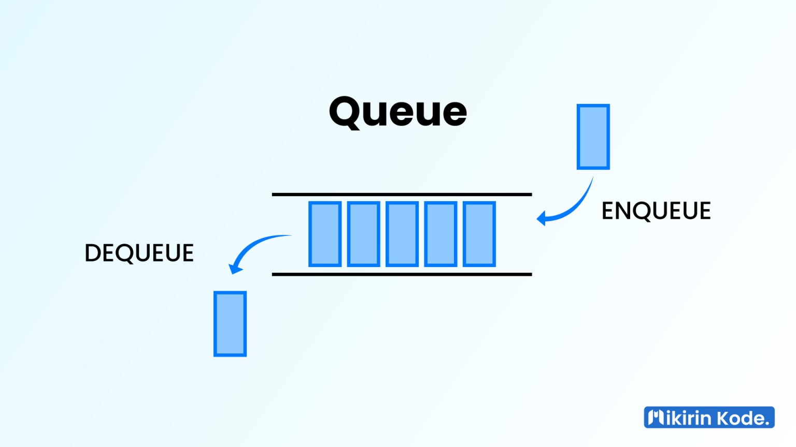

# <h1 align="center">Laporan Praktikum Modul 7 - QUEUE</h1>
<p align="center">Dadya Vio Hendraksa - 2311102123</p>

## Dasar Teori

1. Pengertian, Cara Kerja, dan Fungis Queue<br/>
Queue adalah struktur data yang mengatur elemen-elemen data dalam urutan linier dan beroperasi berdasarkan prinsip "First In, First Out" (FIFO), yang berarti elemen data yang pertama dimasukkan ke dalam antrian akan menjadi yang pertama pula untuk dikeluarkan. Prinsip dasar ini mirip dengan konsep antrean di kehidupan sehari-hari, di mana orang pertama yang datang akan dilayani terlebih dahulu. Dalam antrian, elemen yang berada di urutan pertama disebut sebagai Front atau Head, sementara elemen yang baru saja ditambahkan berada di urutan terakhir dan disebut sebagai Back, Rear, atau Tail.<br/>
Proses penambahan data ke dalam antrian disebut Enqueue, di mana elemen baru akan ditempatkan di bagian belakang antrian. Sedangkan, proses penghapusan data dari antrian disebut Dequeue, di mana elemen di bagian depan antrian akan dihapus. Konsep ini menggambarkan cara kerja antrian, di mana elemen-elemen masuk dan keluar sesuai dengan urutan kedatangan mereka.<br/>
Queue adalah struktur data yang vital dalam sistem komputasi, berperan dalam mengelola antrean tugas atau operasi dengan efisien. Dalam penjadwalan proses, queue menggunakan prinsip FIFO untuk mengatur urutan eksekusi proses. Hal ini mirip dengan antrean dalam kehidupan sehari-hari, di mana orang pertama yang datang akan dilayani terlebih dahulu. Selain itu, queue digunakan dalam antrean pesan, di mana pesan-pesan akan diproses sesuai urutan kedatangannya. Misalnya, dalam layanan pelanggan, pesan dari pelanggan pertama kali akan diberi prioritas untuk diproses agar mendapat respons cepat. Selain itu, queue juga berperan dalam manajemen sumber daya, seperti manajemen printer dalam jaringan, di mana dokumen-dokumen yang masuk untuk dicetak ditempatkan dalam antrian, memastikan proses pencetakan dilakukan secara adil dan efisien. Dengan demikian, queue membantu meningkatkan efisiensi dan kinerja sistem komputasi secara keseluruhan.<br/>
</br>

2. Jenis-Jenis Queue<br/>
Berdasarkan implementasinya:<br/>
Queue memiliki beberapa jenis disini sesuai dengan implementasinya yaitu:<br/>
• Linear atau Simple Queue adalah jenis struktur data di mana elemen-elemen data disusun dalam barisan linear, dan penambahan serta penghapusan elemen hanya terjadi pada dua ujung barisan tersebut.<br/>
• Circular Queue, di sisi lain, memiliki mirip dengan jenis linear, tetapi ujung-ujung barisan terhubung satu sama lain, menciptakan struktur antrean yang berputar. Dengan demikian, elemen terakhir dalam circular queue terhubung kembali ke elemen pertama, menciptakan siklus tertutup yang memungkinkan penggunaan ruang memori yang lebih efisien.<br/>
Berdasarkan penggunaanya:<br/>
Selain berdasarkan implementasinya, queue memiliki peran penting dalam berbagai konteks penggunaanya:<br/>
• Priority Queue adalah jenis struktur data di mana setiap elemen memiliki prioritas tertentu, di mana elemen dengan prioritas tertinggi akan diambil atau diproses terlebih dahulu.<br/>
• Double-ended Queue, yang sering disebut sebagai Dequeue, adalah jenis struktur data di mana elemen dapat ditambahkan atau dihapus dari kedua ujung antrean, memberikan fleksibilitas dalam penambahan dan penghapusan elemen.<br/>

3. Operasi Queue</br>
Berikut adalah beberapa operasi umum pada queue:<br/>
• Enqueue adalah operasi yang digunakan untuk menambahkan elemen baru ke bagian akhir antrian. Operasi ini dapat dilakukan selama antrian tidak penuh. Setiap kali dilakukan penambahan (enqueue), variabel rear atau penunjuk posisi belakang akan bertambah 1 (increment).<br/>
• Dequeue adalah operasi yang digunakan untuk menghapus elemen pertama dari antrian. Penghapusan elemen dapat dilakukan selama antrian tidak kosong. Jika antrian kosong, maka dapat terjadi underflow. Karena penghapusan dilakukan pada elemen yang berada di urutan pertama, setelah penghapusan, perlu dilakukan pergeseran untuk menyesuaikan posisi elemen-elemen setelahnya.<br/>
• Display atau View adalah operasi yang digunakan untuk mencetak atau menampilkan semua data yang ada pada antrian.<br/>
• IsEmpty adalah operasi yang digunakan untuk memeriksa apakah antrian kosong atau tidak. Untuk memastikan tidak terjadi underflow saat dequeue, perlu dipastikan bahwa antrian tidak kosong. Antrian dikatakan kosong jika penunjuk posisi belakang bernilai 0. Operasi ini biasanya diimplementasikan dalam bentuk fungsi yang mengembalikan nilai true jika antrian kosong, dan false jika tidak.<br/>
• IsFull adalah operasi yang digunakan untuk memeriksa apakah antrian sudah penuh atau belum. Pada saat enqueue, perlu dipastikan bahwa antrian tidak penuh untuk menghindari overflow. Antrian dikatakan penuh jika penunjuk posisi belakang sama dengan nilai maksimal antrian. Operasi ini juga biasanya diimplementasikan dalam bentuk fungsi, mengembalikan true jika antrian penuh, dan false jika tidak.<br/>
• Destroy atau Clear adalah operasi yang digunakan untuk menghapus atau membersihkan semua data pada antrian. Operasi ini biasanya memanggil fungsi IsEmpty untuk memastikan bahwa antrian tidak kosong sebelum dilakukan penghapusan. Jika antrian kosong, akan ditampilkan pesan bahwa antrian masih kosong.<br/>
• Peek adalah operasi yang digunakan untuk mendapatkan nilai dari elemen pertama pada antrian tanpa menghapusnya.<br/>

## Guided 

### 1. Program Latihan l Queue

```C++
#include <iostream>

using namespace std;

const int maksimalQueue = 5;  // Maksimal antrian
int front = 0;                // Penanda antrian
int back = 0;                 // Penanda
string queueTeller[5];        // Fungsi pengecekan

bool isFull() {               // Pengecekan antrian penuh atau tidak
  if (back == maksimalQueue) {
    return true;  // =1
  } else {
    return false;
  }
}

bool isEmpty() {  // Antriannya kosong atau tidak
  if (back == 0) {
    return true;
  } else {
    return false;
  }
}

void enqueueAntrian(string data) {  // Fungsi menambahkan antrian
  if (isFull()) {
    cout << "Antrian penuh" << endl;
  } else {
    if (isEmpty()) {  // Kondisi ketika queue kosong
      queueTeller[0] = data;
      front++;
      back++;
    } else {  // Antrianya ada isi
      queueTeller[back] = data;
      back++;
    }
  }
}

void dequeueAntrian() {  // Fungsi mengurangi antrian
  if (isEmpty()) {
    cout << "Antrian kosong" << endl;
  } else {
    for (int i = 0; i < back; i++) {
      queueTeller[i] = queueTeller[i + 1];
    }
    back--;
  }
}

int countQueue() {  // Fungsi menghitung banyak antrian
  return back;
}

void clearQueue() {  // Fungsi menghapus semua antrian
  if (isEmpty()) {
    cout << "Antrian kosong" << endl;
  } else {
    for (int i = 0; i < back; i++) {
      queueTeller[i] = "";
    }
    back = 0;
    front = 0;
  }
}

void viewQueue() {  // Fungsi melihat antrian
  cout << "Data antrian teller:" << endl;
  for (int i = 0; i < maksimalQueue; i++) {
    if (queueTeller[i] != "") {
      cout << i + 1 << ". " << queueTeller[i] << endl;
    } else {
      cout << i + 1 << ". (kosong)" << endl;
    }
  }
}

int main() {
  enqueueAntrian("Andi");
  enqueueAntrian("Maya");
  viewQueue();
  cout << "Jumlah antrian = " << countQueue() << endl;
  dequeueAntrian();
  viewQueue();
  cout << "Jumlah antrian = " << countQueue() << endl;
  clearQueue();
  viewQueue();
  cout << "Jumlah antrian = " << countQueue() << endl;
  return 0;
}
```
Pemprograman ini menggunakan stuktur data queue dengan penyimpanan array. Queue adalah struktur data yang menggunakan prinsip FIFO 
(First In First Out) yang artinya data yang pertama masuk akan keluar pertama kali. Queue memiliki dua operasi utama yaitu enqueue 
(menambahkan elemen) dan dequeue (menghapus elemen). Pada program ini, terdapat fungsi-fungsi yang digunakan untuk menambahkan antrian
(enqueueAntrian), mengurangi antrian (dequeueAntrian), menghitung banyak antrian (countQueue), menghapus semua antrian (clearQueue),
dan melihat antrian (viewQueue). Setelah itu, program akan menampilkan data antrian yang ada, jumlah antrian, mengurangi antrian, yang dipanggil
dari fungsi utama main. Proses pemprograman ini menggunakan array untuk menyimpan data antrian dan variabel front dan back untuk menandai 
antrian yang ada. dengan FIFO, data yang pertama masuk akan keluar pertama kali. Tanpa menggunakan queue, data yang pertama masuk tidak 
akan keluar pertama kali. Jadi menggunakan queue sangat penting untuk mengatur data yang masuk dan keluar.</br>

## Unguided 

### 1. Ubahlah penerapan konsep queue pada bagian guided dari array menjadi linked list.</br>

```C++
/*
Dadya Vio Hendraksa - 2311102123
*/

#include <iostream>

using namespace std;

const int maksimalQueue = 5;  // Maksimal antrian adalah 5

// Node untuk menyimpan data dan pointer ke node berikutnya
struct Node {
    string data;
    Node* next;
};

class Queue {
private:
    Node* front; // Node depan dari antrian
    Node* rear;  // Node belakang dari antrian

public: 
    Queue() { // Konstruktor untuk menginisialisasi antrian kosong
        front = nullptr;
        rear = nullptr;
    }

    // Fungsi untuk menambahkan data ke antrian
    void enqueue_2123(const string& data) {
        Node* newNode = new Node;
        newNode->data = data;
        newNode->next = nullptr;
        
        // Jika antrian kosong
        if (isEmpty_2123()) { // Jika antrian kosong maka front dan rear menunjuk ke newNode yang baru dibuat 
            front = rear = newNode;
        } else { // Jika antrian tidak kosong maka rear menunjuk ke newNode yang baru dibuat
            rear->next = newNode;
            rear = newNode;
        }
        
        cout << data << " ditambahkan ke dalam antrian." << endl;
    }

    // Fungsi untuk menghapus data dari antrian
    void dequeue_2123() {
        if (isEmpty_2123()) { // Jika antrian kosong maka tampilkan pesan "Antrian kosong" dan kembalikan nilai void
            cout << "Antrian kosong." << endl;
            return;
        }

        Node* temp = front; // Simpan node front ke dalam variabel temp untuk dihapus nantinya 
        front = front->next; // Geser front ke node selanjutnya 

        cout << temp->data << " dihapus dari antrian." << endl; // Tampilkan data yang dihapus dari antrian 
        delete temp; // Hapus node yang disimpan di variabel temp

        // Jika setelah penghapusan antrian menjadi kosong
        if (front == nullptr) {
            rear = nullptr;
        }
    }

    // Fungsi untuk menampilkan seluruh antrian
    void displayQueue_2123() {
        if (isEmpty_2123()) { // Jika antrian kosong maka tampilkan pesan "Data antrian:" dan tampilkan pesan "(kosong)"
            cout << "Data antrian:" << endl;
            for (int i = 0; i < maksimalQueue; i++) {
                cout << i + 1 << ". (kosong)" << endl;
            }
        } else { // Jika antrian tidak kosong maka tampilkan data antrian yang ada
            cout << "Data antrian:" << endl;
            Node* current = front;
            int i = 1;
            while (current != nullptr) { // Selama current tidak menunjuk ke nullptr maka tampilkan data antrian yang ada 
                cout << i << ". " << current->data << endl;
                current = current->next;
                i++;
            }
            for (; i <= maksimalQueue; i++) { // Tampilkan pesan "(kosong)" untuk antrian yang kosong 
                cout << i << ". (kosong)" << endl;
            }
        }
    }

    // Fungsi untuk memeriksa apakah antrian kosong
    bool isEmpty_2123() {
        return front == nullptr;
    }

    // Fungsi untuk mengembalikan jumlah elemen dalam antrian
    int countQueue_2123() {
        int count = 0;
        Node* current = front;
        while (current != nullptr) { // Selama current tidak menunjuk ke nullptr maka hitung jumlah elemen dalam antrian
            count++;
            current = current->next;
        }
        return count; // Kembalikan jumlah elemen dalam antrian
    }

    // Fungsi untuk menghapus semua elemen dalam antrian
    void clearQueue() {
        while (!isEmpty_2123()) { // Selama antrian tidak kosong maka hapus elemen dalam antrian
            dequeue_2123(); // Hapus elemen dalam antrian 
        } 
        cout << "Antrian telah dibersihkan." << endl;
    }
};

int main() {
    Queue queue; // Buat objek queue dari class Queue
    queue.enqueue_2123("Andi");
    queue.enqueue_2123("Maya");
    queue.displayQueue_2123();
    cout << "Jumlah antrian = " << queue.countQueue_2123() << endl;
    queue.dequeue_2123();
    queue.displayQueue_2123();
    cout << "Jumlah antrian = " << queue.countQueue_2123() << endl;
    queue.dequeue_2123();
    queue.displayQueue_2123();
    cout << "Jumlah antrian = " << queue.countQueue_2123() << endl;

    return 0;
}
```

#### Output:
</br>
Pemprograman diatas ini menggunakan konsep linked list untuk membuat queue. Queue yang dibuat menggunakan linked list memiliki fungsi enqueue, dequeue, displayQueue, isEmpty, countQueue, dan clearQueue. Fungsi enqueue digunakan untuk menambahkan data ke dalam antrian. Dimana data akan disimpan dalam node baru dan node baru tersebut akan diletakkan di belakang antrian.Fungsi dequeue digunakan untuk menghapus data dari antrian. Dimana node yang berada di depan antrian akan dihapus.  Model queue dengan linked list ini memiliki kelebihan yaitu tidak memerlukan alokasi memori sebesar maksimalQueue, sehingga tidak ada pemborosan memori. Sehingga, queue dengan linked list ini lebih efisien. Untuk prosesnya sendiri, queue dengan linked list ini memiliki kompleksitas waktu O(1) untuk operasi enqueue dan dequeue. dengan memanggil fungsi enqueue atau dequeue, maka operasi tersebut akan langsung dilakukan tanpa perlu melakukan pergeseran elemen lainnya. Pada fungsi utama main terdapat inisialisasi objek queue dari class Queue. Kemudian, dilakukan pemanggilan fungsi enqueue untuk menambahkan data ke dalam antrian. Setelah itu, dilakukan pemanggilan fungsi displayQueue untuk menampilkan seluruh antrian. Selanjutnya, dilakukan pemanggilan fungsi countQueue untuk menghitung jumlah elemen dalam antrian. Kemudian, dilakukan pemanggilan fungsi dequeue untuk menghapus data dari antrian. Setelah itu, dilakukan pemanggilan fungsi displayQueue dan countQueue untuk menampilkan seluruh antrian dan menghitung jumlah elemen dalam antrian. Terakhir, dilakukan pemanggilan fungsi dequeue, displayQueue, dan countQueue untuk menghapus data dari antrian, menampilkan seluruh antrian, dan menghitung jumlah elemen dalam antrian. Dari hasil eksekusi program diatas, dapat dilihat bahwa data "Andi" dan "Maya" berhasil ditambahkan ke dalam antrian. Selanjutnya, data "Andi" dihapus dari antrian. Terakhir, data "Maya" dihapus dari antrian. Setelah data "Andi" dan "Maya" dihapus dari antrian, maka antrian menjadi kosong.</br>

### 2. Dari nomor 1 buatlah konsep antri dengan atribut Nama mahasiswa dan NIM Mahasiswa.</br>

```C++
/*
Dadya Vio Hendraksa - 2311102123
*/

#include <iostream>

using namespace std;

// Node untuk menyimpan data dan pointer ke node berikutnya
struct Node {
    string nama;
    string nim;
    Node* next;
};

class Queue { // Class Queue untuk menyimpan data antrian dan operasi-operasinya 
private:
    Node* front; // Node depan dari antrian
    Node* rear;  // Node belakang dari antrian

public: 
    Queue() { // Konstruktor untuk menginisialisasi antrian kosong 
        front = nullptr;
        rear = nullptr;
    }

    ~Queue() { // Destruktor untuk membersihkan antrian 
        clearQueue(); // Panggil fungsi clearQueue() untuk membersihkan antrian 
    }

    // Fungsi untuk menambahkan data ke antrian
    void enqueue_2123(const string& nama, const string& nim) {
        Node* newNode = new Node;
        newNode->nama = nama;
        newNode->nim = nim;
        newNode->next = nullptr;
        
        // Jika antrian kosong
        if (isEmpty_2123()) { // Jika antrian kosong maka front dan rear menunjuk ke newNode yang baru dibuat 
            front = rear = newNode;
        } else { // Jika antrian tidak kosong maka rear menunjuk ke newNode yang baru dibuat
            rear->next = newNode;
            rear = newNode;
        }
        
        cout << "Mahasiswa dengan Nama: " << nama << " dan NIM: " << nim << " ditambahkan ke dalam antrian." << endl;
    }

    // Fungsi untuk menghapus data dari antrian
    void pop_2123() { // Fungsi pop() sama dengan fungsi dequeue() pada guided01.cpp
        if (isEmpty_2123()) {
            cout << "Antrian kosong." << endl;
            return;
        }

        Node* temp = front; // Simpan node front ke dalam variabel temp untuk dihapus nantinya
        front = front->next; // Geser front ke node selanjutnya

        cout << "Mahasiswa dengan Nama: " << temp->nama << " dan NIM: " << temp->nim << " dihapus dari antrian." << endl;
        delete temp;

        // Jika setelah penghapusan antrian menjadi kosong
        if (front == nullptr) {
            rear = nullptr;
        }
    }

    // Fungsi untuk menampilkan seluruh antrian
    void displayQueue_2123() {
        if (isEmpty_2123()) { // Jika antrian kosong maka tampilkan pesan "Data antrian:" dan tampilkan pesan "(kosong)"
            cout << "Data antrian:" << endl;
            for (int i = 1; i <= 5; ++i) { // Tampilkan pesan "(kosong)" sebanyak 5 kali karena maksimal antrian adalah 5 
                cout << i << ". (kosong)" << endl;
            }
            return;
        }

        cout << "Data antrian:" << endl;
        Node* current = front; // Simpan front ke dalam variabel current
        int i = 1;
        while (current != nullptr) { // Selama current tidak menunjuk ke nullptr maka tampilkan data antrian yang ada
            cout << i << ". Nama: " << current->nama << ", NIM: " << current->nim << endl;
            current = current->next;
            i++;
        }
        for (; i <= 5; ++i) { // Tampilkan pesan "(kosong)" untuk antrian yang kosong 
            cout << i << ". (kosong)" << endl;
        }
    }

    // Fungsi untuk memeriksa apakah antrian kosong
    bool isEmpty_2123() {
        return front == nullptr;
    }

    // Fungsi untuk mengembalikan jumlah elemen dalam antrian
    int countQueue_2123() {
        int count = 0;
        Node* current = front;
        while (current != nullptr) { // Selama current tidak menunjuk ke nullptr maka hitung jumlah elemen dalam antrian 
            count++;
            current = current->next;
        }
        return count;
    }

    // Fungsi untuk menghapus semua elemen dalam antrian
    void clearQueue() {
        while (!isEmpty_2123()) { // Selama antrian tidak kosong maka hapus elemen antrian dengan memanggil fungsi pop()
            pop_2123();
        }
        cout << "Antrian telah dibersihkan." << endl;
    }
};

int main() {
    Queue queue; // Buat objek queue dari class Queue 
    queue.enqueue_2123("Andi", "2311102123");
    queue.enqueue_2123("Maya", "2311102124");
    queue.displayQueue_2123();
    cout << "Jumlah antrian = " << queue.countQueue_2123() << endl;
    queue.pop_2123();
    queue.displayQueue_2123();
    cout << "Jumlah antrian = " << queue.countQueue_2123() << endl;
    queue.pop_2123();
    queue.displayQueue_2123();
    cout << "Jumlah antrian = " << queue.countQueue_2123() << endl;

    return 0;
}
```

#### Output:
</br>
Pemprograman ini sama dengan unguided01.cpp, hanya saja nama variabel dan fungsi yang berbeda. Dimana disini data yang simpan adalah nama dan nim mahasiswa. Jadi, pada fungsi enqueue_2123() digunakan untuk menambahkan data mahasiswa ke dalam antrian. Pada fungsi pop_2123() digunakan untuk menghapus data mahasiswa dari antrian. Pada fungsi displayQueue_2123 digunakan untuk menampilkan data mahasiswa yang ada di dalam antrian. Pada fungsi isEmpty_2123 digunakan untuk mengecek apakah antrian kosong atau tidak. Pada fungsi countQueue_2123 digunakan untuk menghitung jumlah mahasiswa yang ada di dalam antrian. Pada fungsi clearQueue() digunakan untuk menghapus semua data mahasiswa yang ada di dalam antrian. Dimana pada main program, pertama-tama membuat objek queue dari class Queue. Kemudian menambahkan data mahasiswa ke dalam antrian dengan memanggil fungsi enqueue_2123(). Kemudian menampilkan data mahasiswa yang ada di dalam antrian dengan memanggil fungsi displayQueue_2123(). Kemudian menghitung jumlah mahasiswa yang ada di dalam antrian dengan memanggil fungsi countQueue_2123(). Kemudian menghapus data mahasiswa dari antrian dengan memanggil fungsi pop_2123(). Kemudian menampilkan data mahasiswa yang ada di dalam antrian dengan memanggil fungsi displayQueue_2123(). Kemudian menghitung jumlah mahasiswa yang ada di dalam antrian dengan memanggil fungsi countQueue_2123(). Kemudian menghapus data mahasiswa dari antrian dengan memanggil fungsi pop_2123(). Kemudian menampilkan data mahasiswa yang ada di dalam antrian dengan memanggil fungsi displayQueue_2123(). Kemudian menghitung jumlah mahasiswa yang ada di dalam antrian dengan memanggil fungsi countQueue_2123(). Maka dapat dilihat bahwa data mahasiswa yang ada di dalam antrian telah terhapus semua dan antrian menjadi kosong. Dapat disimpukan bahwa program ini digunakan untuk menambahkan data mahasiswa ke dalam antrian, menghapus data mahasiswa dari antrian, menampilkan data mahasiswa yang ada di dalam antrian, menghitung jumlah mahasiswa yang ada di dalam antrian, dan menghapus semua data mahasiswa yang ada di dalam antrian.</br>

## Kesimpulan
Dari berbagai materi yang telah diuraikan, dapat disimpulkan bahwa Queue adalah salah satu struktur data yang penting dalam pemrograman komputer karena memungkinkan pengelolaan data dengan prinsip FIFO (First In, First Out), mirip dengan konsep antrean dalam kehidupan sehari-hari. Dengan adanya queue, kita dapat mengatur tugas atau operasi secara efisien, baik dalam konteks sistem komputasi maupun dalam aplikasi sehari-hari. Melalui operasi seperti Enqueue untuk menambahkan elemen, Dequeue untuk menghapus elemen, dan operasi lainnya seperti Display, IsEmpty, IsFull, Destroy, serta Peek, queue memungkinkan pengelolaan data yang terstruktur dan efisien. Selain itu, dengan adanya jenis-jenis queue seperti Linear Queue, Circular Queue, Priority Queue, dan Double-ended Queue, kita dapat memilih struktur yang sesuai dengan kebutuhan dan konteks penggunaan.</br>
Dalam praktiknya, penggunaan queue dapat ditemui dalam berbagai aplikasi, mulai dari sistem operasi untuk penjadwalan proses hingga layanan pelanggan yang menggunakan antrean pesan. Queue juga digunakan dalam manajemen sumber daya, seperti dalam manajemen printer dalam jaringan. Dengan menggunakan queue, proses-proses dapat diatur secara terstruktur dan adil, memastikan bahwa tugas-tugas diproses dengan urutan yang benar dan efisien. Dengan demikian, pemahaman tentang queue dan penggunaannya menjadi penting dalam pengembangan perangkat lunak untuk mencapai kinerja sistem yang optimal dan pengalaman pengguna yang baik.</br>

## Referensi
[1] Malik, D.S., C++ Programming. Boston: Course Technology, 2023.<br/>
[2] Ahmad Ghiyas Ahyar, et al., JURNAL PEMBELAJARAN ARRAY, LINKED LIST, STACK, DAN QUEUE, 2021.<br/>
[3] Anita Sindar RMS, ST., M.TI., STRUKTUR DATA DAN ALGORITMA DENGAN C++. Serang: CV. AA. RIZKY, 2019.