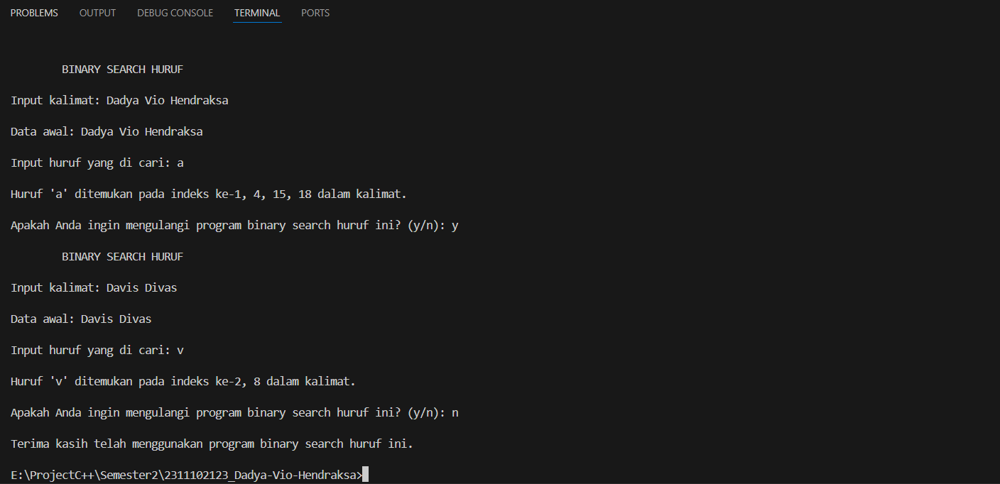

# <h1 align="center">Laporan Praktikum Modul 8 - ALGORITMA SEARCHING</h1>
<p align="center">Dadya Vio Hendraksa - 2311102123</p>

## Dasar Teori

1. Pengertian dan Fungsi Algortima Searching<br/>
Algoritma pencarian adalah salah satu konsep fundamental dalam ilmu komputer dan pemrograman. Ini berkaitan dengan teknik untuk menemukan keberadaan suatu nilai tertentu dalam kumpulan data atau struktur data tertentu. Pencarian ini dapat dilakukan dalam berbagai konteks, mulai dari pencarian elemen dalam larik (array) hingga pencarian node dalam struktur data seperti pohon atau graf.<br/>
Fungsi algoritma pencarian secara umum adalah untuk menemukan keberadaan suatu nilai tertentu dalam kumpulan data. Algoritma pencarian berperan dalam memeriksa setiap elemen dalam kumpulan data, secara berurutan atau dengan cara yang lebih efisien seperti membagi kumpulan data menjadi bagian-bagian yang lebih kecil. Tujuan utamanya adalah untuk menemukan apakah nilai yang dicari ada dalam kumpulan data, dan jika ya, di mana letaknya. Dalam banyak kasus, algoritma pencarian dapat menemukan nilai tersebut dengan kompleksitas waktu yang optimal atau mendekati optimal, bergantung pada ukuran kumpulan data dan sifat struktur data yang digunakan. Selain itu, keberhasilan algoritma pencarian juga bergantung pada fakta apakah kumpulan data sudah diurutkan atau tidak. Dengan pemahaman yang baik tentang jenis-jenis algoritma pencarian dan konteks penerapannya, seorang pengembang dapat memilih dan menerapkan algoritma yang sesuai dengan kebutuhan spesifiknya, meningkatkan efisiensi pengolahan data dalam aplikasi atau sistem yang dibuat.<br/>

2. Sequential search<br/>
Konsep Sequential Search, juga dikenal sebagai Linear Search, adalah salah satu metode pencarian sederhana yang digunakan untuk menemukan keberadaan suatu nilai tertentu dalam sebuah kumpulan data yang tidak terurut. Algoritma ini bekerja dengan cara menelusuri setiap elemen dalam kumpulan data secara berurutan dari awal hingga akhir, dan membandingkan setiap elemen dengan nilai yang dicari. Proses ini berlanjut hingga nilai yang dicari ditemukan atau hingga akhir dari kumpulan data tercapai.<br/>
Cara kerja Sequential Search, juga dikenal sebagai Linear Search, dimulai dengan memulai pencarian dari elemen pertama dalam kumpulan data. Setiap elemen dalam kumpulan data kemudian diperiksa secara berurutan dengan membandingkan nilai yang dicari dengan nilai dari elemen yang sedang diperiksa. Jika nilai yang dicari cocok dengan nilai elemen yang sedang diperiksa, pencarian selesai dan indeks elemen tersebut dikembalikan. Namun, jika nilai yang dicari tidak cocok dengan nilai elemen yang sedang diperiksa, pencarian dilanjutkan ke elemen berikutnya dalam kumpulan data. Proses ini diulangi hingga entah nilai yang dicari ditemukan atau semua elemen dalam kumpulan data telah diperiksa. Jika nilai yang dicari ditemukan, maka fungsi akan mengembalikan indeks elemen yang sesuai. Namun, jika tidak ditemukan, fungsi akan mengembalikan nilai khusus (misalnya, -1) untuk menandakan bahwa nilai tersebut tidak ada dalam kumpulan data. Meskipun pendekatan ini sederhana dan langsung, Sequential Search bisa menjadi kurang efisien untuk kumpulan data besar karena memerlukan penelusuran sepanjang kumpulan data secara linier.<br/>
</br>
Keuntungan Sequential Search:<br/>
Sederhana: Konsepnya mudah dipahami tanpa pengetahuan khusus tentang struktur data.<br/>
Fleksibel: Dapat diterapkan pada berbagai jenis kumpulan data tanpa persyaratan khusus.<br/>
Cocok untuk Kumpulan Data Kecil atau Tidak Terurut: Efektif untuk kumpulan data kecil atau tidak terurut, tanpa memerlukan pengurutan sebelumnya.<br/>
Kerugian Sequential Search:<br/>
Kurang Efisien: Memerlukan penelusuran berurutan yang kurang efisien untuk kumpulan data besar.<br/>
Tidak Cocok untuk Kumpulan Data Besar: Kurang efisien untuk kumpulan data besar, menyebabkan kinerja aplikasi lambat.<br/>
Tidak Menggunakan Informasi Terurut: Tidak memanfaatkan fakta bahwa kumpulan data terurut, mengakibatkan kurangnya efisiensi dalam pencarian.<br/>


3. Binary Search</br>
Binary search adalah algoritma pencarian yang digunakan untuk menemukan lokasi (indeks) suatu elemen tertentu dalam kumpulan data yang telah diurutkan secara terurut. Algoritma ini membagi kumpulan data menjadi dua bagian secara berulang, kemudian memeriksa elemen tengahnya. Jika nilai yang dicari kurang dari nilai elemen tengah, pencarian dilanjutkan ke bagian kiri dari elemen tengah; jika nilai yang dicari lebih besar, pencarian dilanjutkan ke bagian kanan dari elemen tengah. Proses ini diulangi pada setiap iterasi hingga nilai yang dicari ditemukan atau hingga ukuran kumpulan data menjadi nol.</br>
Cara kerjanya, Binary search adalah sebuah algoritma pencarian yang digunakan untuk menemukan lokasi suatu elemen tertentu dalam kumpulan data yang telah diurutkan, baik secara ascending (meningkat) maupun descending (menurun). Algoritma ini bekerja dengan mengurangi rentang pencarian menjadi setengah setiap langkahnya. Pertama, kita memastikan bahwa kumpulan data telah diurutkan untuk memastikan keefektifan algoritma ini. Selanjutnya, kita menetapkan dua indeks, yaitu batas kiri (left) dan batas kanan (right), yang menandakan rentang kumpulan data yang akan dicari. Posisi tengah dari rentang pencarian dihitung dengan mengambil nilai rata-rata dari left dan right, yang akan menjadi titik referensi untuk membagi rentang pencarian. Setelah itu, kita membandingkan nilai yang dicari dengan nilai di posisi tengah. Jika nilai yang dicari sama dengan nilai di posisi tengah, pencarian selesai dan indeks posisi tengah dikembalikan sebagai hasil pencarian. </br>
Namun, jika nilai yang dicari lebih kecil dari nilai di posisi tengah, kita atur ulang batas kanan menjadi posisi tengah - 1 karena nilai yang dicari berada di sebelah kiri dari posisi tengah dalam kumpulan data yang telah diurutkan. Sebaliknya, jika lebih besar, kita atur ulang batas kiri menjadi posisi tengah + 1 karena nilai yang dicari berada di sebelah kanan dari posisi tengah. Langkah-langkah ini diulangi dalam iterasi berikutnya dengan rentang pencarian yang baru hingga nilai yang dicari ditemukan atau rentang pencarian menjadi kosong. Iterasi terus berlanjut sampai batas kiri (left) lebih besar dari batas kanan (right), menandakan bahwa nilai yang dicari tidak ada dalam kumpulan data. Binary search memiliki kompleksitas waktu O(log n), menjadikannya salah satu algoritma pencarian yang paling efisien untuk kumpulan data yang besar.</br>
</br>
Keuntungan Binary Search:</br>
Efisiensi: Dengan kompleksitas waktu O(log n), binary search efisien untuk kumpulan data besar karena membagi rentang pencarian menjadi setengah setiap langkahnya.</br>
Kecepatan: Dengan membagi rentang pencarian secara eksponensial, binary search dapat menemukan elemen dalam kumpulan data besar dengan cepat, cocok untuk aplikasi yang memerlukan respons cepat.</br>
Kemudahan Implementasi: Konsep binary search sederhana dan mudah dipahami, serta tersedia dalam berbagai bahasa pemrograman.</br>
Kerugian Binary Search:</br>
Ketergantungan pada Kumpulan Data Terurut: Hanya berfungsi pada kumpulan data yang terurut, memerlukan langkah tambahan untuk mengurutkan kumpulan data terlebih dahulu jika belum diurutkan.</br>
Penggunaan Memori Tambahan: Memerlukan alokasi memori tambahan untuk menyimpan indeks batas dan posisi tengah, yang dapat memengaruhi kinerja pada kumpulan data besar atau di lingkungan dengan keterbatasan memori.</br>
Tidak Cocok untuk Kumpulan Data yang Sering Berubah: Tidak cocok untuk kumpulan data yang sering berubah karena memerlukan kumpulan data yang tetap diurutkan, yang dapat mengurangi efisiensi jika proses pengurutan ulang sering terjadi.</br>

## Guided 

### 1. Buatlah sebuah project dengan menggunakan sequential search sederhana untuk melakukan pencarian data.

```C++
#include <iostream>

using namespace std;

int main() {
  int n = 10;
  int data[n] = {9, 4, 1, 7, 5, 12, 4, 13, 4, 10};
  int cari = 10;
  bool ketemu = false;
  int i;
  // Algoritma Sequential Search
  for (i = 0; i < n; i++) {
    if (data[i] == cari) {
      ketemu = true;
      break;
    }
  }
  cout << "\tProgram Sequential Search Sederhana\n" << endl;
  cout << "data: {9, 4, 1, 7, 5, 12, 4, 13, 4, 10}" << endl;
  if (ketemu) {
    cout << "\nAngka " << cari << " ditemukan pada indeks ke-" << i << endl;
  } else {
    cout << cari << " tidak dapat ditemukan pada data." << endl;
  }
  return 0;
}
```
Pemprogramana diatas merupakan program pencarian data dengan metode Sequential Search. Program ini akan mencari data yang dicari pada array data. 
Jika data ditemukan, maka program akan menampilkan indeks data tersebut. Jika data tidak ditemukan, maka program akan menampilkan pesan bahwa data 
tidak ditemukan. Dalam program diatas, data yang dicari adalah angka 10. Dimana algorithm Sequential Search akan mencari angka 10 pada array data dengan menggunakan perulangan for. Setelah data ditemukan, program akan menampilkan pesan bahwa angka 10 ditemukan pada indeks ke-9. Kesimpulannya, program diatas berhasil menemukan data yang dicari pada array data. </br>

### 2. Buatlah sebuah project untuk melakukan pencarian data dengan menggunakan Binary Search.

```C++
#include <conio.h>
#include <iomanip>
#include <iostream>

using namespace std;

int dataArray[7] = {1, 8, 2, 5, 4, 9, 7};
int cari;
void selection_sort() {
  int temp, min, i, j;
  for (i = 0; i < 7; i++) {
    min = i;
    for (j = i + 1; j < 7; j++) {
      if (dataArray[j] < dataArray[min]) {
        min = j;
      }
    }
    temp = dataArray[i];
    dataArray[i] = dataArray[min];
    dataArray[min] = temp;
  }
}

void binarysearch() {
  int awal, akhir, tengah;
  bool b_flag = false;
  awal = 0;
  akhir = 6;  // Corrected to 6 to match array bounds
  while (!b_flag && awal <= akhir) {
    tengah = (awal + akhir) / 2;
    if (dataArray[tengah] == cari) {
      b_flag = true;
    } else if (dataArray[tengah] < cari) {
      awal = tengah + 1;
    } else {
      akhir = tengah - 1;
    }
  }
  if (b_flag) {
    cout << "\nData ditemukan pada index ke- " << tengah << endl;
  } else {
    cout << "\nData tidak ditemukan\n";
  }
}

int main() {
  cout << "\tBINARY SEARCH" << endl;
  cout << "\nData: ";
  // Tampilkan data awal
  for (int x = 0; x < 7; x++) {
    cout << setw(3) << dataArray[x];
  }
  cout << endl;
  cout << "\nMasukkan data yang ingin Anda cari: ";
  cin >> cari;
  cout << "\nData diurutkan: ";
  // Urutkan data dengan selection sort
  selection_sort();
  // Tampilkan data setelah diurutkan
  for (int x = 0; x < 7; x++) {
    cout << setw(3) << dataArray[x];
  }
  cout << endl;
  binarysearch();
  _getche();
  return 0;
}
```
Pemprograman diatas merupakan program yang digunakan untuk mencari data dalam array menggunakan algoritma binary search. Program ini akan meminta input data yang ingin dicari, kemudian program akan mengurutkan data menggunakan selection sort, dan terakhir program akan mencari data menggunakan algoritma binary search dan menampilkan hasilnya. Yang dimana fungsi selection_sort() menggunakan double loop untuk mengurutkan data dalam array menggunakan selection sort, fungsi binarysearch() menggunakan  while yang didalamnya terdapat if else untuk mencari data dalam array menggunakan algoritma binary search, dan fungsi main() yang digunakan untuk menampilkan data awal meminta input data yang ingin dicari, menampilkan data setelah diurutkan, dan memanggil fungsi binarysearch(). Sehingga program akan menampilkan hasil data ditemukan pada index ke- 3 karena data 5 berada pada index ke-3 setelah diurutkan. Kesimpulannya program ini berhasil mencari data dalam array. </br>

## Unguided 

### 1. Buatlah sebuah program untuk mencari sebuah huruf pada sebuah kalimat yang sudah di input dengan menggunakan Binary Search!

```C++
/*
Dadya Vio Hendraksa - 2311102123
*/

#include <iostream> // Library untuk fungsi input-output C++
#include <cstring> // Library untuk fungsi string C
#include <vector> // Library untuk tipe data dinamis
#include <algorithm> // Library untuk fungsi sort()

using namespace std;

struct CharIndexPair_2123 { // Struktur data untuk menyimpan pasangan karakter dan indeks dalam array 
    char character;
    int index;
};

vector<int> binary_search_all_2123(CharIndexPair_2123 dataArray[], int size, char target) { // Fungsi untuk mencari semua indeks karakter target dalam array pasangan karakter dan indeks dengan algoritma pencarian biner sederhana.
    vector<int> result; // Array dinamis untuk menyimpan indeks hasil pencarian karakter target dalam array pasangan karakter dan indeks.
    for (int i = 0; i < size; i++) {
        if (dataArray[i].character == target) {
            result.push_back(dataArray[i].index); // Menambahkan indeks karakter target ke dalam array hasil pencarian.
        }
    }
    return result;
}

int main() {
    char sentence_2123[100]; // Array karakter untuk menyimpan kalimat yang diinputkan pengguna.
    char cari_2123; 
    char ulangi_2123;

    do {
        cout << "\n\tBINARY SEARCH HURUF" << endl;
        cout << "\nInput kalimat: ";
        cin.getline(sentence_2123, 100); // Menggunakan getline() agar kalimat yang diinputkan dapat mengandung spasi.

        int size_2123 = strlen(sentence_2123); // Menghitung panjang kalimat yang diinputkan.
        CharIndexPair_2123 dataArray[100]; // Array statis untuk menyimpan pasangan karakter dan indeks

        // Membuat array pasangan karakter dan indeks aslinya
        for (int i = 0; i < size_2123; i++) {
            dataArray[i] = {sentence_2123[i], i};
        }

        cout << "\nData awal: " << sentence_2123 << endl;

        cout << "\nInput huruf yang di cari: ";
        cin >> cari_2123;

        // Pencarian biner sederhana
        vector<int> indices = binary_search_all_2123(dataArray, size_2123, cari_2123); 

        if (!indices.empty()) { // Jika indeks ditemukan dalam array pasangan karakter dan indeks.
            // Sort hasil jika lebih dari satu indeks ditemukan
            if (indices.size() > 1) {
                sort(indices.begin(), indices.end());
            }

            cout << "\nHuruf '" << cari_2123 << "' ditemukan pada indeks ke-";
            for (int i = 0; i < indices.size(); i++) { // Menampilkan semua indeks karakter target dalam kalimat.
                if (i > 0) cout << ", ";
                cout << indices[i];
            }
            cout << " dalam kalimat.\n";
        } else {
            cout << "\nHuruf '" << cari_2123 << "' tidak ditemukan dalam kalimat.\n";
        }

        cout << "\nApakah Anda ingin mengulangi program binary search huruf ini? (y/n): ";
        cin >> ulangi_2123;
        cin.ignore(); // Membersihkan buffer agar getline() tidak terganggu

    } while (ulangi_2123 == 'y' || ulangi_2123 == 'Y'); // Ulangi program jika pengguna mengetikkan 'y' atau 'Y'

    cout << "\nTerima kasih telah menggunakan program binary search huruf ini.\n";

    return 0;
}
```

#### Output:
</br>
Pemprograman diatas ini menggunakan algoritam binary search sederhana untuk mencari semua indeks karakter target dalam array pasangan karakter 
dan indeks. Program ini meminta pengguna untuk memasukkan kalimat dan karakter yang ingin dicari, kemudian menampilkan semua indeks karakter target dalam kalimat. Pertama kita akan menggunakan sturuktur CharIndexPair_2123 untuk menyimpan pasangan karakter dan indeks dalam array. Kemudian kitamembuat fungsi binary_search_all_2123 dengan vektor sebagai tipe kembalian untuk mencari semua indeks karakter target dalam array pasangan karakterdan indeks. Di dalam fungsi main, kita meminta pengguna untuk memasukkan kalimat dan karakter yang ingin dicari. Kemudian kita membuat array pasangan karakter dan indeks aslinya. Setelah itu kita memanggil fungsi binary_search_all_2123 untuk mencari semua indeks karakter target dalam array pasangan karakter dan indeks. Jika indeks ditemukan dalam array pasangan karakter dan indeks, kita akan menampilkan semua indeks karakter target dalam kalimat. Jika tidak ditemukan, kita akan menampilkan pesan bahwa karakter target tidak ditemukan dalam kalimat. Terakhir, kita akan meminta pengguna apakah ingin mengulangi program atau tidak. Program akan berhenti jika pengguna tidak ingin mengulangi program.</br>

### 2. Buatlah sebuah program yang dapat menghitung banyaknya huruf vocal dalam sebuah kalimat!

```C++
/*
Dadya Vio Hendraksa - 2311102123
*/

#include <iostream> // Library untuk fungsi input-output C++
#include <map> // Library untuk tipe data map

using namespace std;

int hitung_vokal_2123(const char kalimat_2123[]) { // Fungsi untuk menghitung jumlah huruf vokal dalam kalimat yang diinputkan pengguna
    int jumlah_vokal = 0;
    for (int i = 0; kalimat_2123[i] != '\0'; i++) { // Looping untuk setiap karakter dalam kalimat hingga karakter null terminator (akhir string)
        char huruf = tolower(kalimat_2123[i]); // Ubah huruf menjadi lowercase untuk mempermudah perbandingan
        if (huruf == 'a' || huruf == 'e' || huruf == 'i' || huruf == 'o' || huruf == 'u') {
            jumlah_vokal++; // Jika huruf adalah huruf vokal, tambahkan jumlah vokal
        }
    }
    return jumlah_vokal; // Kembalikan jumlah vokal
}

int main() {
    char kalimat_2123[100]; // Array karakter untuk menyimpan kalimat yang diinputkan pengguna
    char ulangi_2123;

    do {
        cout << "\nInput kalimat: ";
        cin.getline(kalimat_2123, 100); // Menggunakan getline() agar kalimat yang diinputkan dapat mengandung spasi dan karakter khusus lainnya

        int jumlah_vokal = hitung_vokal_2123(kalimat_2123); // Hitung jumlah huruf vokal dalam kalimat yang diinputkan pengguna

        cout << "\nJumlah huruf vokal dalam kalimat adalah: " << jumlah_vokal << endl;

        map<char, int> vokal_map; // Map untuk menyimpan jumlah kemunculan setiap huruf vokal dalam kalimat yang diinputkan pengguna
        for (int i = 0; kalimat_2123[i] != '\0'; i++) { // Looping untuk setiap karakter dalam kalimat hingga karakter null terminator (akhir string)
            char huruf = tolower(kalimat_2123[i]); // Ubah huruf menjadi lowercase untuk mempermudah perbandingan dan penyimpanan dalam map
            if (huruf == 'a' || huruf == 'e' || huruf == 'i' || huruf == 'o' || huruf == 'u') {
                vokal_map[huruf]++;
            }
        }

        for (auto const &pair : vokal_map) { // Looping untuk setiap pasangan key-value dalam map vokal_map (auto digunakan untuk menentukan tipe data secara otomatis)
            cout << pair.first << " = " << pair.second << endl; // Tampilkan huruf vokal dan jumlah kemunculannya dalam kalimat
        }

        cout << "\nUlangi? (y/n): ";
        cin >> ulangi_2123;
        cin.ignore(); // Membersihkan input buffer
    } while (ulangi_2123 == 'y' || ulangi_2123 == 'Y'); // Ulangi program jika pengguna mengetikkan 'y' atau 'Y'

    return 0;
}
```

#### Output:
</br>
Pemprograman diatas ini menggunakan algoritma sequential search untuk mencari jumlah huruf vokal dalam kalimat yang diinputkan pengguna.
Pertama saya menggunakan library map untuk menyimpan jumlah kemunculan setiap huruf vokal dalam kalimat yang diinputkan pengguna. yang kemudian
kita membuat fungsi hitung_vokal_2123 untuk menghitung jumlah huruf vokal dalam kalimat yang diinputkan pengguna, yang dimana menggunakan looping
untuk setiap karakter dalam kalimat hingga karakter null terminator (akhir string) dan menggunakan if statement untuk mengecek apakah huruf tersebut adalah huruf vokal atau bukan. jika huruf tersebut adalah huruf vokal maka jumlah vokal akan bertambah. kemudian kita membuat map vokal_map untuk menyimpan jumlah kemunculan setiap huruf vokal dalam kalimat yang diinputkan pengguna. Selanjutnya pada fungsi utama main kita membuat looping do-while yang didalamnya terdapat input kalimat yang diinputkan pengguna, selanjutnya memanggil fungsi hitung_vokal_2123 untuk menghitung jumlah huruf vokal dalam kalimat yang diinputkan pengguna. setelah itu membuat map vokal_map untuk menyimpan jumlah kemunculan setiap huruf vokal dalam kalimat yang diinputkan pengguna. maka seterusnya membuat looping for untuk setiap karakter dalam kalimat hingga karakter null terminator (akhir string) dan menggunakan if statement untuk mengecek apakah huruf tersebut adalah huruf vokal atau bukan. jika huruf tersebut adalah huruf vokal maka huruf tersebut akan dimasukkan kedalam map vokal_map. dibawahnya kita membuat looping for untuk setiap pasangan key-value dalam map vokal_map dan menampilkan huruf vokal dan jumlah kemunculannya dalam kalimat. kemudian membuat input ulangi_2123 untuk menanyakan apakah ingin mengulangi program atau tidak. terakhir membuat if statement untuk mengecek apakah pengguna ingin mengulangi program atau tidak. jika pengguna ingin mengulangi program maka program akan dilakukan looping. jika pengguna tidak ingin mengulangi program maka program akan berhenti.</br>

### 3. Diketahui data = 9, 4, 1, 4, 7, 10, 5, 4, 12, 4. Hitunglah berapa banyak angka 4 dengan menggunakan algoritma Sequential Search!

```C++
/*
Dadya Vio Hendraksa - 2311102123
*/

#include <iostream> // Library untuk fungsi input-output C++

using namespace std;

int main() {
    int data_2123[] = {9, 4, 1, 4, 7, 10, 5, 4, 12, 4}; // Array data
    int cari_2123 = 4; // Angka yang dicari
    int jumlah_angka_4 = 0; // Jumlah angka 4 dalam data
    const int ukuran_2123 = sizeof(data_2123) / sizeof(data_2123[0]); // Ukuran array

    // Menampilkan data array
    cout << "\nData array: ";
    for (int i = 0; i < ukuran_2123; i++) {
        cout << data_2123[i] << " "; // Menampilkan nilai setiap elemen array
    }
    cout << endl;

    // Algoritma Sequential Search
    for (int i = 0; i < ukuran_2123; i++) { // Looping untuk setiap elemen dalam array data (10 elemen)
        if (data_2123[i] == cari_2123) { // Jika elemen saat ini sama dengan angka yang dicari (4)
            jumlah_angka_4++; // Tambahkan jumlah angka 4
        }
    }

    cout << "\nBanyaknya angka 4 dalam data diatas adalah: " << jumlah_angka_4 << endl; // Tampilkan jumlah angka 4 dalam data

    return 0;
}
```

#### Output:
</br>
Pemprograman diatas ini menggunakan algoritma binary search untuk mencari semua indeks karakter target dalam array pasangan karakter dan indeks. Pertamapada fungsi utama main dengan menggunakan array data_2123 yang berisi data angka, kemudian kita membuat variabel cari_2123 yang berisi angka yang dicari yaitu 4, kemudian kita membuat variabel jumlah_angka_4 yang berisi jumlah angka 4 dalam data, kemudian kita membuat variabel konstanta ukuran_2123 yang berisi ukuran array data_2123. Selanjutnya kita looping for untuk menampilkan semua data pada array kemudian setelah itu kita membuat algoritma sequential search dengan looping for untuk setiap elemen dalam array data (10 elemen) dan menggunakan if statement untuk mengecek apakah elemen saat ini sama dengan angka yang dicari (4). jika elemen tersebut sama dengan angka yang dicari maka jumlah_angka_4 akan bertambah. kemudian kita menampilkan jumlah angka 4 dalam data.</br>

## Kesimpulan
Dari berbagai materi yang telah diuraikan, dapat disimpulkan bahwa algoritma searching adalah konsep dasar dalam ilmu komputer yang bertujuan untuk menemukan keberadaan suatu nilai tertentu dalam kumpulan data. Terdapat beberapa jenis algoritma searching, di antaranya adalah Sequential Search dan Binary Search. Sequential Search, atau pencarian berurutan, sederhana dalam konsepnya dan cocok untuk kumpulan data kecil atau tidak terurut, meskipun kurang efisien untuk kumpulan data besar. Sementara itu, Binary Search, yang bekerja dengan membagi rentang pencarian secara eksponensial, sangat efisien untuk kumpulan data besar karena memiliki kompleksitas waktu yang optimal. Namun, Binary Search hanya berfungsi pada kumpulan data yang sudah diurutkan, sementara Sequential Search lebih fleksibel dalam hal ini.</br>
Dari penjelasan tentang implementasi algoritma Sequential Search dan Binary Search dalam pemrograman, kita dapat melihat bahwa kedua algoritma tersebut memiliki pendekatan dan karakteristik yang berbeda. Penggunaan masing-masing algoritma tergantung pada kebutuhan spesifik, seperti ukuran dan sifat kumpulan data yang akan dicari. Meskipun Binary Search lebih efisien secara teoritis, namun Sequential Search masih memiliki kegunaan dalam kasus-kasus di mana kumpulan data relatif kecil atau tidak terurut. Dengan pemahaman yang baik tentang kedua algoritma ini, seorang pengembang dapat memilih dan menerapkan algoritma searching yang paling sesuai untuk menyelesaikan tugas-tugas pemrograman mereka.</br>

## Referensi
[1] Malik, D.S., C++ Programming. Boston: Course Technology, 2023.<br/>
[2] Bart J. Van Zeghbroeck, et al., Josephson Sampler Response Using a Binary Search Algorithm, Colorado: IEEE, 2024.<br/>
[3] Anita Sindar RMS, ST., M.TI., STRUKTUR DATA DAN ALGORITMA DENGAN C++. Serang: CV. AA. RIZKY, 2019.