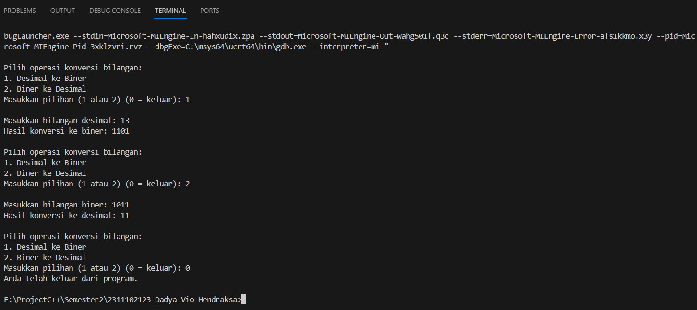
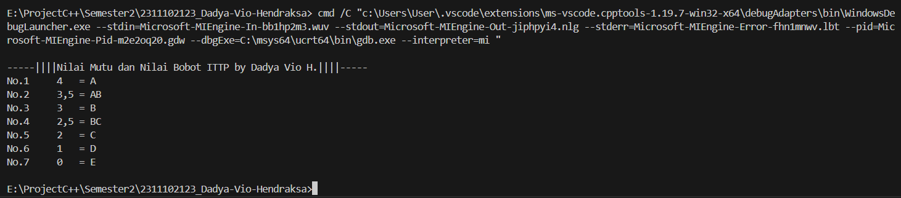

# <h1 align="center">Laporan Praktikum Modul 1 - Tipe Data</h1>
<p align="center">Dadya Vio Hendraksa - 2311102123</p>

## Dasar Teori

Tipe data mengacu pada jenis nilai yang dapat disimpan dan digunakan dalam variabel atau ekspresi pada program komputer. Setiap tipe data memiliki karakteristik unik, termasuk rentang nilai yang dapat diwakili, besarnya ruang memori yang dibutuhkan, serta operasi yang dapat diterapkan pada nilai tersebut. Berikut ini adalah tpe data yang umum digunakan dalam C++:

1. Tipe Data Primitif<br/>
Tipe data yang didefinisikan oleh sistem disebut tipe data primitif. Tipe data primitif yang disediakan oleh banyak bahasa pemrograman adalah: int, float, char, double, bool, dll. Jumlah bit yang dialokasikan untuk setiap tipe data primitif tergantung pada bahasa pemrograman, kompiler, dan sistem operasi. Untuk tipe data primitif yang sama, bahasa yang berbeda dapat menggunakan ukuran yang berbeda. Tergantung pada ukuran tipe data, nilai total yang tersedia (domain) juga akan berubah.

2. Tipe Data Abstrak<br/>
Struktur data dengan operasinya dan Kita menyebutnya Tipe Data Abstrak (ADT). Sebuah ADT terdiri dari dua bagian:
   - Deklarasi data
   - Deklarasi operasi
ADT yang umum digunakan meliputi: Linked Lists, Stacks, Queues, Priority Queues, Binary Trees, Dictionaries, Disjoint Sets (Union and Find), Hash Tables, Graphs, dan banyak lainnya. Misalnya, stack menggunakan mekanisme LIFO (Last-In-First-Out) saat menyimpan data dalam struktur data. Elemen terakhir yang dimasukkan ke dalam tumpukan adalah elemen pertama yang dihapus. Operasi umum itu adalah: membuat tumpukan, mendorong elemen ke tumpukan, mengeluarkan elemen dari tumpukan, menemukan bagian atas tumpukan saat ini, menemukan jumlah elemen dalam tumpukan, dll.

3. Tipe Data Koleksi<br/>
Tipe data koleksi (Collection Data Type) merujuk pada jenis data yang dirancang untuk menampung sejumlah elemen atau nilai dalam satu kesatuan. Fungsi utama tipe data ini adalah untuk menggabungkan dan mengorganisir beberapa nilai ke dalam satu struktur atau variabel.
   - Array yaitu strucktur data statis yang menyimpan elemen yang tipe datanya sama dan dimulai dari indeks 0.
   - Vector merupakan struktur data dinamis yang menyimpan elemen dengant tipe data yang sama. Akan tetapi, keunggulannya yaitu dapat mengubah ukuran sesuai dengan elemen yang disimpannya sehingga dapat fleksibel.
   - Map merupakan fungsi yang seperti array akan tetapi dapat memiliki elemen yang berbeda tipe data yang dapat diakses menggunakan tipe data kunci. Sehingga memiliki efisiensi dan kecepatan dalam aksesnya.

## Guided 

### 1. Tipe Data Primitif

```C++
#include <iostream>
#include <iomanip>

using namespace std;

int main () {
    char op;
    float num1, num2;

    // It allows user to enter operator i.e. +, -, *, /
    cout << "Enter operator (+,-,*,/)";
    cout << endl;
    cin >> op;

    // It allows user to enter the operands
    cout << "Enter two operands : ";
    cin >> num1 >> num2;

    // Switch statement begins
    switch (op) {
    // If user enters +
    case '+':
        cout << "Result: " << num1 + num2;
        break;
    // If user enters -
    case '-':
        cout << "Result: " << num1 - num2;
        break;
    // If user enters *
    case '*':
        cout << "Result: " << num1 * num2;
        break;
    // If user enters /
    case '/':
        if (num2 != 0) {
            cout << "Result: " << fixed << setprecision(2) << num1 / num2;
        } else {
            cout << "Error! Division by zero is not allowed.";
        }
        break;
    // If the operator is other than +, -, * or /,
    // errror message will display
    default:
        cout << "Error! Operator is not correct";
    } // switch statement ends
    
    return 0;
}
```
Program diatas ini merupakan 4 dari operasi aritmatika dasar yaitu penambahan (+), pengurangan (-), Perkalian (*), dan pembagian (/). Pertama user akan memilih operator yang akan digunakan pada cin dan berguna juga untuk memilih switch casenya. Setelahnya user diminta untuk memasukkan 2 angka sebagai imput untuk dapat melakukan operasi aritmatika yang dipilih. Maka, program diatas memiliki 2 tipe data primitif yang digunakan yaitu char untuk pemilihan operator dan float untuk input angka.

### 2. Tipe Data Abstrak

```C++
#include <string.h>
#include <stdio.h>

struct Mahasiswa
{
    char name[50];
    char address[100];
    int age;
};
int main()
{
    // menggunakan struct
    struct Mahasiswa mhs1, mhs2;
    // mengisi nilai ke struct
    strcpy(mhs1.name, "Dian");
    strcpy(mhs1.address, "Mataram");
    mhs1.age = 22;
    strcpy(mhs2.name, "Bambang");
    strcpy(mhs2.address, "Surabaya");
    mhs2.age = 23;

    // mencetak isi struct
    printf("## Mahasiswa 1 ##\n");
    printf("Nama: %s\n", mhs1.name);
    printf("Alamat: %s\n", mhs1.address);
    printf("Umur: %d\n", mhs1.age);
    printf ("\n");
    printf("## Mahasiswa 2 ##\n");
    printf("Nama: %s\n", mhs2.name);
    printf("Alamat: %s\n", mhs2.address);
    printf("Umur: %d\n", mhs2.age);
    return 0;
}
```
Program diatas ini menggunakan tipe data struct yang bersifat abstrak, sehingga bisa berisi banyak tipe data dan memiliki nilai beragam tipe data. Karena struct bersifat public maka dapat diakses siapapun, diatas ini dapat dilihat struct nya memiliki 3 nilai yaitu char name [50], char address[100], dan int umur. Sehingga pada fungsi main kita akan mendeklarasikan atau mengisi nilai struct untuk 2 struct yaitu mhs1 dan mhs2.

### 3. Tipe Data Koleksi

```C++
#include <iostream>
#include <array>
using namespace std;

int main() {
    // Deklarasi dan inisialisasi array
    int nilai[5];
    nilai[0] = 23;
    nilai[1] = 50;
    nilai[2] = 34;
    nilai[3] = 78;
    nilai[4] = 90;

    // Mencetak array dengan tab
    cout << "Isi array pertama : " << nilai[0] << endl;
    cout << "Isi array kedua : " << nilai[1] << endl;
    cout << "Isi array ketiga : " << nilai[2] << endl;
    cout << "Isi array keempat : " << nilai[3] << endl;
    cout << "Isi array kelima : " << nilai[4] << endl;

    return 0;
}
```
Program diatas ini menggunakan library array untuk memudahkan penggunaan arrau. Di sini array merupakan tipe data koleksi yaitu array yang isi elemennya harus tipe data sama dan array ini memiliki ukuran yang tetap. disini terdapat 5 elemen array yang tipe datanya int dengan indeks pertama pasti 0, lalu dibawahnya kita tinggal memanggil deklarasi array yang telah kita buat sebelumnya secara runtut.

## Unguided 

### 1. Buatlah program menggunakan tipe data primitif minimal dua fungsi dan bebas. Menampilkan program, jelaskan program tersebut dan ambil kesimpulan dari materi tipe data primitif!

```C++
/*
Dadya Vio Hendraksa - 2311102123
*/

#include <iostream>
#include <cmath> // Library untuk fungsi dalam operasi matematika

using namespace std;

int pilihan_2123, desimal_2123; // Data primitif int untuk pilihan menu pilihan_2123 dan angka decimal_2123
long biner_2123; // Data primitif long untuk angka biner_2123

void DadyaKonversiBilangan_2123() { // Fungsi void untuk tampilan menu pilihan user
    cout << "\nPilih operasi konversi bilangan:\n";
    cout << "1. Desimal ke Biner\n";
    cout << "2. Biner ke Desimal\n";
    cout << "Masukkan pilihan (1 atau 2) (0 = keluar): ";
    cin >> pilihan_2123;
}

long DesimalKeBiner(int desimal_2123) { // Fungsi untuk mengonversi bilangan desimal ke biner
    long biner_2123 = 0;
    int sisa, i = 1, langkah = 1;

    while (desimal_2123 != 0) {
        sisa = desimal_2123 % 2;
        desimal_2123 /= 2;
        biner_2123 += sisa * i;
        i *= 10;
    }

    return biner_2123; // Mengembalikan nilai hasil konversi biner
}

int BinerKeDesimal(long biner_2123) { // Fungsi untuk mengonversi bilangan biner ke desimal
    int desimal_2123 = 0, i = 0, sisa;

    while (biner_2123 != 0) {
        sisa = biner_2123 % 10;
        biner_2123 /= 10;
        desimal_2123 += sisa * pow(2, i);
        ++i;
    }

    return desimal_2123; // Mengembalikan nilai hasil konversi desimal
}

int main() {
    do { // Perulangan untuk menu pilihan user 
        DadyaKonversiBilangan_2123();
        switch (pilihan_2123) { // Switch case pilihan user
            case 1: // User memiih 1 maka fungsi konversi desimal ke biner akan dijalankan
                cout << "\nMasukkan bilangan desimal: ";
                cin >> desimal_2123; // Input desimal dari user
                cout << "Hasil konversi ke biner: " << DesimalKeBiner(desimal_2123) << endl; // Pemanggilan hasil fungsi konversi desimal ke biner
            break;
            case 2: // User memiih 1 maka fungsi konversi biner ke desimal akan dijalankan
                cout << "\nMasukkan bilangan biner: ";
                cin >> biner_2123; // Input biner dari user
                cout << "Hasil konversi ke desimal: " << BinerKeDesimal(biner_2123) << endl; // Pemanggilan hasil fungsi konversi biner ke desimal
            break;
            default:
                cout << "Anda telah keluar dari program.\n";
                break;
        }
    } while (pilihan_2123 != 0); // Jika memilih 0 switch case default akan dijalankan dan program berakhir

    return 0;
}
```
#### Output:

Program diatas ini berguna untuk melakukan konversi bilangan. pertama disini saya menggunakan library cmath untuk memudahkan dalam operasi matematikanya. Saya menggunakan 2 data primitif yaitu tipe data int dan long. Karena harus menggunakan 2 fungsi, maka saya menggunakan 1 prosedur yang berisi menu pilihan dan input untuk menu yang terhubung dengan switch case yang ada, 1 fungsi untuk konversi desimal ke biner yang isinya yaitu operasi matematika untuk konversi, dan 1 fungsi untuk konversi biner ke desimal yang isinya yaitu operasi matematika untuk konversi juga. Selanjutnya di fungsi main kita gunakan do while menu yang ada jika tidak menginputkan 0, yang dimana didalamnya ada switch case dengan pemanggilan nilai yang ada pada 2 fungsi konversi.

Kesimpulan Tipe Data Primitif:<br/>
Kesimpulan yang dapat diambil tipe data primitif berguna untuk menyimpan nilai sederhana, akan tetapi tipe data primitif ini merupakan sebuah bagian yang sangat penting untuk membangun sebuah program awal yang baik. maka, disini pengguna dapat memiliki kemudahan untuk memahami program yang ada tipe data primitif ini.

### 2. Jelaskan fungsi dari class dan struct secara detail dan berikan contoh programnya!

```C++
/*
Dadya Vio Hendraksa - 2311102123
*/

#include <iostream>
#include <string>

using namespace std;

struct Creator_2123 { // Struct Creator_2123 yang berisi tipe data string nama, negara, pekerjaan dan int umur.
    string Nama_2123;
    string Negara_2123;
    string Pekerjaan_2123;
    int Umur_2123;
};

class Karya_2123 { // Class Karya_2123 yang berisi tipe data string nama karya, genre, dan int tahun terbit yang akses private kemudian dibuat menjadi public.
private:
    string NamaKarya_2123;
    string Genre_2123;
    int TahunTerbit_2123;

public:
    // Metode ini untuk mengatur nilai awal atribut private yang ada.
    Karya_2123(string namaKarya, string genre, int tahunTerbit)
        : NamaKarya_2123(namaKarya), Genre_2123(genre), TahunTerbit_2123(tahunTerbit) {}

    // Fungsi ini untuk mengambil nilai atribut private yang sudah di deklarasikan.
    string GetNamaKarya() const { return NamaKarya_2123; }
    string GetGenre() const { return Genre_2123; }
    int GetTahunTerbit() const { return TahunTerbit_2123; }
};

int main() {
    cout << "=========== Struct dan Class Biography Akira Toriyama oleh Dadya Vio Hendraksa ===========" << endl;
    // Pendeklarasian Struct Creator_2123
    Creator_2123 creator{"Akira Toriyama", "Jepang", "Mangaka", 68};
    cout << "\n|||| Biography Akira Toriyama ||||" << endl;
    cout << "Nama: " << creator.Nama_2123 << endl;
    cout << "Negara: " << creator.Negara_2123 << endl;
    cout << "Pekerjaan: " << creator.Pekerjaan_2123 << endl;
    cout << "Umur: " << creator.Umur_2123 << endl;
    // Pendeklarasian Class Karya_2123
    Karya_2123 karya("Dragon Ball", "Fantasi", 1984);
    cout << "\n|||| Karya Akira Toriyama ||||" << endl;
    cout << "Nama Karya: " << karya.GetNamaKarya() << endl;
    cout << "Genre: " << karya.GetGenre() << endl;
    cout << "Tahun Terbit: " << karya.GetTahunTerbit() << endl;

    return 0;
}
```
#### Output:

Program diatas berunga untuk mengoutputkan tipe data abstrak yaitu class dan struct. Dimana, terdapat sebuah struct Creator_2123 yang memiliki nilai string nama, negara, pekerjaan, dan int umur. Lalu terdapat juga sebuah class yang terdapat nilai yaitu string nama karya, genre, dan int tahun terbit yang masih bersifat private. Kemudian nilai private pada class ini diatur untuk nilai awalnya dan mengambil nilai private yang ada, pada sebuah class publicnya. maka nilai yang ada distruct akan di isi dengan "Akira Toriyama", "Jepang", "Mangaka", 68. Nilai pada class akan di isi dengan "Dragon Ball", "Fantasi", 1984. Terakhir pada fungsi main akan di deklarasikan dan menjadikan output untuk nilai struct dan classnya.

A. Class<br/>
Class disini sudah diketahui bahwa memiliki sifat private yang tidak sembarang user dapat mengakses dari keluar class. Class juga memiliki sifat untuk penggabungan data dan operasinya menjadi satu kesatuan. Di class kita tidak dapat membuat inisial variabel saat deklarasi. Sehingga membutuhkan pada fungsi public untuk private data yang ada sehingga harus mengatur nilai awal dan mengambil nilai atribut private.

B. Struct<br/>
Struct merupakan sebuah jenis khusus dari class, Pada dasarnya anggota class memiliki sifat private. Akan tetapi struct berbeda, struct disini memili sifat sebaliknya yaitu public sehingga dapat diakses dengan bebas. Di dalam struct juga memiliki fungsi yang spesifik yaitu untuk pengelompokan data yang dibuat dengan tipe data yang berlainan pada program.

### 3. Buat dan jelaskan program menggunakan fungsi map dan jelaskan perbedaan dari array dengan map!

```C++
/*
Dadya Vio Hendraksa - 2311102123
*/

#include <iostream>
#include <map> // Library untuk melakukan fungsi map

using namespace std;

int main() {
    
    // Deklarasi map dengan key int dan value string
    map<int, string> Nilai_2123;
  
    // Tamnbahkan elemen string yang di inginkan untuk map
    Nilai_2123[1] = "4   = A";
    Nilai_2123[2] = "3,5 = AB";
    Nilai_2123[3] = "3   = B";
    Nilai_2123[4] = "2,5 = BC";
    Nilai_2123[5] = "2   = C";
    Nilai_2123[6] = "1   = D";
    Nilai_2123[7] = "0   = E";

    cout << "\n-----||||Nilai Mutu dan Nilai Bobot ITTP by Dadya Vio H.||||-----" << endl;
    for (int i = 1; i <= Nilai_2123.size(); ++i) { // Melakukan pengulangan untuk untuk mengoutputkan elemen yang telah di masukkan pada map
        cout << "No." << i << "     " << Nilai_2123[i] << endl; // Menampilkan elemen map yang sudah di ulang
    }

    return 0;
}
```
#### Output:

Program di ditas ini menggunakan fungsi map yang dapat mengisi nilai dengan tipe data berbeda. Seperti program ini dengan key nya tipe data int dan isi nilai elemennya dengan tipe data string. Disis saya melakukan map untuk nilai mutu dan nilai bobot di ITTP  dengan adanya 7 elemen yang di dkelarasikan dari nilai 4 sampai 0 yang inisial A sampai E. Bagian akhir seperti biasa kita menggunakan for untuk melakukan perulangan semua elemen yang ada dengan kondisinya.  Sehingga akan beroutput semua elemen yang ada pada map.

Perbedaan Map dan Array
1. Pengubahan Elemen
    - Array untuk perubahan elemn sangat tidak dinamis, karena tidak dapat mengubah salah satu elemen saja.
    - Map lebih fleksibel dan dinamis karena dapat mengubah salah satu elemen saja.
2. Ukuran
    - Array ukurannya sudah ditentukan saat pembuatanya/deklarasinya dan tidak bisa diubah.
    - Map ukurannya bisa diubah lebih kecil atau lebih besar tergantung dengan banyak elemen yang ada.
3. Tipe Data
    - Array hanya bisa memiliki elemen dengan tipe data yang sama.
    - Map dapat memiliki elemen yang tipe datanya berbeda dalam satu kelompok data.
4. Penggunaan
    - Array menggunakan pengelompokkan data dengan indeks yang sudah tetap yaitu dari indeks 0.
    - Map lebih fleksibel karena pengelompokkannya menggunakan nilai kunci yang telah kita buat, jadi tidak ada ketetapan.


## Kesimpulan
Tipe data C++ seperti tipe data primitif, abstrak, dan koleksi merupakan sebuah kesatuan yang sangat penting dalam program C++. Seperti semua variabel yang ada pasti memiliki tipe data untuk memberikan informasi kepada pengguna supaya dapat membuat program yang se efisien dan secepat mungkin dalam operasinya.

## Referensi
[1] Shofyann Hanief,et al., Konsep Algoritme dan Aplikasinya dalam Bahasa Pemrograman C++. Yogyakarta: Andi Publisher, 2020. <br/>
[2] Joseph Teguh Santoso., STRUKTUR DATA dan ALGORITMA (Bagian 1). Semarang: Yayasan Prima Agus Teknik, 2021.