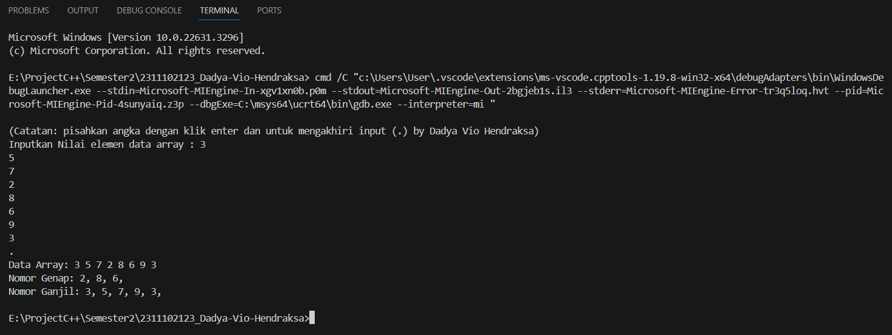
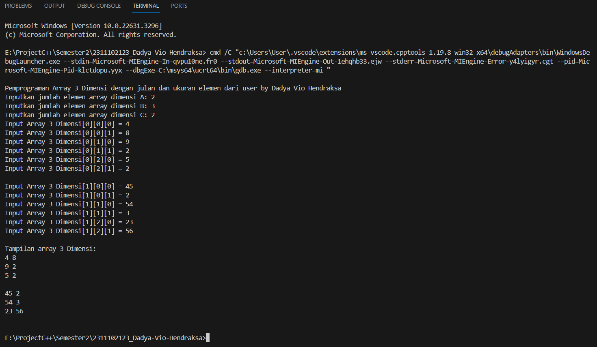
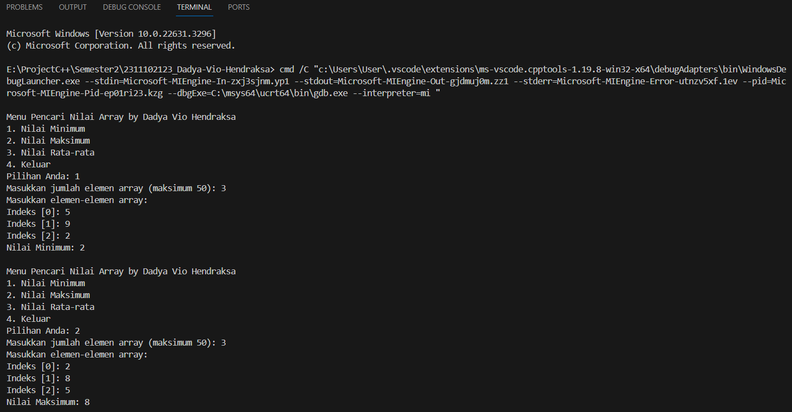

# <h1 align="center">Laporan Praktikum Modul 12 - ARRAY</h1>
<p align="center">Dadya Vio Hendraksa - 2311102123</p>

## Dasar Teori

Tipe data mengacu pada jenis nilai yang dapat disimpan dan digunakan dalam variabel atau ekspresi pada program komputer. Setiap tipe data memiliki karakteristik unik, termasuk rentang nilai yang dapat diwakili, besarnya ruang memori yang dibutuhkan, serta operasi yang dapat diterapkan pada nilai tersebut. Berikut ini adalah tpe data yang umum digunakan dalam C++:

1. Tipe Data Primitif<br/>
Tipe data yang didefinisikan oleh sistem disebut tipe data primitif. Tipe data primitif yang disediakan oleh banyak bahasa pemrograman adalah: int, float, char, double, bool, dll. Jumlah bit yang dialokasikan untuk setiap tipe data primitif tergantung pada bahasa pemrograman, kompiler, dan sistem operasi. Untuk tipe data primitif yang sama, bahasa yang berbeda dapat menggunakan ukuran yang berbeda. Tergantung pada ukuran tipe data, nilai total yang tersedia (domain) juga akan berubah.

2. Tipe Data Abstrak<br/>
Struktur data dengan operasinya dan Kita menyebutnya Tipe Data Abstrak (ADT). ADT yang umum digunakan meliputi: Linked Lists, Stacks, Queues, Priority Queues, Binary Trees, Dictionaries, Disjoint Sets (Union and Find), Hash Tables, Graphs, dan banyak lainnya. Misalnya, stack menggunakan mekanisme LIFO (Last-In-First-Out) saat menyimpan data dalam struktur data. Elemen terakhir yang dimasukkan ke dalam tumpukan adalah elemen pertama yang dihapus. Operasi umum itu adalah: membuat tumpukan, mendorong elemen ke tumpukan, mengeluarkan elemen dari tumpukan, menemukan bagian atas tumpukan saat ini, menemukan jumlah elemen dalam tumpukan, dll. Maka dari itu, sebuah ADT memiliki dua bagian:
   - Deklarasi data
   - Deklarasi operasi<br/>

3. Tipe Data Koleksi<br/>
Tipe data koleksi (Collection Data Type) merujuk pada jenis data yang dirancang untuk menampung sejumlah elemen atau nilai dalam satu kesatuan. Fungsi utama tipe data ini adalah untuk menggabungkan dan mengorganisir beberapa nilai ke dalam satu struktur atau variabel.
   - Array yaitu strucktur data statis yang menyimpan elemen yang tipe datanya sama dan dimulai dari indeks 0.
   - Vector merupakan struktur data dinamis yang menyimpan elemen dengant tipe data yang sama. Akan tetapi, keunggulannya yaitu dapat mengubah ukuran sesuai dengan elemen yang disimpannya sehingga dapat fleksibel.
   - Map merupakan fungsi yang seperti array akan tetapi dapat memiliki elemen yang berbeda tipe data yang dapat diakses menggunakan tipe data kunci. Sehingga memiliki efisiensi dan kecepatan dalam aksesnya.

## Guided 

### 1. Program Input Array Tiga Dimensi

```C++
#include <iostream>

using namespace std;
// PROGRAM INPUT ARRAY 3 DIMENSI
int main() {
  // Deklarasi array
  int arr[2][3][3];
  // Input elemen
  for (int x = 0; x < 2; x++) {
    for (int y = 0; y < 3; y++) {
      for (int z = 0; z < 3; z++) {
        cout << "Input Array[" << x << "][" << y << "][" <<
          z << "] = ";
        cin >> arr[x][y][z];
      }
    }
    cout << endl;
  }
  // Output Array
  for (int x = 0; x < 2; x++) {
    for (int y = 0; y < 3; y++) {
      for (int z = 0; z < 3; z++) {
        cout << "Data Array[" << x << "][" << y << "][" << z <<
          "] = " << arr[x][y][z] << endl;
      }
    }
  }
  cout << endl;
  // Tampilan array
  for (int x = 0; x < 2; x++) {
    for (int y = 0; y < 3; y++) {
      for (int z = 0; z < 3; z++) {
        cout << arr[x][y][z] << ends;
      }
      cout << endl;
    }
    cout << endl;
  }
}
```
Program diatas ini merupakan 4 dari operasi aritmatika dasar yaitu penambahan (+), pengurangan (-), Perkalian (*), dan pembagian (/). Pertama user akan memilih operator yang akan digunakan pada cin dan berguna juga untuk memilih switch casenya. Setelahnya user diminta untuk memasukkan 2 angka sebagai imput untuk dapat melakukan operasi aritmatika yang dipilih. Maka, program diatas memiliki 2 tipe data primitif yang digunakan yaitu char untuk pemilihan operator dan float untuk input angka.

### 2. Program Mencari Nilai Maksimal pada Array

```C++
#include <iostream>

using namespace std;
int main() {
  int maks, a, i = 1, lokasi;
  cout << "Masukkan panjang array: ";
  cin >> a;
  int array[a];
  cout << "Masukkan " << a << " angka\n";
  for (i = 0; i < a; i++) {
    cout << "Array ke-" << (i) << ": ";
    cin >> array[i];
  }
  maks = array[0];
  for (i = 0; i < a; i++) {
    if (array[i] > maks) {
      maks = array[i];
      lokasi = i;
    }
  }
  cout << "Nilai maksimum adalah " << maks << " berada di Array ke " << lokasi << endl;
}
```
Program diatas ini menggunakan tipe data struct yang bersifat abstrak, sehingga bisa berisi banyak tipe data dan memiliki nilai beragam tipe data. Karena struct bersifat public maka dapat diakses siapapun, diatas ini dapat dilihat struct nya memiliki 3 nilai yaitu char name [50], char address[100], dan int umur. Sehingga pada fungsi main kita akan mendeklarasikan atau mengisi nilai struct untuk 2 struct yaitu mhs1 dan mhs2.

## Unguided 

### 1. Buatlah program untuk menampilkan Output seperti berikut ini dengan data yang diinputkan oleh user!
(Soal_Unguided-01_Dadya-Vio-H.png)

```C++
/*
Dadya Vio Hendraksa - 2311102123
*/

#include <iostream>

using namespace std;

int main() {
  // Deklarasi variabel untuk menyimpan nilai data array yang diinputkan pengguna
  int data_array_2123[50], size_2123 = 0;

  // Melakukan Input nilai data array dari pengguna
  cout << "\n(Catatan: pisahkan angka dengan klik enter dan untuk mengakhiri input (.) by Dadya Vio Hendraksa)" << endl;
  cout << "Inputkan Nilai elemen data array : ";
  while (cin >> data_array_2123[size_2123]) {
    size_2123++;
  }

  // Deklarasi variabel max menampung nilai elemen array
  bool genap[50] = {false}, ganjil[50] = {false};

  // Melakukan perulangan untuk setiap elemen dalam array yang telah diinputkan
  for (int i = 0; i < size_2123; i++) 
  { if (data_array_2123[i] % 2 == 0) // Memeriksa bilangan genap pada nilai array yang diinputkan
    {   genap[i] = true;} 
    else { ganjil[i] = true;} // Jika tidak sesuai bilangan genap maka akan masuk ke bilangan ganjil
  }

  // Menggunakan perulangan for dan percabangan untuk menampilkan nilai(Output) yang telah diinput tadi
  cout << "Data Array: "; // Menampilkan data array yang dinputkan pengguna
  for (int i = 0; i < size_2123; i++) 
  { cout << data_array_2123[i] << " ";}
  cout << endl;

  cout << "Nomor Genap: "; // Menampilkan data array genap
  for (int i = 0; i < size_2123; i++) 
  { if (genap[i]) 
    {   cout << data_array_2123[i] << ", ";}
  }
  cout << endl;

  cout << "Nomor Ganjil: "; // Menampilkan data array ganjil
  for (int i = 0; i < size_2123; i++) 
  { if (ganjil[i]) 
    {   cout << data_array_2123[i] << ", ";}
  }
  cout << endl;

  return 0;
}
```
#### Output:

Program diatas ini berguna untuk melakukan konversi bilangan. pertama disini saya menggunakan library cmath untuk memudahkan dalam operasi matematikanya. Saya menggunakan 2 data primitif yaitu tipe data int dan long. Karena harus menggunakan 2 fungsi, maka saya menggunakan 1 prosedur yang berisi menu pilihan dan input untuk menu yang terhubung dengan switch case yang ada, 1 fungsi untuk konversi desimal ke biner yang isinya yaitu operasi matematika untuk konversi, dan 1 fungsi untuk konversi biner ke desimal yang isinya yaitu operasi matematika untuk konversi juga. Selanjutnya di fungsi main kita gunakan do while menu yang ada jika tidak menginputkan 0, yang dimana didalamnya ada switch case dengan pemanggilan nilai yang ada pada 2 fungsi konversi.

Kesimpulan Tipe Data Primitif:<br/>
Kesimpulan yang dapat diambil tipe data primitif berguna untuk menyimpan nilai sederhana, akan tetapi tipe data primitif ini merupakan sebuah bagian yang sangat penting untuk membangun sebuah program awal yang baik. maka, disini pengguna dapat memiliki kemudahan untuk memahami program yang ada tipe data primitif ini.

### 2. Buatlah program Input array tiga dimensi (seperti pada guided) tetapi jumlah atau ukuran elemennya diinputkan oleh user!

```C++
/*
Dadya Vio Hendraksa - 2311102123
*/

#include <iostream>

using namespace std;

int main() {
    int A_2123, B_2123, C_2123; // Deklarasi variabel 3 dimensi isi array

    // Input user ukuran array tiga dimensi per dimensi
    cout << "\nPemprograman Array 3 Dimensi dengan julan dan ukuran elemen dari user by Dadya Vio Hendraksa" << endl;
    cout << "Inputkan jumlah elemen array dimensi A: ";
    cin >> A_2123; // input ukuran elemen array nilai A
    cout << "Inputkan jumlah elemen array dimensi B: ";
    cin >> B_2123; // input ukuran elemen array nilai B
    cout << "Inputkan jumlah elemen array dimensi C: ";
    cin >> C_2123; // input ukuran elemen array nilai C

    // Deklarasi dan inisialisasi 3 dimensi is array
    int arr[A_2123][B_2123][C_2123];

    // Input elemen array yang telah ditetapkan
    for (int a = 0; a < A_2123; a++)  // Perulangan untuk input elemen array A
    {   for (int b = 0; b < B_2123; b++) // Perulangan untuk input elemen array B
        {   for (int c = 0; c < C_2123; c++) // Perulangan untuk input elemen array C
            {   cout << "Input Array 3 Dimensi[" << a << "][" << b << "][" << c << "] = ";
                cin >> arr[a][b][c];}
        }
        cout << endl;
    }

    // Menampilkan inputan elemen array yang telah di isi user
    cout << "Tampilan array 3 Dimensi:" << endl;
    for (int a = 0; a < A_2123; a++) // Perulangan untuk menampilkan input elemen array A
    {    for (int b = 0; b < B_2123; b++) // Perulangan untuk menampilkan input elemen array B
        {   for (int c = 0; c < C_2123; c++) // Perulangan untuk menampilkan input elemen array C
            {   cout << arr[a][b][c] << " ";}
            cout << endl;
        }
        cout << endl;
    }

    return 0;
}
```
#### Output:

Program diatas berunga untuk mengoutputkan tipe data abstrak yaitu class dan struct. Dimana, terdapat sebuah struct Creator_2123 yang memiliki nilai string nama, negara, pekerjaan, dan int umur. Lalu terdapat juga sebuah class yang terdapat nilai yaitu string nama karya, genre, dan int tahun terbit yang masih bersifat private. Kemudian nilai private pada class ini diatur untuk nilai awalnya dan mengambil nilai private yang ada, pada sebuah class publicnya. maka nilai yang ada distruct akan di isi dengan "Akira Toriyama", "Jepang", "Mangaka", 68. Nilai pada class akan di isi dengan "Dragon Ball", "Fantasi", 1984. Terakhir pada fungsi main akan di deklarasikan dan menjadikan output untuk nilai struct dan classnya.

A. Class<br/>
Class disini sudah diketahui bahwa memiliki sifat private yang tidak sembarang user dapat mengakses dari keluar class. Class juga memiliki sifat untuk penggabungan data dan operasinya menjadi satu kesatuan. Di class kita tidak dapat membuat inisial variabel saat deklarasi. Sehingga membutuhkan pada fungsi public untuk private data yang ada sehingga harus mengatur nilai awal dan mengambil nilai atribut private.

B. Struct<br/>
Struct merupakan sebuah jenis khusus dari class, Pada dasarnya anggota class memiliki sifat private. Akan tetapi struct berbeda, struct disini memili sifat sebaliknya yaitu public sehingga dapat diakses dengan bebas. Di dalam struct juga memiliki fungsi yang spesifik yaitu untuk pengelompokan data yang dibuat dengan tipe data yang berlainan pada program.

### 3. Buatlah program menu untuk mencari nilai Maksimum, Minimum dan Nilai rata – rata dari suatu array dengan input yang dimasukan oleh user!

```C++
/*
Dadya Vio Hendraksa - 2311102123
*/

#include <iostream> // Library

using namespace std;

// Fungsi untuk mencari nilai minimum dari array yang telah diinputkan oleh pengguna
int Minimal_2123(int arr[], int size)
{   int nilai_min = arr[0];
        for (int i = 1; i < size; ++i) 
        {   if (arr[i] < nilai_min) 
            {   nilai_min = arr[i];}
        }
    return nilai_min; // mengembalikan nilai dari variabel Minimal_2123
}

// Fungsi untuk mencari nilai maksimum dari array yang telah diinputkan oleh pengguna
int Maksimal_2123(int arr[], int size) 
{   int nilai_max = arr[0];
        for (int i = 1; i < size; ++i) 
        {   if (arr[i] > nilai_max) 
            {   nilai_max = arr[i];}
        }
    return nilai_max; // mengembalikan nilai dari variabel Maksimal_2123
}

// Fungsi untuk mencari nilai rata-rata dari array yang telah diinputkan oleh pengguna
double Rata_2123(int arr[], int size) 
{   double jumlah = 0;
        for (int i = 0; i < size; ++i)
        {   jumlah += arr[i];}
    return jumlah / size; // mengembalikan nilai dari variabel Rata_2123
}

int main() { // Fungsi utama
    const int ukuran_maksimal_2123 = 50; // Batasan jumlah elemen array
    int arr_2123[ukuran_maksimal_2123]; // Array untuk menyimpan elemen-elemen
    int pilih_2123, size_2123; // deklarasi variabel

    do { // Untuk melakukan Looping jika sudah output muncul
        cout << "\nMenu Pencari Nilai Array by Dadya Vio Hendraksa" << endl; // Bagian menu
        cout << "1. Nilai Minimum" << endl;
        cout << "2. Nilai Maksimum" << endl;
        cout << "3. Nilai Rata-rata" << endl;
        cout << "4. Keluar" << endl;
        cout << "Pilihan Anda: ";
        cin >> pilih_2123; // Input menu

        switch (pilih_2123) {
            case 1:
            case 2:
            case 3:
                // Input jumlah elemen array dari pengguna
                cout << "Masukkan jumlah elemen array (maksimum " << ukuran_maksimal_2123 << "): ";
                cin >> size_2123;

                // Cek ukuran array apakah tidak melebihi batas jumlah elemen array
                if (size_2123 <= 0 || size_2123 > ukuran_maksimal_2123) {
                    cout << "Ukuran array tidak valid! Harap masukkan ukuran antara 1 dan " << ukuran_maksimal_2123 << endl;
                    break;
                }

                // Menginputkan nilai elemen-elemen array
                cout << "Masukkan elemen-elemen array:" << endl;
                for (int i = 0; i < size_2123; ++i) {
                    cout << "Indeks [" << i << "]: ";
                    cin >> arr_2123[i];
                }

                // Memproses pilihan pengguna
                switch (pilih_2123) {
                    case 1: // Mencari nilai minimum dan menampilkannya dengan memanggil fungsi Minimal_2123
                        cout << "Nilai Minimum: " << Minimal_2123(arr_2123, size_2123) << endl;
                        break;
                    case 2: // Mencari nilai minimum dan menampilkannya dengan memanggil fungsi Maksimal_2123
                        cout << "Nilai Maksimum: " << Maksimal_2123(arr_2123, size_2123) << endl;
                        break;
                    case 3: // Mencari nilai minimum dan menampilkannya dengan memanggil fungsi Rata_2123
                        cout << "Nilai Rata-rata: " << Rata_2123(arr_2123, size_2123) << endl;
                        break;
                }
                break;
            case 4: // Jika memilih 4 maka akan keluar dari program ini
                cout << "Anda telah keluar dari program ini. Terima kasih." << endl;
                break;
            default: // Bagian ini dijalankan jika input jumlah ukuran array lebih dari batas maksimal
                cout << "Input junlah elemen array salah, Tolong inputkan angka yang sesuai." << endl;
                break;
        }

    } while (pilih_2123 != 4); // Input selain 4 maka akan melakukan perulangan

    return 0;
}
```
#### Output:


Program di ditas ini menggunakan fungsi map yang dapat mengisi nilai dengan tipe data berbeda. Seperti program ini dengan key nya tipe data int dan isi nilai elemennya dengan tipe data string. Disis saya melakukan map untuk nilai mutu dan nilai bobot di ITTP  dengan adanya 7 elemen yang di dkelarasikan dari nilai 4 sampai 0 yang inisial A sampai E. Bagian akhir seperti biasa kita menggunakan for untuk melakukan perulangan semua elemen yang ada dengan kondisinya.  Sehingga akan beroutput semua elemen yang ada pada map.

Perbedaan Map dan Array
1. Pengubahan Elemen
    - Array untuk perubahan elemn sangat tidak dinamis, karena tidak dapat mengubah salah satu elemen saja.
    - Map lebih fleksibel dan dinamis karena dapat mengubah salah satu elemen saja.
2. Ukuran
    - Array ukurannya sudah ditentukan saat pembuatanya/deklarasinya dan tidak bisa diubah.
    - Map ukurannya bisa diubah lebih kecil atau lebih besar tergantung dengan banyak elemen yang ada.
3. Tipe Data
    - Array hanya bisa memiliki elemen dengan tipe data yang sama.
    - Map dapat memiliki elemen yang tipe datanya berbeda dalam satu kelompok data.
4. Penggunaan
    - Array menggunakan pengelompokkan data dengan indeks yang sudah tetap yaitu dari indeks 0.
    - Map lebih fleksibel karena pengelompokkannya menggunakan nilai kunci yang telah kita buat, jadi tidak ada ketetapan.


## Kesimpulan
Tipe data C++ seperti tipe data primitif, abstrak, dan koleksi merupakan sebuah kesatuan yang sangat penting dalam program C++. Seperti semua variabel yang ada pasti memiliki tipe data untuk memberikan informasi kepada pengguna supaya dapat membuat program yang se efisien dan secepat mungkin dalam operasinya.

## Referensi
[1] Shofyann Hanief,et al., Konsep Algoritme dan Aplikasinya dalam Bahasa Pemrograman C++. Yogyakarta: Andi Publisher, 2020. <br/>
[2] Joseph Teguh Santoso., STRUKTUR DATA dan ALGORITMA (Bagian 1). Semarang: Yayasan Prima Agus Teknik, 2021.