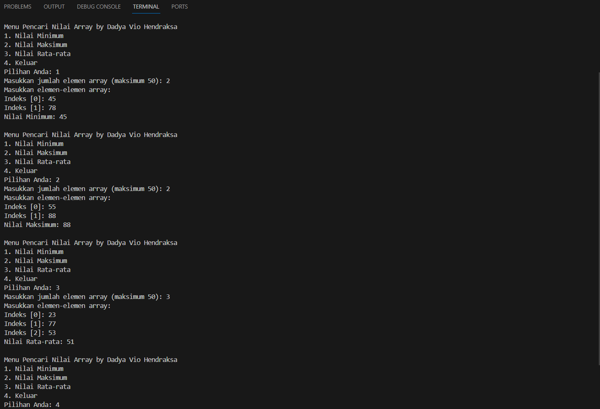

# <h1 align="center">Laporan Praktikum Modul 2 - ARRAY</h1>
<p align="center">Dadya Vio Hendraksa - 2311102123</p>

## Dasar Teori

Array merupakan struktur data yang paling dasar. Satu blok memori dialokasikan untuk seluruh array untuk menampung elemen-elemen array.  Elemen  array  dapat  diakses  dalam  waktu  yang  konstan  dengan  menggunakan  indeks elemen tertentu sebagai subskrip. Untuk  mengakses  elemen  array,  alamat  elemen  dihitung  sebagai  offset  dari  alamat dasar   array   dan   satu   perkalian   diperlukan   untuk   menghitung   apa   yang   seharusnya ditambahkan  ke  alamat  dasar  untuk  mendapatkan  alamat  memori  elemen. 

Keuntungan dari Array<br/>
   - Sederhana dan mudah digunakan
   - Akses lebih cepat ke elemen (akses konstan)<br/>

Kekurangan Array<br/>
   - Mengalokasikan  semua  memori  yang  dibutuhkan  di  depan  dan  membuang-buang ruang memori untuk indeks dalam array yang kosong.
   - Ukuran    tetap:    Ukuran    larik    bersifat    statis    (tentukan    ukuran    larik    sebelum menggunakannya).
   - Alokasi  satu  blok:  Untuk  mengalokasikan  array  itu  sendiri  di  awal,  terkadang  tidak mungkin  untuk  mendapatkan  memori  untuk  array  yang  lengkap(jika  ukuran  array besar).
   - Penyisipan berbasis posisi kompleks: Untuk menyisipkan elemen pada posisi tertentu, kita  mungkin  perlu  menggeser  elemen  yang  ada.  Ini  akan  membuat  posisi  bagi  kita untuk memasukkan elemen baru pada posisi yang diinginkan. Jika posisi di mana kita ingin menambahkan elemen di awal, maka operasi pemindahan lebih mahal.

1. Array 1 Dimensi<br/>
Array satu dimensi adalah tipe variabel yang terdiri dari kumpulan data dengan tipe yang sama yang disusun dalam satu baris atau satu dimensi. Setiap elemen di dalam array memiliki sebuah indeks atau nomor yang digunakan untuk mengakses elemen tersebut. Indeks dimulai dari 0 dan berakhir pada jumlah elemen dikurangi satu. Array satu dimensi merupakan kumpulan data yang disusun dalam satu baris atau kolom, terdiri dari elemen-elemen dengan tipe yang sama. Setiap elemen dalam array satu dimensi dapat diakses menggunakan indeksnya. Array satu dimensi sering digunakan untuk menampung sejumlah elemen dengan tipe data yang sama, seperti angka, nilai, atau teks. Penggunaan array memungkinkan penyimpanan dan akses data secara terstruktur dalam satu variabel, yang lebih efisien daripada menggunakan sejumlah variabel terpisah.

2. Array 2 Dimensi<br/>
Array dua dimensi adalah struktur data yang terdiri dari baris dan kolom, di mana setiap elemen dapat diakses menggunakan indeks yang terdapat di dalamnya. Dalam array dua dimensi, setiap elemen memiliki dua indeks, yaitu indeks baris dan indeks kolom. Indeks baris menunjukkan posisi elemen dalam baris, sementara indeks kolom menunjukkan posisi elemen dalam kolom. Jadi, array dua dimensi digunakan untuk menyimpan data yang terorganisir dalam bentuk tabel dengan baris dan kolom, atau untuk data yang memiliki struktur yang lebih kompleks, seperti matriks.

3. Array 3 Dimensi<br/>
Array tiga dimensi adalah tipe array yang terdiri dari satu baris, satu kolom, dan beberapa lapisan. Array tiga dimensi sering digunakan untuk menyimpan data dalam bentuk tabel yang meliputi baris, kolom, dan halaman, atau untuk menyimpan data yang memiliki struktur yang kompleks seperti matriks, sehingga memiliki ukuran memori yang lebih besar. Ini memungkinkan penyimpanan dan akses data yang terstruktur dalam satu variabel, meningkatkan efisiensi dalam pengelolaan data. Array tiga dimensi sering digunakan untuk menyimpan data dalam bentuk tabel yang meliputi baris, kolom, dan halaman, atau untuk menyimpan data yang memiliki struktur yang kompleks seperti matriks. Untuk mengakses elemen dalam array tiga dimensi, kita dapat menggunakan perulangan nested.

## Guided 

### 1. Program Input Array Tiga Dimensi

```C++
#include <iostream>

using namespace std;
// PROGRAM INPUT ARRAY 3 DIMENSI
int main() {
  // Deklarasi array
  int arr[2][3][3];
  // Input elemen
  for (int x = 0; x < 2; x++) {
    for (int y = 0; y < 3; y++) {
      for (int z = 0; z < 3; z++) {
        cout << "Input Array[" << x << "][" << y << "][" <<
          z << "] = ";
        cin >> arr[x][y][z];
      }
    }
    cout << endl;
  }
  // Output Array
  for (int x = 0; x < 2; x++) {
    for (int y = 0; y < 3; y++) {
      for (int z = 0; z < 3; z++) {
        cout << "Data Array[" << x << "][" << y << "][" << z <<
          "] = " << arr[x][y][z] << endl;
      }
    }
  }
  cout << endl;
  // Tampilan array
  for (int x = 0; x < 2; x++) {
    for (int y = 0; y < 3; y++) {
      for (int z = 0; z < 3; z++) {
        cout << arr[x][y][z] << ends;
      }
      cout << endl;
    }
    cout << endl;
  }
}
```
Program diatas ini merupakan input array 3 dimensi. Dimana user akan  menginputkan nilai elemen setiap bari dan kolom yang ada. Dimana disini dideklarasikan array arr[2][3][3]; maka kita akan input sesuai kondisi yang ada pada program tersebut. Setelahnya input array ini akan ditampilkan menjadi data array untuk melihat apakah benar semua nilai inputnya. Terakhir yaitu menampilkan susunan array yang ada pada data arry yang tadi kita inputkan. Disini program menggunakan nested for 3 kali.

### 2. Program Mencari Nilai Maksimal pada Array

```C++
#include <iostream>

using namespace std;
int main() {
  int maks, a, i = 1, lokasi;
  cout << "Masukkan panjang array: ";
  cin >> a;
  int array[a];
  cout << "Masukkan " << a << " angka\n";
  for (i = 0; i < a; i++) {
    cout << "Array ke-" << (i) << ": ";
    cin >> array[i];
  }
  maks = array[0];
  for (i = 0; i < a; i++) {
    if (array[i] > maks) {
      maks = array[i];
      lokasi = i;
    }
  }
  cout << "Nilai maksimum adalah " << maks << " berada di Array ke " << lokasi << endl;
}
```
Program diatas ini berguna untuk mencari nilai maksimal dari elemen array yang telah diinputkan user. Jadi program ini hanya menggunakan array 1 dimensi maka tidak akan menggunakan nested for. Pertama user akan diminta untuk menentukan penjang untuk elemen array nya. Contoh kita input 3 maka selanjutnya kita akan mengisi nilai elemen array 1 dimensi tersebut dari indeks 0 sampai indeks 2 yang kemudian akan dicari nilai max dari elemen menggunakan percabangan if di dalam for. Terakhir tinggal memanggil nilai maks yang telah ditemukan.

## Unguided 

### 1. Buatlah program untuk menampilkan Output seperti berikut ini dengan data yang diinputkan oleh user!


```C++
/*
Dadya Vio Hendraksa - 2311102123
*/

#include <iostream>

using namespace std;

int main() {
  // Deklarasi variabel untuk menyimpan nilai data array yang diinputkan pengguna
  int data_array_2123[50], size_2123 = 0;

  // Melakukan Input nilai data array dari pengguna
  cout << "\n(Catatan: pisahkan angka dengan klik enter dan untuk mengakhiri input (.) by Dadya Vio Hendraksa)" << endl;
  cout << "Inputkan Nilai elemen data array : ";
  while (cin >> data_array_2123[size_2123]) {
    size_2123++;
  }

  // Deklarasi variabel max menampung nilai elemen array
  bool genap[50] = {false}, ganjil[50] = {false};

  // Melakukan perulangan untuk setiap elemen dalam array yang telah diinputkan
  for (int i = 0; i < size_2123; i++) 
  { if (data_array_2123[i] % 2 == 0) // Memeriksa bilangan genap pada nilai array yang diinputkan
    {   genap[i] = true;} 
    else { ganjil[i] = true;} // Jika tidak sesuai bilangan genap maka akan masuk ke bilangan ganjil
  }

  // Menggunakan perulangan for dan percabangan untuk menampilkan nilai(Output) yang telah diinput tadi
  cout << "Data Array: "; // Menampilkan data array yang dinputkan pengguna
  for (int i = 0; i < size_2123; i++) 
  { cout << data_array_2123[i] << " ";}
  cout << endl;

  cout << "Nomor Genap: "; // Menampilkan data array genap
  for (int i = 0; i < size_2123; i++) 
  { if (genap[i]) 
    {   cout << data_array_2123[i] << ", ";}
  }
  cout << endl;

  cout << "Nomor Ganjil: "; // Menampilkan data array ganjil
  for (int i = 0; i < size_2123; i++) 
  { if (ganjil[i]) 
    {   cout << data_array_2123[i] << ", ";}
  }
  cout << endl;

  return 0;
}
```
#### Output:

Program ini hanya menggunakan array 1 dimensi dengan batas max elemen 50, jadi pertama user akan langsung diminta untuk mengisi nilai elemenya, jika sudah dapat menginput tanda (.) untuk melanjutkan program. Di program terlihat bahwa batas max angka genap dan ganjil yaitu 50. Kemudian kita menggunakan looping for yang didalamnya ada percabangan if-else untuk memeriksa dan memilah elemen array yang kita masukkan menjadi angka genap dan angka ganjil. Maka selanjutnya kita buat looping for yang memperhatikan syaratnya juga untuk menampilkan data array yang telah kita masukkan semuanya. Selanjutnya yaitu menampilkan elemen array yang ber-angka genap dimana disini saya menggunakan looping for untuk menampilkan nilai dan percabangan if untuk memanggil nilai genapnya. Lanjut  untuk menampilkan elemen array yang angka ganjil juga sama menggunakan looping for untuk menampilkan nilai dan percabangan if untuk memanggil nilai ganjil dari if-else pemisahan diawal tadi.

### 2. Buatlah program Input array tiga dimensi (seperti pada guided) tetapi jumlah atau ukuran elemennya diinputkan oleh user!

```C++
/*
Dadya Vio Hendraksa - 2311102123
*/

#include <iostream>

using namespace std;

int main() {
    int A_2123, B_2123, C_2123; // Deklarasi variabel 3 dimensi isi array

    // Input user ukuran array tiga dimensi per dimensi
    cout << "\nPemprograman Array 3 Dimensi dengan julan dan ukuran elemen dari user by Dadya Vio Hendraksa" << endl;
    cout << "Inputkan jumlah elemen array dimensi A: ";
    cin >> A_2123; // input ukuran elemen array nilai A
    cout << "Inputkan jumlah elemen array dimensi B: ";
    cin >> B_2123; // input ukuran elemen array nilai B
    cout << "Inputkan jumlah elemen array dimensi C: ";
    cin >> C_2123; // input ukuran elemen array nilai C

    // Deklarasi dan inisialisasi 3 dimensi isi array
    int arr[A_2123][B_2123][C_2123];

    // Input elemen array yang telah ditetapkan
    for (int a = 0; a < A_2123; a++)  // Perulangan untuk input elemen array A
    {   for (int b = 0; b < B_2123; b++) // Perulangan untuk input elemen array B
        {   for (int c = 0; c < C_2123; c++) // Perulangan untuk input elemen array C
            {   cout << "Input Array 3 Dimensi[" << a << "][" << b << "][" << c << "] = ";
                cin >> arr[a][b][c];}
        }
        cout << endl;
    }

    // Menampilkan inputan elemen array yang telah di isi user
    cout << "Tampilan array 3 Dimensi:" << endl;
    for (int a = 0; a < A_2123; a++) // Perulangan untuk menampilkan input elemen array A
    {    for (int b = 0; b < B_2123; b++) // Perulangan untuk menampilkan input elemen array B
        {   for (int c = 0; c < C_2123; c++) // Perulangan untuk menampilkan input elemen array C
            {   cout << arr[a][b][c] << " ";}
            cout << endl;
        }
        cout << endl;
    }

    return 0;
}
```
#### Output:

Program ini menggunakan 3 dimensi yang dimana kita harus input untuk jumlah elemen yang akan kita isi nantinya. disini saya menggunakan A, B, C untuk inisial dimensinya. pertama user akan diminta untuk mengisi jumlah elemen dari A, B, C. yang kemudian kita sebagai user akan mengisi nilai elemen dengan menggunakan angka disinilah kita menggunakan nested for yang sebanyak 3x karena array nya 3 dimensi yaitu nested A, B, C untuk menginput elemen tiap dimensinya, baris dan kolommnya. Selanjutnya yaitu menampilkan array 3 dimensi yang telah kita buat tadi seperti sebelumnya kita menggunakan nested for yang sebanyak 3x karena array nya 3 dimensi yaitu nested A, B, C untuk menampilkannya elemen tiap baris dan kolomnya. Secara sekilas seperti guided 1 akan tetapi disini kita menentukan jumlah elemen array nya.

### 3. Buatlah program menu untuk mencari nilai Maksimum, Minimum dan Nilai rata – rata dari suatu array dengan input yang dimasukan oleh user!

```C++
/*
Dadya Vio Hendraksa - 2311102123
*/

#include <iostream> // Library

using namespace std;

// Fungsi untuk mencari nilai minimum dari array yang telah diinputkan oleh pengguna
int Minimal_2123(int arr[], int size)
{   int nilai_min = arr[0];
        for (int i = 1; i < size; ++i) 
        {   if (arr[i] < nilai_min) 
            {   nilai_min = arr[i];}
        }
    return nilai_min; // mengembalikan nilai dari variabel Minimal_2123
}

// Fungsi untuk mencari nilai maksimum dari array yang telah diinputkan oleh pengguna
int Maksimal_2123(int arr[], int size) 
{   int nilai_max = arr[0];
        for (int i = 1; i < size; ++i) 
        {   if (arr[i] > nilai_max) 
            {   nilai_max = arr[i];}
        }
    return nilai_max; // mengembalikan nilai dari variabel Maksimal_2123
}

// Fungsi untuk mencari nilai rata-rata dari array yang telah diinputkan oleh pengguna
double Rata_2123(int arr[], int size) 
{   double jumlah = 0;
        for (int i = 0; i < size; ++i)
        {   jumlah += arr[i];}
    return jumlah / size; // mengembalikan nilai dari variabel Rata_2123
}

int main() { // Fungsi utama
    const int ukuran_maksimal_2123 = 50; // Batasan jumlah elemen array
    int arr_2123[ukuran_maksimal_2123]; // Array untuk menyimpan elemen-elemen
    int pilih_2123, size_2123; // deklarasi variabel

    do { // Untuk melakukan Looping jika sudah output muncul
        cout << "\nMenu Pencari Nilai Array by Dadya Vio Hendraksa" << endl; // Bagian menu
        cout << "1. Nilai Minimum" << endl;
        cout << "2. Nilai Maksimum" << endl;
        cout << "3. Nilai Rata-rata" << endl;
        cout << "4. Keluar" << endl;
        cout << "Pilihan Anda: ";
        cin >> pilih_2123; // Input menu

        switch (pilih_2123) {
            case 1:
            case 2:
            case 3:
                // Input jumlah elemen array dari pengguna
                cout << "Masukkan jumlah elemen array (maksimum " << ukuran_maksimal_2123 << "): ";
                cin >> size_2123;

                // Cek ukuran array apakah tidak melebihi batas jumlah elemen array
                if (size_2123 <= 0 || size_2123 > ukuran_maksimal_2123) {
                    cout << "Ukuran array tidak valid! Harap masukkan ukuran antara 1 dan " << ukuran_maksimal_2123 << endl;
                    break;
                }

                // Menginputkan nilai elemen-elemen array
                cout << "Masukkan elemen-elemen array:" << endl;
                for (int i = 0; i < size_2123; ++i) {
                    cout << "Indeks [" << i << "]: ";
                    cin >> arr_2123[i];
                }

                // Memproses pilihan pengguna
                switch (pilih_2123) {
                    case 1: // Mencari nilai minimum dan menampilkannya dengan memanggil fungsi Minimal_2123
                        cout << "Nilai Minimum: " << Minimal_2123(arr_2123, size_2123) << endl;
                        break;
                    case 2: // Mencari nilai minimum dan menampilkannya dengan memanggil fungsi Maksimal_2123
                        cout << "Nilai Maksimum: " << Maksimal_2123(arr_2123, size_2123) << endl;
                        break;
                    case 3: // Mencari nilai minimum dan menampilkannya dengan memanggil fungsi Rata_2123
                        cout << "Nilai Rata-rata: " << Rata_2123(arr_2123, size_2123) << endl;
                        break;
                }
                break;
            case 4: // Jika memilih 4 maka akan keluar dari program ini
                cout << "Anda telah keluar dari program ini. Terima kasih." << endl;
                break;
            default: // Bagian ini dijalankan jika input jumlah ukuran array lebih dari batas maksimal
                cout << "Input junlah elemen array salah, Tolong inputkan angka yang sesuai." << endl;
                break;
        }

    } while (pilih_2123 != 4); // Input selain 4 maka akan melakukan perulangan

    return 0;
}
```
#### Output:

Program ini berguna untuk mencari min, max, dan median dari array yang diinput user. Saya disini menggunakan 3 fungsi yaitu Minimal_2123, Maksimal_2123, Rata_2123 untuk memudahkan dalam pemprosesan dan penghitungan mencari min, max, dan median dari array dengan menggunakan looping for dan pecabangan if-else. Selanjutnya pada Fungsi utama main pertama kita deklarasikan array, jumlah max elemen array dan variabel pilih_2123, size_2123. Kemudian disini saya menggunakan do while untuk melakukan perulangan menunya, didalam nya terdapat menu untuk memilih mencari nilai apa yang kita inginkan. <br/>
Kemudian ada switch pertama dari case 1 samapai case 4. untuk case 1 sampai case 3 disini saya jadikan 1 karena ada beberapa kesamaan untuk input jumlah elemen array, cek ukuran jumlah elemen array dengan perulangan if, dan input nilai elemen array dengam menggunakan looping for. Selanjutnya terdapat switch kedua didalam case 1-3 switch pertama yang berguna untuk memanggil nilai dari 3 fungsi yang kita buat tadi diluat fungsi utama main yang harusnya teroutput sesuai dengan pilihan menu yang dipilih user. Unuk penjelasan case 4 dan default switch pertama yaitu case 4 untuk keluar dari program ini sedangkan default untuk looping jika user input jumlah elemen arraynya salah.
## Kesimpulan
Array sangat membantu dalam efisiensi program karena dapat mempermudah dalam menyimpan dan mengakses data yang terkumpul dalam satu variabel, dari pada menggunakan banyak variabel. Dengan adanya pengurutan data indeks yang tetap dari 0 ini memberikan kemudahan dalam membaca alamat elemen tersebut. Akan tetapi perlu diketahui bahwa menggunakan array yang lebih dari 2 dimensi tidaklah efisien. Semua tergantung program yang akan dibuat dan pembangunan sturuktur data dan algoritma yang digunakan sebelum melakukan pemprograman.

## Referensi
[1] Shofyann Hanief,et al., Konsep Algoritme dan Aplikasinya dalam Bahasa Pemrograman C++. Yogyakarta: Andi Publisher, 2020. <br/>
[2] Joseph Teguh Santoso., STRUKTUR DATA dan ALGORITMA (Bagian 1). Semarang: Yayasan Prima Agus Teknik, 2021.