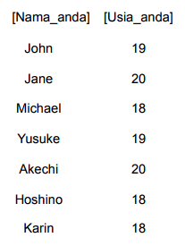
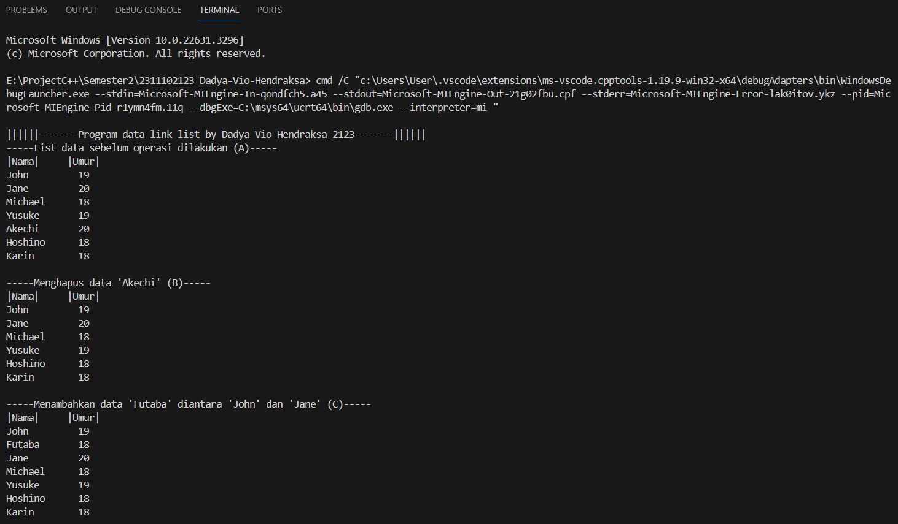
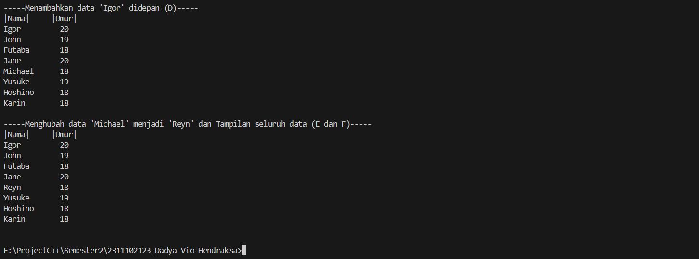
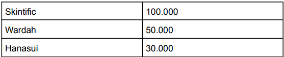
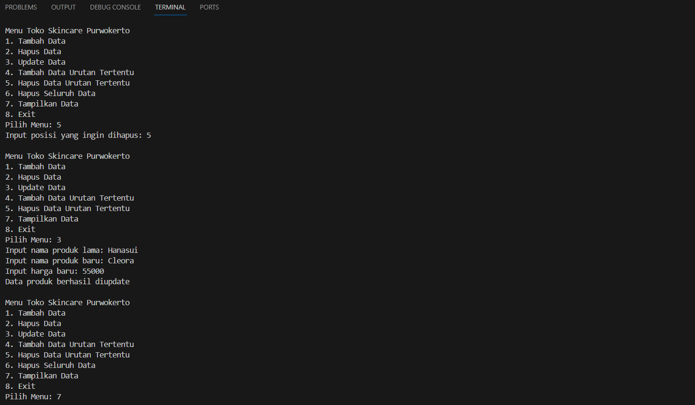
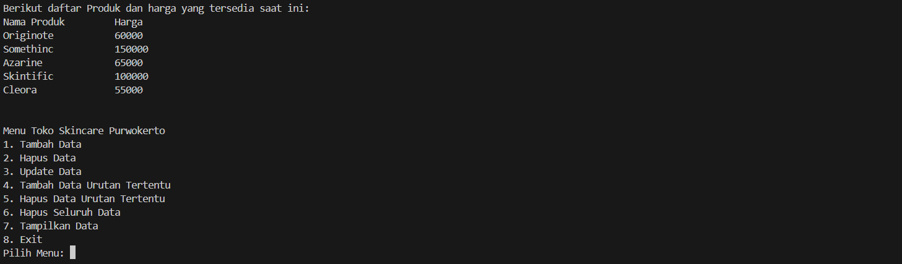

# <h1 align="center">Laporan Praktikum Modul 3 - LINKED LIST</h1>
<p align="center">Dadya Vio Hendraksa - 2311102123</p>

## Dasar Teori

Daftar tertaut/Linked List adalah struktur data yang digunakan untuk menyimpan kumpulan data. 
Daftar tertaut memiliki properti berikut:<br/>
• Elemen yang berurutan dihubungkan oleh pointer<br/>
• Elemen terakhir menunjuk ke NULL<br/>
• Dapat tumbuh atau menyusut dalam ukuran selama eksekusi program<br/>
• Dapat dibuat selama diperlukan (sampai memori sistem habis)<br/>
• Tidak membuang-buang ruang memori (tetapi membutuhkan memori ekstra untuk
pointer). Ini mengalokasikan memori saat daftar bertambah.

Keuntungan Linked List<br/>
Daftar tertaut/Liinked List memiliki kelebihan dan kekurangan. Keuntungan dari daftar tertaut adalah mereka dapat diperluas dalam waktu yang konstan. Untuk membuat array, kita harus mengalokasikan memori untuk sejumlah elemen tertentu. Untuk menambahkan lebih banyak elemen ke array saat penuh, kita harus membuat array baru dan menyalin array lama ke dalam array baru. Ini bisa memakan banyak waktu. Dengan daftar tertaut, kita dapat memulai dengan ruang hanya untuk satu elemen yang dialokasikan dan menambahkan elemen baru dengan mudah tanpa perlu melakukan penyalinan dan pengalokasian ulang.

Kerugian Linked List<br/>
Ada sejumlah masalah dengan daftar tertaut. Kerugian utama dari daftar tertaut adalah waktu akses ke elemen individual. Meskipun alokasi penyimpanan dinamis merupakan keuntungan besar, overhead dengan menyimpan dan mengambil data dapat membuat perbedaan besar. Terkadang daftar tertaut sulit untuk dimanipulasi. Jika item terakhir dihapus, yang terakhir tetapi satu harus mengubah penunjuknya untuk menyimpan referensi NULL Ini mengharuskan daftar dilintasi untuk menemukan tautan terakhir kecuali satu, dan penunjuknya disetel ke referensi NULL. Akhirnya, daftar tertaut membuang-buang memori dalam hal poin referensi tambahan.

1. Single Linked List<br/>
Umumnya "daftar tertaut" berarti daftar tertaut tunggal. Daftar ini terdiri dari sejumlah node di mana setiap node memiliki pointer berikutnya ke elemen berikut. Tautan simpul terakhir dalam daftar adalah NULL, yang menunjukkan akhir daftar. Operasi Dasar pada Daftar:<br/>
• Melintasi daftar<br/>
• Memasukkan item ke dalam daftar<br/>
• Menghapus item dari daftar<br/>
Masing-masing komponen sering disebut dengan simpul atau node atau verteks. Pointer adalah alamat elemen. Setiap simpul pada dasarnya dibagi atas dua bagian pertama disebut bagian isi atau informasi atau data yang berisi nilai yang disimpan oleh simpul. Bagian kedua disebut bagian pointer yang berisi alamat dari node berikutnya atau sebelumnya. Dengan menggunakan struktur seperti ini, linked list dibentuk dengan cara menunjuk pointer next suatu elemen ke elemen yang mengikutinya. Pointer next pada elemen terakhir merupakan NULL, yang menunjukkan akhir dari suatu list. Elemen pada awal suatu list disebut head dan elemen terakhir dari suatu list disebut tail.

2. Double Linked List<br/>
Double Linked List adalah struktur data Linked List yang mirip dengan Single Linked List, namun dengan tambahan satu pointer tambahan pada setiap
simpul yaitu pointer prev yang menunjuk ke simpul sebelumnya. Dengan adanya pointer prev, Double Linked List memungkinkan untuk melakukan operasi penghapusan dan penambahan pada simpul mana saja secara efisien. Setiap simpul pada Double Linked List memiliki tiga elemen penting, yaitu elemen data (biasanya berupa nilai), pointer next yang menunjuk ke simpul berikutnya, dan pointer prev yang menunjuk ke simpul sebelumnya. Keuntungan dari daftar tertaut ganda (juga disebut daftar tertaut dua arah) adalah bahwa dengan adanya simpul dalam daftar, kita dapat menavigasi ke dua arah. Sebuah node dalam daftar tertaut tunggal tidak dapat dihapus kecuali kita memiliki penunjuk ke pendahulunya. Tetapi dalam daftar tertaut ganda, kita dapat menghapus sebuah node bahkan jika kita tidak memiliki alamat node sebelumnya (karena setiap node memiliki pointer kiri yang menunjuk ke node sebelumnya dan dapat bergerak mundur).Kerugian utama dari daftar tertaut ganda adalah:<br/>
• Setiap node membutuhkan pointer tambahan, membutuhkan lebih banyak ruang.<br/>
• Penyisipan atau penghapusan node membutuhkan waktu sedikit lebih lama (lebih 
banyak operasi pointer)

## Guided 

### 1. Program Latihan Single Linked List

```C++
#include <iostream>

using namespace std;
///PROGRAM SINGLE LINKED LIST NON-CIRCULAR
//Deklarasi Struct Node
struct Node {
  int data;
  Node * next;
};
Node * head;
Node * tail;
//Inisialisasi Node
void init() {
  head = NULL;
  tail = NULL;
}
// Pengecekan
bool isEmpty() {
  if (head == NULL)
    return true;
  else
    return false;
}
//Tambah Depan
void insertDepan(int nilai) {
  //Buat Node baru
  Node * baru = new Node;
  baru -> data = nilai;
  baru -> next = NULL;
  if (isEmpty() == true) {
    head = tail = baru;
    tail -> next = NULL;
  } else {
    baru -> next = head;
    head = baru;
  }
}
//Tambah Belakang
void insertBelakang(int nilai) {
  //Buat Node baru
  Node * baru = new Node;
  baru -> data = nilai;
  baru -> next = NULL;
  if (isEmpty() == true) {
    head = tail = baru;
    tail -> next = NULL;
  } else {
    tail -> next = baru;
    tail = baru;
  }
}
//Hitung Jumlah List
int hitungList() {
  Node * hitung;
  hitung = head;
  int jumlah = 0;
  while (hitung != NULL) {
    jumlah++;
    hitung = hitung -> next;
  }
  return jumlah;
}
//Tambah Tengah
void insertTengah(int data, int posisi) {
  if (posisi < 1 || posisi > hitungList()) {
    cout << "Posisi diluar jangkauan" << endl;
  } else if (posisi == 1) {
    cout << "Posisi bukan posisi tengah" <<
      endl;
  } else {
    Node * baru, * bantu;
    baru = new Node();
    baru -> data = data;
    // tranversing
    bantu = head;
    int nomor = 1;
    while (nomor < posisi - 1) {
      bantu = bantu -> next;
      nomor++;
    }
    baru -> next = bantu -> next;
    bantu -> next = baru;
  }
}
//Hapus Depan
void hapusDepan() {
  Node * hapus;
  if (isEmpty() == false) {
    if (head -> next != NULL) {
      hapus = head;
      head = head -> next;
      delete hapus;
    } else {
      head = tail = NULL;
    }
  } else {
    cout << "List kosong!" << endl;
  }
}
//Hapus Belakang
void hapusBelakang() {
  Node * hapus;
  Node * bantu;
  if (isEmpty() == false) {
    if (head != tail) {
      hapus = tail;
      bantu = head;
      while (bantu -> next != tail) {
        bantu = bantu -> next;
      }
      tail = bantu;
      tail -> next = NULL;
      delete hapus;
    } else {
      head = tail = NULL;
    }
  } else {
    cout << "List kosong!" << endl;
  }
}
//Hapus Tengah
void hapusTengah(int posisi) {
  Node * hapus, * bantu, * bantu2;
  if (posisi < 1 || posisi > hitungList()) {
    cout << "Posisi di luar jangkauan" << endl;
  } else if (posisi == 1) {
    cout << "Posisi bukan posisi tengah" <<
      endl;
  } else {
    int nomor = 1;
    bantu = head;
    while (nomor <= posisi) {
      if (nomor == posisi - 1) {
        bantu2 = bantu;
      }
      if (nomor == posisi) {
        hapus = bantu;
      }
      bantu = bantu -> next;
      nomor++;
    }
    bantu2 -> next = bantu;
    delete hapus;
  }
}
//Ubah Depan
void ubahDepan(int data) {
  if (isEmpty() == false) {
    head -> data = data;
  } else {
    cout << "List masih kosong!" << endl;
  }
}
//Ubah Tengah
void ubahTengah(int data, int posisi) {
  Node * bantu;
  if (isEmpty() == false) {
    if (posisi < 1 || posisi > hitungList()) {
      cout << "Posisi di luar jangkauan" <<
        endl;
    } else if (posisi == 1) {
      cout << "Posisi bukan posisi tengah" <<
        endl;
    } else {
      bantu = head;
      int nomor = 1;
      while (nomor < posisi) {
        bantu = bantu -> next;
        nomor++;
      }
      bantu -> data = data;
    }
  } else {
    cout << "List masih kosong!" << endl;
  }
}
//Ubah Belakang
void ubahBelakang(int data) {
  if (isEmpty() == false) {
    tail -> data = data;
  } else {
    cout << "List masih kosong!" << endl;
  }
}
//Hapus List
void clearList() {
  Node * bantu, * hapus;
  bantu = head;
  while (bantu != NULL) {
    hapus = bantu;
    bantu = bantu -> next;
    delete hapus;
  }
  head = tail = NULL;
  cout << "List berhasil terhapus!" << endl;
}
//Tampilkan List
void tampil() {
  Node * bantu;
  bantu = head;
  if (isEmpty() == false) {
    while (bantu != NULL) {
      cout << bantu -> data << ends;
      bantu = bantu -> next;
    }
    cout << endl;
  } else {
    cout << "List masih kosong!" << endl;
  }
}
int main() {
  init();
  insertDepan(3);
  tampil();
  insertBelakang(5);
  tampil();
  insertDepan(2);
  tampil();
  insertDepan(1);
  tampil();
  hapusDepan();
  tampil();
  hapusBelakang();
  tampil();
  insertTengah(7, 2);
  tampil();
  hapusTengah(2);
  tampil();
  ubahDepan(1);
  tampil();
  ubahBelakang(8);
  tampil();
  ubahTengah(11, 2);
  tampil();
  return 0;
}
```
Pemprograman ini merupakan program single linked list non-circular yang berisi fungsi-fungsi untuk menambahkan data pada linked list, menghitung jumlah data pada linked list, menghapus data pada linked list, mengubah data pada linked list, dan menampilkan data pada linked list. Program ini menggunakan struct Node yang berisi data dan pointer next. Dimana struct Node: Ini adalah struktur data untuk merepresentasikan node dalam linked list. int data: Menyimpan nilai data pada node. Node *next: Pointer yang menunjukkan ke node berikutnya dalam linked list. Jadi, pada fungsi main kita hanya memanggil fungsi-fungsi yang telah didefinisikan sebelumnya.

### 2. Program Latihan Double Linked List

```C++
#include <iostream>

using namespace std;
class Node {
  public: int data;
  Node * prev;
  Node * next;
};
class DoublyLinkedList {
  public: Node * head;
  Node * tail;
  DoublyLinkedList() {
    head = nullptr;
    tail = nullptr;
  }
  void push(int data) {
    Node * newNode = new Node;
    newNode -> data = data;
    newNode -> prev = nullptr;
    newNode -> next = head;
    if (head != nullptr) {
      head -> prev = newNode;
    } else {
      tail = newNode;
    }
    head = newNode;
  }
  void pop() {
    if (head == nullptr) {
      return;
    }
    Node * temp = head;
    head = head -> next;
    if (head != nullptr) {
      head -> prev = nullptr;
    } else {
      tail = nullptr;
    }
    delete temp;
  }
  bool update(int oldData, int newData) {
    Node * current = head;
    while (current != nullptr) {
      if (current -> data == oldData) {
        current -> data = newData;
        return true;
      }
      current = current -> next;
    }
    return false;
  }
  void deleteAll() {
    Node * current = head;
    while (current != nullptr) {
      Node * temp = current;
      current = current -> next;
      delete temp;
    }
    head = nullptr;
    tail = nullptr;
  }
  void display() {
    Node * current = head;
    while (current != nullptr) {
      cout << current -> data << " ";
      current = current -> next;
    }
    cout << endl;
  }
};
int main() {
  DoublyLinkedList list;
  while (true) {
    cout << "1. Add data" << endl;
    cout << "2. Delete data" << endl;
    cout << "3. Update data" << endl;
    cout << "4. Clear data" << endl;
    cout << "5. Display data" << endl;
    cout << "6. Exit" << endl;
    int choice;
    cout << "Enter your choice: ";
    cin >> choice;
    switch (choice) {
    case 1: {
      int data;
      cout << "Enter data to add: ";
      cin >> data;
      list.push(data);
      break;
    }
    case 2: {
      list.pop();
      break;
    }
    case 3: {
      int oldData, newData;
      cout << "Enter old data: ";
      cin >> oldData;
      cout << "Enter new data: ";
      cin >> newData;
      bool updated = list.update(oldData,
        newData);
      if (!updated) {
        cout << "Data not found" << endl;
      }
      break;
    }
    case 4: {
      list.deleteAll();
      break;
    }
    case 5: {
      list.display();
      break;
    }
    case 6: {
      return 0;
    }
    default: {
      cout << "Invalid choice" << endl;
      break;
    }
    }
  }
  return 0;
}
```
Program yang disediakan merupakan sebuah aplikasi yang mengimplementasikan Doubly Linked List. Doubly Linked List adalah struktur data yang memungkinkan penyimpanan data secara terurut dengan kemampuan untuk menambah, menghapus, dan mengubah data. Pemprograman ini menggunakan sebuah class bernama DoublyLinkedList yang menyediakan beberapa method, antara lain:</br>
push: Method ini digunakan untuk menambahkan data ke dalam list.</br>
pop: Method ini digunakan untuk menghapus data dari list.</br>
update: Method ini digunakan untuk mengubah data yang sudah ada di dalam list.</br>
deleteAll: Method ini digunakan untuk menghapus semua data yang ada di dalam list.</br>
display: Method ini digunakan untuk menampilkan data yang ada di dalam list.</br>
Program menggunakan struktur kontrol switch-case untuk memungkinkan pengguna memilih operasi yang diinginkan, seperti menambahkan, menghapus, mengubah, atau menampilkan data. Program akan terus berjalan hingga pengguna memilih untuk keluar (exit).</br>
Dengan implementasi Doubly Linked List, program ini memberikan kemudahan dalam mengelola data dengan fleksibilitas tambahan karena setiap node dalam list memiliki pointer yang menunjuk baik ke node sebelumnya maupun node berikutnya.

## Unguided 

### 1. Buatlah program menu Single Linked List Non-Circular untuk menyimpan Nama dan usia mahasiswa, dengan menggunakan inputan dari user. Lakukan operasi berikut: </br> a. Masukkan data sesuai urutan berikut. (Gunakan insert depan, belakang atau tengah). Data pertama yang dimasukkan adalah nama dan usia anda.</br> <br/> b. Hapus data Akechi<br/> c. Tambahkan data berikut diantara John dan Jane : Futaba, 18<br/> d. Tambahkan data berikut diawal : Igor, 20<br/> e. Ubah data Michael menjadi : Reyn, 18<br/> f. Tampilkan seluruh data

```C++
/*
Dadya Vio Hendraksa - 2311102123
*/

#include <iostream> // Library standar yang digunakan untuk input dan output
#include <iomanip> // Library standar yang digunakan untuk manipulasi input dan output
#include <string> // Library standar yang digunakan untuk manipulasi string

using namespace std;

struct Node { // Membuat struct Node untuk menyimpan data mahasiswa yang berisi nama dan umur
    string Nama_2123;
    int Umur_2123;
    Node* next;
};

Node* head = nullptr;
Node* tail = nullptr;

void inisialisasi_2123() { // Inisialisasi awal linked list dengan head dan tail bernilai nullptr
    head = nullptr;
    tail = nullptr;
}

bool apakah_kosong_2123() { // Mengecek apakah linked list kosong atau tidak
    return head == nullptr;
}

void tambah_depan_2123(string Nama, int Umur) { // Menambahkan data mahasiswa di depan linked list
    Node* newNode = new Node;
    newNode->Nama_2123 = Nama;
    newNode->Umur_2123 = Umur;
    newNode->next = head;
    head = newNode;

    if (tail == nullptr) {
        tail = newNode;
    }
}

void tambah_belakang_2123(string Nama, int Umur) { // Menambahkan data mahasiswa di belakang linked list
    Node* newNode = new Node;
    newNode->Nama_2123 = Nama;
    newNode->Umur_2123 = Umur;
    newNode->next = nullptr;

    if (apakah_kosong_2123()) {
        head = tail = newNode;
    } else {
        tail->next = newNode;
        tail = newNode;
    }
}

void tambah_tengah_2123(string Nama, int Umur, int Posisi) { // Menambahkan data mahasiswa di tengah linked list berdasarkan posisi yang diinputkan oleh user
    if (Posisi <= 1 || apakah_kosong_2123()) {
        cout << "Posisi tidak valid atau list kosong, Maka di tambah ke depan." << endl;
        tambah_depan_2123(Nama, Umur);
        return;
    }

    Node* newNode = new Node; // Membuat node baru untuk menyimpan data mahasiswa yang akan ditambahkan ke linked list
    newNode->Nama_2123 = Nama;
    newNode->Umur_2123 = Umur;

    Node* current = head;
    int currentPosition = 1;

    while (current->next != nullptr && currentPosition < Posisi - 1) { // Mencari posisi node yang akan ditambahkan data mahasiswanya berdasarkan posisi yang diinputkan oleh user
        current = current->next;
        currentPosition++;
    }

    newNode->next = current->next;
    current->next = newNode;
}

void hapus_depan_2123() { // Menghapus data mahasiswa di depan linked list
    if (apakah_kosong_2123()) {
        cout << "List kosong, Jadi tidak ada yang dapat dihapus." << endl;
        return;
    }

    Node* temp = head;
    head = head->next;
    delete temp;

    if (head == nullptr) {
        tail = nullptr;
    }
}

void hapus_belakang_2123() { // Menghapus data mahasiswa di belakang linked list 
    if (apakah_kosong_2123()) {
        cout << "List kosong, Jadi tidak ada yang dapat dihapus." << endl;
        return;
    }

    if (head == tail) {
        delete head;
        head = tail = nullptr;
        return;
    }

    Node* current = head;
    while (current->next != tail) { // Mencari node yang berada sebelum node yang akan dihapus di belakang linked list 
        current = current->next;
    }
    delete tail;
    tail = current;
    tail->next = nullptr;
}

void hapus_tengah_2123(int Posisi) { // Menghapus data mahasiswa di tengah linked list berdasarkan posisi yang diinputkan oleh user
    if (Posisi <= 1 || apakah_kosong_2123()) {
        cout << "Posisi tidak valid atau list kosong, Jadi tidak ada yang dapat dihapus." << endl;
        return;
    }

    Node* current = head;
    Node* previous = nullptr; // Node sebelum node yang akan dihapus di tengah linked list 
    int currentPosition = 1;

    while (current->next != nullptr && currentPosition < Posisi) { // Mencari posisi node yang akan dihapus data mahasiswanya berdasarkan posisi yang diinputkan oleh user
        previous = current;
        current = current->next;
        currentPosition++;
    }

    if (currentPosition < Posisi) {
        cout << "Posisi tidak ada, Maka tida ada yang dihapus" << endl;
        return;
    }

    previous->next = current->next; // Menghapus node yang ditunjuk oleh current 
    delete current;

    if (previous->next == nullptr) {
        tail = previous;
    }
}

void ubah_depan_2123(string Nama, int Umur) { // Mengubah data mahasiswa di depan linked list
    if (apakah_kosong_2123()) {
        cout << "List kosong, Maka tidak ada yang dapat diubah." << endl;
        return;
    }

    head->Nama_2123 = Nama;
    head->Umur_2123 = Umur;
}

void ubah_belakang_2123(string Nama, int Umur) { // Mengubah data mahasiswa di belakang linked list 
    if (apakah_kosong_2123()) {
        cout << "List kosong, Maka tidak ada yang dapat diubah." << endl;
        return;
    }

    tail->Nama_2123 = Nama;
    tail->Umur_2123 = Umur;
}

void ubah_tengah_2123(string Nama, int Umur, int Posisi) { // Mengubah data mahasiswa di tengah linked list berdasarkan posisi yang diinputkan oleh user
    if (Posisi <= 1 || apakah_kosong_2123()) {
        cout << "Posisi tidak valid atau list kosong, Jadi tidak ada yang dapat diubah." << endl;
        return;
    }

    Node* current = head;
    int currentPosition = 1;

    while (current->next != nullptr && currentPosition < Posisi) { // Mencari posisi node yang akan diubah datanya berdasarkan posisi yang diinputkan oleh user
        current = current->next;
        currentPosition++;
    }

    if (currentPosition < Posisi) {
        cout << "Posisi tidak ada, Maka tidak ada yang diubah" << endl;
        return;
    }

    current->Nama_2123 = Nama;
    current->Umur_2123 = Umur;
}

void display() { // Menampilkan data mahasiswa yang ada di linked list 
    if (apakah_kosong_2123()) {
        cout << "List kosong." << endl;
        return;
    }

    Node* current = head;
    cout << left << setw(10) << "|Nama|" << right << setw(5) << " |Umur|" << endl; // Menampilkan header tabel data mahasiswa 
    while (current != nullptr) {
        cout << left << setw(10) << current->Nama_2123 << right << setw(5) << current->Umur_2123 << endl; // Menampilkan data mahasiswa dan merapikan tampilan data mahasiswa
        current = current->next;
    }
}

int main() { // Fungsi utama yang akan dieksekusi pertama kali saat program dijalankan
    inisialisasi_2123(); // Memanggil fungsi inisialisasi_2123 untuk menginisialisasi linked list dengan head dan tail bernilai nullptr

    cout << "\n||||||-------Program data link list by Dadya Vio Hendraksa_2123-------||||||" << endl;
    
    int jumlah_data; // Deklarasi variabel jumlah_data untuk menyimpan jumlah data mahasiswa yang akan diinputkan oleh user
    cout << "Masukkan jumlah data mahasiswa: ";
    cin >> jumlah_data; // Menginputkan jumlah data mahasiswa yang akan diinputkan oleh user

    for (int i = 0; i < jumlah_data; ++i) { // Perulangan untuk menginputkan data mahasiswa sebanyak jumlah_data yang diinputkan oleh user
        string nama;
        int umur;
        cout << "\nData Mahasiswa ke-" << i + 1 << endl;
        cout << "Nama: ";
        cin >> nama;
        cout << "Umur: ";
        cin >> umur;
        tambah_belakang_2123(nama, umur); // Memanggil fungsi tambah_belakang_2123 untuk menambahkan data mahasiswa ke linked list
    }
    
    cout << "\nData Mahasiswa Terbaru:" << endl;
    display(); // Memanggil fungsi display untuk menampilkan data mahasiswa yang ada di linked list

    int pilihan; // Deklarasi variabel pilihan untuk menyimpan pilihan menu yang diinputkan oleh user
    do { // Perulangan untuk menampilkan menu pilihan yang dapat dilakukan oleh user
        cout << "\nMenu Data Mahasiswa:\n1. Tambah Data di Depan\n2. Tambah Data di Belakang\n3. Tambah Data di Tengah\n";
        cout << "4. Hapus Data di Depan\n5. Hapus Data di Belakang\n6. Hapus Data di Tengah\n";
        cout << "7. Ubah Data di Depan\n8. Ubah Data di Belakang\n9. Ubah Data di Tengah\n";
        cout << "10. Menampilkan Data\n0. Keluar\n";
        cout << "Pilihan Anda: ";
        cin >> pilihan; // Menginputkan pilihan menu yang diinginkan oleh user

        switch (pilihan) { // Percabangan switch case untuk mengeksekusi fungsi sesuai dengan pilihan menu yang diinputkan oleh user
            case 1: { // Pilihan menu 1 untuk menambahkan data mahasiswa di depan linked list
                string nama;
                int umur;
                cout << "Masukkan Nama: ";
                cin >> nama;
                cout << "Masukkan Umur: ";
                cin >> umur;
                tambah_depan_2123(nama, umur); // Memanggil fungsi tambah_depan_2123 untuk menambahkan data mahasiswa ke linked list
                cout << "\nData Mahasiswa Terbaru:" << endl;
                display();
                break;
            }
            case 2: { // Pilihan menu 2 untuk menambahkan data mahasiswa di belakang linked list
                string nama;
                int umur;
                cout << "Masukkan Nama: ";
                cin >> nama;
                cout << "Masukkan Umur: ";
                cin >> umur;
                tambah_belakang_2123(nama, umur); // Memanggil fungsi tambah_belakang_2123 untuk menambahkan data mahasiswa ke linked list
                cout << "\nData Mahasiswa Terbaru:" << endl;
                display();
                break;
            }
            case 3: { // Pilihan menu 3 untuk menambahkan data mahasiswa di tengah linked list
                string nama;
                int umur, posisi;
                cout << "Masukkan Nama: ";
                cin >> nama;
                cout << "Masukkan Umur: ";
                cin >> umur;
                cout << "Masukkan Posisi: ";
                cin >> posisi;
                tambah_tengah_2123(nama, umur, posisi); // Memanggil fungsi tambah_tengah_2123 untuk menambahkan data mahasiswa ke linked list
                cout << "\nData Mahasiswa Terbaru:" << endl;
                display();
                break;
            }
            case 4: // Pilihan menu 4 untuk menghapus data mahasiswa di depan linked list
                hapus_depan_2123(); // Memanggil fungsi hapus_depan_2123 untuk menghapus data mahasiswa di depan linked list
                cout << "\nData Mahasiswa Terbaru:" << endl;
                display();
                break;
            case 5: // Pilihan menu 5 untuk menghapus data mahasiswa di belakang linked list
                hapus_belakang_2123(); // Memanggil fungsi hapus_belakang_2123 untuk menghapus data mahasiswa di belakang linked list
                cout << "\nData Mahasiswa Terbaru:" << endl;
                display();
                break;
            case 6: { // Pilihan menu 6 untuk menghapus data mahasiswa di tengah linked list
                int posisi;
                cout << "Masukkan Posisi: ";
                cin >> posisi;
                hapus_tengah_2123(posisi); // Memanggil fungsi hapus_tengah_2123 untuk menghapus data mahasiswa di tengah linked list
                cout << "\nData Mahasiswa Terbaru:" << endl;
                display();
                break;
            }
            case 7: { // Pilihan menu 7 untuk mengubah data mahasiswa di depan linked list
                string nama;
                int umur;
                cout << "Masukkan Nama Baru: ";
                cin >> nama;
                cout << "Masukkan Umur Baru: ";
                cin >> umur;
                ubah_depan_2123(nama, umur); // Memanggil fungsi ubah_depan_2123 untuk mengubah data mahasiswa di depan linked list
                cout << "\nData Mahasiswa Terbaru:" << endl;
                display();
                break;
            }
            case 8: { // Pilihan menu 8 untuk mengubah data mahasiswa di belakang linked list
                string nama;
                int umur;
                cout << "Masukkan Nama Baru: ";
                cin >> nama;
                cout << "Masukkan Umur Baru: ";
                cin >> umur;
                ubah_belakang_2123(nama, umur); // Memanggil fungsi ubah_belakang_2123 untuk mengubah data mahasiswa di belakang linked list
                cout << "\nData Mahasiswa Terbaru:" << endl;
                display();
                break;
            }
            case 9: { // Pilihan menu 9 untuk mengubah data mahasiswa di tengah linked list
                string nama;
                int umur, posisi;
                cout << "Masukkan Nama Baru: ";
                cin >> nama;
                cout << "Masukkan Umur Baru: ";
                cin >> umur;
                cout << "Masukkan Posisi: ";
                cin >> posisi;
                ubah_tengah_2123(nama, umur, posisi); // Memanggil fungsi ubah_tengah_2123 untuk mengubah data mahasiswa di tengah linked list
                cout << "\nData Mahasiswa Terbaru:" << endl;
                display();
                break;
            }
            case 10: // Pilihan menu 10 untuk menampilkan data mahasiswa yang ada di linked list
                cout << "\nData Mahasiswa Terbaru:" << endl;
                display(); // Memanggil fungsi display untuk menampilkan data mahasiswa yang ada di linked list
                break;
            case 0: // Pilihan menu 0 untuk keluar dari program
                cout << "Terima kasih!" << endl;
                break;
            default: // Pilihan default jika pilihan menu yang diinputkan oleh user tidak valid
                cout << "Input pilihan tidak valid!" << endl;
        }
    } while (pilihan != 0); // Perulangan akan terus berjalan selama pilihan menu yang diinputkan oleh user bukan 0

    return 0;
}
```
#### Output:
</br>
</br>
</br>
</br>
</br>
Program ini adalah sistem pengelolaan data mahasiswa yang menggunakan struktur data linked list yang menyediakan berbagai opsi pengelolaan data, termasuk penambahan, penghapusan, dan pengubahan data mahasiswa, serta menampilkan data yang tersimpan dalam linked list. Pengguna dapat menambahkan data di bagian depan, belakang, atau tengah linked list, menghapus data dari bagian depan, belakang, atau tengah linked list, mengubah data di bagian depan, belakang, atau tengah linked list, dan menampilkan semua data mahasiswa yang tersimpan. Program akan terus berjalan hingga pengguna memilih opsi untuk keluar. Pengelolaan data mahasiswa menggunakan linked list, yang menyimpan informasi seperti nama dan umur. Program ini juga memiliki  fungsi-fungsi yang digunakan yaitu inisialisasi_2123, apakah_kosong_2123, tambah_depan_2123 tambah_belakang_2123, tambah_tengah_2123, hapus_depan_2123, hapus_belakang_2123, hapus_tengah_2123, ubah_depan_2123, ubah_belakang_2123, ubah_tengah_2123, dan display. Semua penjelasan fungsi-fungsi sudah ada di kalimat sebelumnya. Pilihan menu ditampilkan kepada pengguna dalam sebuah perulangan do-while, yang memungkinkan pengguna untuk memilih opsi yang diinginkan secara berulang hingga mereka memilih untuk keluar dari program.

### 2. Modifikasi Guided Double Linked List dilakukan dengan penambahan operasi untuk menambah data, menghapus, dan update di tengah / di urutan tertentu yang diminta. Selain itu, buatlah agar tampilannya menampilkan Nama produk dan harga.</br> <br/> <br/> Case:</br> 1. Tambahkan produk Azarine dengan harga 65000 diantara Somethinc dan Skintific</br> 2. Hapus produk wardah</br> 3. Update produk Hanasui menjadi Cleora dengan harga 55.000</br> 4. Tampilkan menu seperti dibawah ini:</br> 

### Toko Skincare Purwokerto</br> 1. Tambah Data</br> 2. Hapus Data 3 Update Data</br> 4. Tambah Data Urutan Tertentu</br> 5. Hapus Data Urutan Tertentu</br> 6. Hapus Seluruh Data</br> 7. Tampilkan Data</br> 8. Exit</br> Pada menu 7, tampilan akhirnya akan menjadi seperti dibawah ini :</br> 

```C++
/*
Dadya Vio Hendraksa - 2311102123
*/

#include <iostream> // mengatur input output
#include <iomanip> // mengatur layout output
#include <string> // mengatur string

using namespace std; // menggunakan standar library

class Node { // Deklarasi Class Node untuk Double Linked List
public: // Deklarasi Public untuk Class Node agar bisa diakses di luar class Node
    string Nama_Produk; 
    int harga;
    Node* prev;
    Node* next;
};

class DoublyLinkedList { // Deklarasi Class DoublyLinkedList untuk Double Linked List
public: // Deklarasi Public untuk Class DoublyLinkedList agar bisa diakses di luar class DoublyLinkedList
    Node* head;
    Node* tail;
    DoublyLinkedList() {
        head = nullptr;
        tail = nullptr;
    }
 
    void tambah_produk_2123(string Nama_Produk, int harga) { // Menambahkan produk ke dalam linked list di bagian atas
        Node* newNode = new Node;
        newNode->Nama_Produk = Nama_Produk; // Menambahkan nama produk ke dalam linked list
        newNode->harga = harga; // Menambahkan harga produk ke dalam linked list
        newNode->prev = nullptr; // Pointer prev menunjuk ke nullptr
        newNode->next = head; // Pointer next menunjuk ke head
        if (head != nullptr) {
            head->prev = newNode; // Pointer prev head menunjuk ke newNode jika head tidak nullptr
        }
        else {
            tail = newNode; // Tail menunjuk ke newNode jika head nullptr
        }
        head = newNode; // Head menunjuk ke newNode setelah newNode di tambahkan ke linked list
    }

    void hapus_produk_2123() { // Menghapus produk teratas dari linked list
        if (head == nullptr) {
            return;
        }
        Node* temp = head;
        head = head->next;
        if (head != nullptr) {
            head->prev = nullptr;
        }
        else {
            tail = nullptr;
        }
        delete temp;
    }

    bool ubah_produk_2123(string Nama_Produk_Lama, string Nama_Produk_Baru, int Harga_Baru) { // Mengubah data produk berdasarkan nama produk
        Node* current = head;
        while (current != nullptr) { // Looping selama current tidak nullptr
            if (current->Nama_Produk == Nama_Produk_Lama) { // Jika nama produk lama ditemukan di linked list maka lakukan perubahan data produk
                current->Nama_Produk = Nama_Produk_Baru; // Mengubah nama produk lama menjadi nama produk baru
                current->harga = Harga_Baru; // Mengubah harga produk lama menjadi harga produk baru
                return true;
            }
            current = current->next;
        }
        return false; // Mengembalikan false jika data produk tidak ditemukan
    }

    void sisipkan_posisi_tertentu_2123(string Nama_Produk, int harga, int posisi) { // Menambahkan data produk pada posisi tertentu
        if (posisi < 1) {
            cout << "Posisi tidak ada" << endl;
            return;
        }
        Node* newNode = new Node;
        newNode->Nama_Produk = Nama_Produk;
        newNode->harga = harga;
        if (posisi == 1) { // Jika posisi adalah 1 maka tambahkan data produk di depan linked list
            newNode->next = head;
            newNode->prev = nullptr;
            if (head != nullptr) {
                head->prev = newNode;
            }
            else {
                tail = newNode;
            }
            head = newNode;
            return;
        }
        Node* current = head;
        for (int i = 1; i < posisi - 1 && current != nullptr; ++i) { // Looping sampai posisi sebelum posisi yang diinginkan (Posisi - 1)
            current = current->next;
        }
        if (current == nullptr) {
            cout << "Posisi tidak ada" << endl;
            return;
        }
        newNode->next = current->next;
        newNode->prev = current;
        if (current->next != nullptr) {
            current->next->prev = newNode; // Pointer prev node setelah current menunjuk ke newNode jika node setelah current tidak nullptr
        }
        else {
            tail = newNode;
        }
        current->next = newNode;
    }

    void hapus_posisi_tertentu_2123(int posisi) { // Menghapus data produk pada posisi tertentu
        if (posisi < 1 || head == nullptr) { // Jika posisi kurang dari 1 atau head nullptr maka tampilkan pesan
            cout << "Posisi tidak ada atau list kosong" << endl;
            return;
        }
        Node* current = head;
        if (posisi == 1) {
            head = head->next;
            if (head != nullptr) {
                head->prev = nullptr;
            }
            else {
                tail = nullptr;
            }
            delete current;
            return;
        }
        for (int i = 1; current != nullptr && i < posisi; ++i) { // Looping sampai posisi yang diinginkan
            current = current->next;
        }
        if (current == nullptr) {
            cout << "Posisi tidak ada" << endl;
            return;
        }
        if (current->next != nullptr) {
            current->next->prev = current->prev;
        }
        else {
            tail = current->prev;
        }
        current->prev->next = current->next;
        delete current;
    }

    void hapus_semua_2123() { // Menghapus semua data produk
        Node* current = head; // Pointer current menunjuk ke head
        while (current != nullptr) {
            Node* temp = current; // Pointer temp menunjuk ke current
            current = current->next; // Pointer current menunjuk ke node selanjutnya
            delete temp; // Menghapus node temp (node head sebelumnya)
        }
        head = nullptr;
        tail = nullptr;
    }

    void display_2123() { // Menampilkan data produk
        Node* current = head;
        cout << "\nBerikut daftar Produk dan harga yang tersedia saat ini:" << endl;
        cout << left << setw(20) << "Nama Produk" << "Harga" << endl; // Menampilkan header tabel nama produk dan harga
        while (current != nullptr) {
            cout << left << setw(20) << current->Nama_Produk << current->harga << endl;  // Menampilkan produk dan harga dan meluruskan ke tabel
            current = current->next;
        }
        cout << endl;
    }
};

int main() {
    DoublyLinkedList list; // Deklarasi objek list dari class DoublyLinkedList
    
    list.tambah_produk_2123("Hanasui", 30000);
    list.tambah_produk_2123("Wardah", 50000);
    list.tambah_produk_2123("Skintific", 100000);
    list.tambah_produk_2123("Somethinc", 150000);
    list.tambah_produk_2123("Originote", 60000);

    cout << "\n||||||-------Selamat datang di Toko Skincare Purwokerto by Dadya Vio Hendraksa_2123-------||||||" << endl;
    list.display_2123();

    while (true) { // Looping menu utama
        cout << "\nMenu Toko Skincare Purwokerto" << endl;
        cout << "1. Tambah Data" << endl;
        cout << "2. Hapus Data" << endl;
        cout << "3. Update Data" << endl;
        cout << "4. Tambah Data Urutan Tertentu" << endl;
        cout << "5. Hapus Data Urutan Tertentu" << endl;
        cout << "6. Hapus Seluruh Data" << endl;
        cout << "7. Tampilkan Data" << endl;
        cout << "8. Exit" << endl;
        int pilihan; // Deklarasi variabel pilihan
        cout << "Pilih Menu: ";
        cin >> pilihan; // Input pilihan menu
        switch (pilihan) { // Switch case untuk memilih menu
        case 1: {
            string Nama_Produk;
            int harga;
            cout << "Masukkan nama produk: ";
            cin >> Nama_Produk;
            cout << "Masukkan harga: ";
            cin >> harga;
            list.tambah_produk_2123(Nama_Produk, harga); // Memanggil fungsi tambah_produk
            cout << "Produk berhasil ditambahkan teratas" << endl;
            break;
        }
        case 2: {
            list.hapus_produk_2123(); // Memanggil fungsi hapus_produk
            cout << "Produk teratas berhasil dihapus" << endl;
            break;
        }
        case 3: { 
            string Nama_Produk_Lama, Nama_Produk_Baru;
            int Harga_Baru;
            cout << "Input nama produk lama: ";
            cin >> Nama_Produk_Lama;
            cout << "Input nama produk baru: ";
            cin >> Nama_Produk_Baru;
            cout << "Input harga baru: ";
            cin >> Harga_Baru;
            bool updated = list.ubah_produk_2123(Nama_Produk_Lama, Nama_Produk_Baru, Harga_Baru); // Memanggil fungsi ubah_produk
            if (!updated) {
                cout << "Data produk tidak ditemukan" << endl;
            }
            else {
                cout << "Data produk berhasil diupdate" << endl;
            }
            break;
        }
        case 4: {
            string Nama_Produk;
            int harga, position;
            cout << "Input nama produk: ";
            cin >> Nama_Produk;
            cout << "Input harga: ";
            cin >> harga;
            cout << "Input posisi: ";
            cin >> position;
            list.sisipkan_posisi_tertentu_2123(Nama_Produk, harga, position); // Memanggil fungsi sisipkan_posisi_tertentu
            cout << "Produk berhasil ditambahkan pada posisi " << position << endl;
            break;
        }
        case 5: {
            int position;
            cout << "Input posisi yang ingin dihapus: ";
            cin >> position;
            list.hapus_posisi_tertentu_2123(position); // Memanggil fungsi hapus_posisi_tertentu

            break;
        }
        case 6: {
            list.hapus_semua_2123(); // Memanggil fungsi hapus_semua
            break;
        }
        case 7: {
            list.display_2123(); // Memanggil fungsi display
            break;
        }
        case 8: {
            return 0; // Exit program
        }
        default: {
            cout << "Input Invalid" << endl; 
            break;
        }
        }
    }
    return 0;
}
```
#### Output:
</br>
</br>
</br>
Pemprograman ini merupakan program yang digunakan untuk mengelola data produk skincare di sebuah toko skincare. Program ini menggunakan konsep double linked list untuk menyimpan data produk skincare. Program ini memiliki beberapa fitur yaitu menambah data produk, menghapus data produk, mengubah data produk, menambah data produk pada posisi tertentu, menghapus data produk pada posisi tertentu, menghapus semua data produk, dan menampilkan data produk. Program ini akan terus berjalan hingga user memilih menu exit. Ada beberapa fungsi yang digunakan dalam program ini yaitu tambah_produk_2123, hapus_produk_2123, ubah_produk_2123, sisipkan_posisi_tertentu_2123, hapus_posisi_tertentu_2123, hapus_semua_2123, dan display_2123. Sesuai dengan fitur yang ada tadi. Sehingga pada fungsi main, terdapat switch case yang digunakan untuk memilih menu yang diinginkan oleh user untuk memanggil fungsi yang sesuai dengan menu yang dipilih.

## Kesimpulan
Kesimpulannya setelah mempelajari linked list, diketahui bahwa struktur data ini menawarkan fleksibilitas dalam manajemen data secara dinamis. Konsep dasar linked list yang terdiri dari node-node yang saling terhubung membuatnya sangat cocok untuk situasi di mana perlu menambah atau menghapus data dengan cepat tanpa memerlukan realokasi memori besar. Keuntungan utamanya terletak pada efisiensi operasi penyisipan dan penghapusan di awal atau akhir linked list dengan kompleksitas waktu konstan. Namun, kita juga perlu mempertimbangkan kelemahan linked list seperti penggunaan memori tambahan untuk menyimpan pointer dan keterbatasan dalam akses langsung ke elemen-elemen data, yang dapat mempengaruhi kinerja terutama dalam aplikasi dengan jumlah data besar. Dengan memperhitungkan karakteristik dan kompleksitas operasi linked list, kita dapat membuat keputusan yang tepat dalam pemilihan struktur data yang paling sesuai dengan kebutuhan kita.
## Referensi
[1] Shofyann Hanief,et al., Konsep Algoritme dan Aplikasinya dalam Bahasa Pemrograman C++. Yogyakarta: Andi Publisher, 2020. <br/>
[2] Joseph Teguh Santoso., STRUKTUR DATA dan ALGORITMA (Bagian 1). Semarang: Yayasan Prima Agus Teknik, 2021.</br>
[3] Malik, D.S., C++ Programming. Boston: Course Technology, 2023.