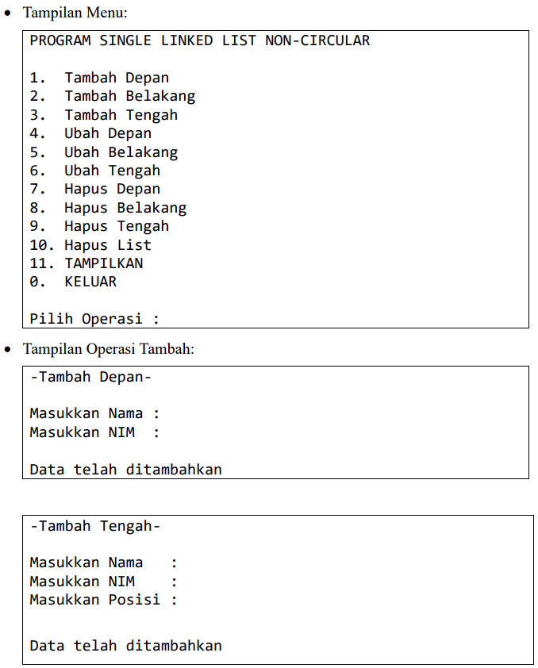
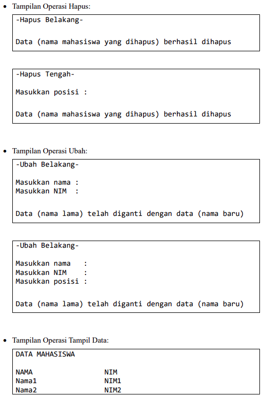
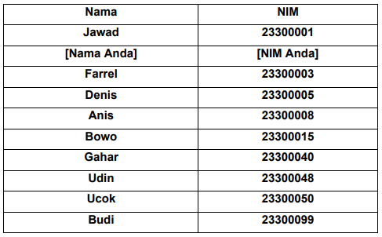
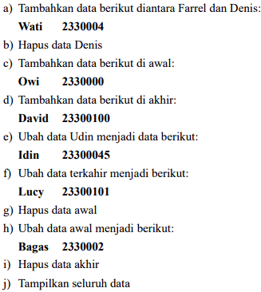
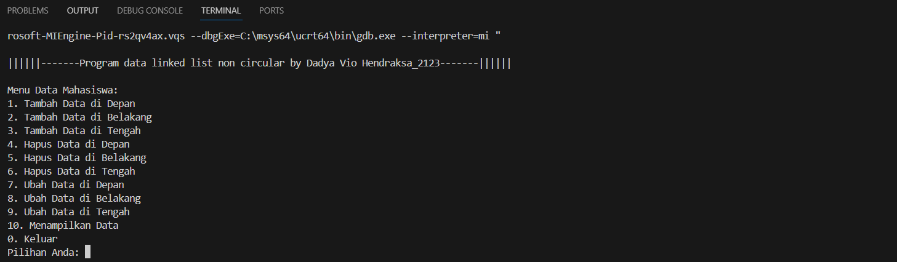
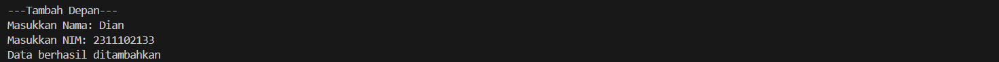
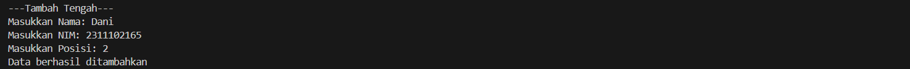
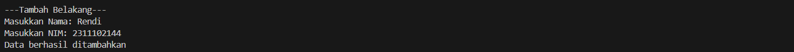
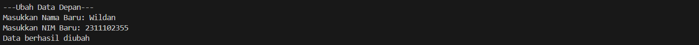
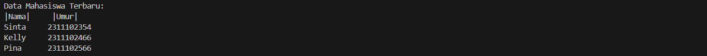

# <h1 align="center">Laporan Praktikum Modul 4 - LINKED LIST CIRCULAR DAN NON CIRCULAR</h1>
<p align="center">Dadya Vio Hendraksa - 2311102123</p>

## Dasar Teori

Daftar tertaut/Linked List adalah struktur data yang digunakan untuk menyimpan kumpulan data. 
Daftar tertaut memiliki properti berikut:<br/>
• Elemen yang berurutan dihubungkan oleh pointer<br/>
• Elemen terakhir menunjuk ke NULL<br/>
• Dapat tumbuh atau menyusut dalam ukuran selama eksekusi program<br/>
• Dapat dibuat selama diperlukan (sampai memori sistem habis)<br/>
• Tidak membuang-buang ruang memori (tetapi membutuhkan memori ekstra untuk
pointer). Ini mengalokasikan memori saat daftar bertambah.

Keuntungan Linked List<br/>
Daftar tertaut/Liinked List memiliki kelebihan dan kekurangan. Keuntungan dari daftar tertaut adalah mereka dapat diperluas dalam waktu yang konstan. Untuk membuat array, kita harus mengalokasikan memori untuk sejumlah elemen tertentu. Untuk menambahkan lebih banyak elemen ke array saat penuh, kita harus membuat array baru dan menyalin array lama ke dalam array baru. Ini bisa memakan banyak waktu. Dengan daftar tertaut, kita dapat memulai dengan ruang hanya untuk satu elemen yang dialokasikan dan menambahkan elemen baru dengan mudah tanpa perlu melakukan penyalinan dan pengalokasian ulang.

Kerugian Linked List<br/>
Ada sejumlah masalah dengan daftar tertaut. Kerugian utama dari daftar tertaut adalah waktu akses ke elemen individual. Meskipun alokasi penyimpanan dinamis merupakan keuntungan besar, overhead dengan menyimpan dan mengambil data dapat membuat perbedaan besar. Terkadang daftar tertaut sulit untuk dimanipulasi. Jika item terakhir dihapus, yang terakhir tetapi satu harus mengubah penunjuknya untuk menyimpan referensi NULL Ini mengharuskan daftar dilintasi untuk menemukan tautan terakhir kecuali satu, dan penunjuknya disetel ke referensi NULL. Akhirnya, daftar tertaut membuang-buang memori dalam hal poin referensi tambahan.

1. Single Linked List<br/>
Umumnya "daftar tertaut" berarti daftar tertaut tunggal. Daftar ini terdiri dari sejumlah node di mana setiap node memiliki pointer berikutnya ke elemen berikut. Tautan simpul terakhir dalam daftar adalah NULL, yang menunjukkan akhir daftar. Operasi Dasar pada Daftar:<br/>
• Melintasi daftar<br/>
• Memasukkan item ke dalam daftar<br/>
• Menghapus item dari daftar<br/>
</br>
Masing-masing komponen sering disebut dengan simpul atau node atau verteks. Pointer adalah alamat elemen. Setiap simpul pada dasarnya dibagi atas dua bagian pertama disebut bagian isi atau informasi atau data yang berisi nilai yang disimpan oleh simpul. Bagian kedua disebut bagian pointer yang berisi alamat dari node berikutnya atau sebelumnya. Dengan menggunakan struktur seperti ini, linked list dibentuk dengan cara menunjuk pointer next suatu elemen ke elemen yang mengikutinya. Pointer next pada elemen terakhir merupakan NULL, yang menunjukkan akhir dari suatu list. Elemen pada awal suatu list disebut head dan elemen terakhir dari suatu list disebut tail.

2. Double Linked List<br/>
Double Linked List adalah struktur data Linked List yang mirip dengan Single Linked List, namun dengan tambahan satu pointer tambahan pada setiap
simpul yaitu pointer prev yang menunjuk ke simpul sebelumnya. Dengan adanya pointer prev, Double Linked List memungkinkan untuk melakukan operasi penghapusan dan penambahan pada simpul mana saja secara efisien. Setiap simpul pada Double Linked List memiliki tiga elemen penting, yaitu elemen data (biasanya berupa nilai), pointer next yang menunjuk ke simpul berikutnya, dan pointer prev yang menunjuk ke simpul sebelumnya. Keuntungan dari daftar tertaut ganda (juga disebut daftar tertaut dua arah) adalah bahwa dengan adanya simpul dalam daftar, kita dapat menavigasi ke dua arah. Sebuah node dalam daftar tertaut tunggal tidak dapat dihapus kecuali kita memiliki penunjuk ke pendahulunya. Tetapi dalam daftar tertaut ganda, kita dapat menghapus sebuah node bahkan jika kita tidak memiliki alamat node sebelumnya (karena setiap node memiliki pointer kiri yang menunjuk ke node sebelumnya dan dapat bergerak mundur).Kerugian utama dari daftar tertaut ganda adalah:<br/>
• Setiap node membutuhkan pointer tambahan, membutuhkan lebih banyak ruang.<br/>
• Penyisipan atau penghapusan node membutuhkan waktu sedikit lebih lama (lebih 
banyak operasi pointer)</br>


## Guided 

### 1. Program Latihanl Linked List Non Circular

```C++
#include <iostream>
using namespace std;
/// PROGRAM SINGLE LINKED LIST NON-CIRCULAR
// Deklarasi Struct Node
struct Node {
  int data;
  Node *next;
};
Node *head;
Node *tail;
// Inisialisasi Node
void init() {
  head = NULL;
  tail = NULL;
}
// Pengecekan
bool isEmpty() {
  if (head == NULL)
    return true;
  else
    return false;
}
// Tambah Depan
void insertDepan(int nilai) {
  // Buat Node baru
  Node *baru = new Node;
  baru->data = nilai;
  baru->next = NULL;
  if (isEmpty() == true) {
    head = tail = baru;
    tail->next = NULL;
  } else {
    baru->next = head;
    head = baru;
  }
}
// Tambah Belakang
void insertBelakang(int nilai) {
  // Buat Node baru
  Node *baru = new Node;
  baru->data = nilai;
  baru->next = NULL;
  if (isEmpty() == true) {
    head = tail = baru;
    tail->next = NULL;
  } else {
    tail->next = baru;
    tail = baru;
  }
}
// Hitung Jumlah List
int hitungList() {
  Node *hitung;
  hitung = head;
  int jumlah = 0;
  while (hitung != NULL) {
    jumlah++;
    hitung = hitung->next;
  }
  return jumlah;
}
// Tambah Tengah
void insertTengah(int data, int posisi) {
  if (posisi < 1 || posisi > hitungList()) {
    cout << "Posisi diluar jangkauan" << endl;
  } else if (posisi == 1) {
    cout << "Posisi bukan posisi tengah" << endl;
  } else {
    Node *baru, *bantu;
    baru = new Node();
    baru->data = data;
    // tranversing
    bantu = head;
    int nomor = 1;
    while (nomor < posisi - 1) {
      bantu = bantu->next;
      nomor++;
    }
    baru->next = bantu->next;
    bantu->next = baru;
  }
}
// Hapus Depan
void hapusDepan() {
  Node *hapus;
  if (isEmpty() == false) {
    if (head->next != NULL) {
      hapus = head;
      head = head->next;
      delete hapus;
      } else {
      head = tail = NULL;
    }
  } else {
    cout << "List kosong!" << endl;
  }
}
// Hapus Belakang
void hapusBelakang() {
  Node *hapus;
  Node *bantu;
  if (isEmpty() == false) {
    if (head != tail) {
      hapus = tail;
      bantu = head;
      while (bantu->next != tail) {
        bantu = bantu->next;
      }
      tail = bantu;
      tail->next = NULL;
      delete hapus;
    } else {
      head = tail = NULL;
    }
  } else {
    cout << "List kosong!" << endl;
  }
}
// Hapus Tengah
void hapusTengah(int posisi) {
  Node *bantu, *hapus, *sebelum;
  if (posisi < 1 || posisi > hitungList()) {
    cout << "Posisi di luar jangkauan" << endl;
  } else if (posisi == 1) {
    cout << "Posisi bukan posisi tengah" << endl;
  } else {
    int nomor = 1;
    bantu = head;
    while (nomor <= posisi) {
      if (nomor == posisi - 1) {
        sebelum = bantu;
      }
      if (nomor == posisi) {
        hapus = bantu;
      }
      bantu = bantu->next;
      nomor++;
    }
    sebelum->next = bantu;
    delete hapus;
  }
}
// Ubah Depan
void ubahDepan(int data) {
  if (isEmpty() == 0) {
    head->data = data;
  } else {
    cout << "List masih kosong!" << endl;
  }
}
// Ubah Tengah
void ubahTengah(int data, int posisi) {
  Node *bantu;
  if (isEmpty() == 0) {
    if (posisi < 1 || posisi > hitungList()) {
      cout << "Posisi di luar jangkauan" << endl;
    } else if (posisi == 1) {
    } else {
      cout << "Posisi bukan posisi tengah" << endl;
      bantu = head;
      int nomor = 1;
      while (nomor < posisi) {
        bantu = bantu->next;
        nomor++;
      }
      bantu->data = data;
    }
  } else {
    cout << "List masih kosong!" << endl;
  }
}
// Ubah Belakang
void ubahBelakang(int data) {
  if (isEmpty() == 0) {
    tail->data = data;
  } else {
    cout << "List masih kosong!" << endl;
  }
}
// Hapus List
void clearList() {
  Node *bantu, *hapus;
  bantu = head;
  while (bantu != NULL) {
    hapus = bantu;
    bantu = bantu->next;
    delete hapus;
  }
  head = tail = NULL;
  cout << "List berhasil terhapus!" << endl;
}
// Tampilkan List
void tampil() {
  Node *bantu;
  bantu = head;
  if (isEmpty() == false) {
    while (bantu != NULL) {
      cout << bantu->data << ends;
      bantu = bantu->next;
    }
    cout << endl;
  } else {
    cout << "List masih kosong!" << endl;
  }
}
int main() {
  init();
  insertDepan(3);
  tampil();
  insertBelakang(5);
  tampil();
  insertDepan(2);
  tampil();
  insertDepan(1);
  tampil();
  hapusDepan();
  tampil();
  hapusBelakang();
  tampil();
  insertTengah(7, 2);
  tampil();
  hapusTengah(2);
  tampil();
  ubahDepan(1);
  tampil();
  ubahBelakang(8);
  tampil();
  ubahTengah(11, 2);
  tampil();
  return 0;
}
```
Program ini merupakan implementasi dari single linked list non-circular yang digunakan untuk melakukan operasi penambahan, penghapusan, pengubahan, dan penampilan data pada list. Struktur data ini menggunakan struct Node yang memiliki atribut data dan pointer next untuk menunjukkan elemen selanjutnya dalam list. Program ini menyediakan sejumlah fungsi untuk berbagai operasi, antara lain:</br>
• void init(): untuk menginisialisasi head dan tail.</br>
• bool isEmpty(): untuk mengecek apakah list kosong atau tidak.</br>
• void insertDepan(int nilai): untuk menambahkan data di depan list.</br>
• void insertBelakang(int nilai): untuk menambahkan data di belakang list.</br>
• int hitungList(): untuk menghitung jumlah elemen dalam list.</br>
• void insertTengah(int data, int posisi): untuk menambahkan data di tengah list.</br>
• void hapusDepan(): untuk menghapus data di depan list.</br>
• void hapusBelakang(): untuk menghapus data di belakang list.</br>
• void hapusTengah(int posisi): untuk menghapus data di tengah list.</br>
• void ubahDepan(int data): untuk mengubah data di depan list.</br>
• void ubahTengah(int data, int posisi): untuk mengubah data di tengah list.</br>
• void ubahBelakang(int data): untuk mengubah data di belakang list.</br>
• void clearList(): untuk menghapus seluruh elemen dalam list.</br>
• void tampil(): untuk menampilkan seluruh isi list.</br>
Fungsi-fungsi tersebut dapat digunakan pada fungsi main(), yang memungkinkan pengguna untuk melakukan berbagai operasi pada list seperti menambah, menghapus, mengubah, dan menampilkan data. Setelah melakukan operasi yang diinginkan, program akan menampilkan seluruh isi list dengan memanggil fungsi tampil(). Dengan demikian, tidak ada hubungan langsung antara head dan tail, tidak ada pengulangan, dan tidak ada pengecekan apakah sudah mencapai tail atau belum.

### 2. Program Latihan Linked List Circular

```C++
#include <iostream>
using namespace std;
/// PROGRAM SINGLE LINKED LIST CIRCULAR
// Deklarasi Struct Node
struct Node {
  string data;
  Node *next;
};
Node *head, *tail, *baru, *bantu, *hapus;
void init() {
  head = NULL;
  tail = head;
}
// Pengecekan
int isEmpty() {
  if (head == NULL)
    return 1;  // true
  else
    return 0;  // false
}
// Buat Node Baru
void buatNode(string data) {
  baru = new Node;
  baru->data = data;
  baru->next = NULL;
}
// Hitung List
int hitungList() {
  bantu = head;
  int jumlah = 0;
  while (bantu != NULL) {
    jumlah++;
    bantu = bantu->next;
  }
  return jumlah;
}
// Tambah Depan
void insertDepan(string data) {
  // Buat Node baru
  buatNode(data);
  if (isEmpty() == 1) {
    head = baru;
    tail = head;
    baru->next = head;
  } else {
    while (tail->next != head) {
      tail = tail->next;
    }
    baru->next = head;
    head = baru;
    tail->next = head;
  }
}
// Tambah Belakang
void insertBelakang(string data) {
  // Buat Node baru
  buatNode(data);
  if (isEmpty() == 1) {
    head = baru;
    tail = head;
    baru->next = head;
  } else {
    while (tail->next != head) {
      tail = tail->next;
    }
    tail->next = baru;
    baru->next = head;
  }
}
// Tambah Tengah
void insertTengah(string data, int posisi) {
  if (isEmpty() == 1) {
    head = baru;
    tail = head;
    baru->next = head;
  } else {
    baru->data = data;
    // transversing
    int nomor = 1;
    bantu = head;
    while (nomor < posisi - 1) {
      bantu = bantu->next;
      nomor++;
    }
    baru->next = bantu->next;
    bantu->next = baru;
  }
}
// Hapus Depan
void hapusDepan() {
  if (isEmpty() == 0) {
    hapus = head;
    tail = head;
    if (hapus->next == head) {
      head = NULL;
      tail = NULL;
      delete hapus;
    } else {
      while (tail->next != hapus) {
        tail = tail->next;
      }
      head = head->next;
      tail->next = head;
      hapus->next = NULL;
      delete hapus;
    }
  } else {
    cout << "List masih kosong!" << endl;
  }
}
// Hapus Belakang
void hapusBelakang() {
  if (isEmpty() == 0) {
    hapus = head;
    tail = head;
    if (hapus->next == head) {
      head = NULL;
      tail = NULL;
    
      delete hapus;
      } else {
        while (hapus->next != head) {
            hapus = hapus->next;
        }
        while (tail->next != hapus) {
            tail = tail->next;
        }
        tail->next = head;
        hapus->next = NULL;
        delete hapus;
    }
  } else {
    cout << "List masih kosong!" << endl;
  }
}
// Hapus Tengah
void hapusTengah(int posisi) {
  if (isEmpty() == 0) {
    // transversing
    int nomor = 1;
    bantu = head;
    while (nomor < posisi - 1) {
      bantu = bantu->next;
      nomor++;
    }
    hapus = bantu->next;
    bantu->next = hapus->next;
    delete hapus;
  } else {
    cout << "List masih kosong!" << endl;
  }
}
// Hapus List
void clearList() {
  if (head != NULL) {
    hapus = head->next;
    while (hapus != head) {
      bantu = hapus->next;
      delete hapus;
      hapus = bantu;
    }
    delete head;
    head = NULL;
  }
  cout << "List berhasil terhapus!" << endl;
}
// Tampilkan List
void tampil() {
  if (isEmpty() == 0) {
    tail = head;
    do {
      cout << tail->data << ends;
      tail = tail->next;
    } while (tail != head);
    cout << endl;
  } else {
    cout << "List masih kosong!" << endl;
  }
}
int main() {
  init();
  insertDepan("Ayam");
  tampil();
  insertDepan("Bebek");
  tampil();
  insertBelakang("Cicak");
  tampil();
  insertBelakang("Domba");
  tampil();
  hapusBelakang();
  tampil();
  hapusDepan();
  tampil();
  insertTengah("Sapi", 2);
  tampil();
  hapusTengah(2);
  tampil();
  return 0;
}
```
Program ini merupakan implementasi dari single linked list circular yang digunakan untuk melakukan operasi penambahan, penghapusan, dan pengubahan data pada linked list. Program ini memiliki fungsi-fungsi sebagai berikut:</br>
• void init(): untuk menginisialisasi head dan tail.</br>
• int isEmpty(): untuk mengecek apakah linked list kosong atau tidak.</br>
• void buatNode(string data): untuk membuat node baru.</br>
• int hitungList(): untuk menghitung jumlah node pada linked list.</br>
• void insertDepan(string data): untuk menambahkan node di depan.</br>
• void insertBelakang(string data): untuk menambahkan node di belakang.</br>
• void insertTengah(string data, int posisi): untuk menambahkan node di tengah.</br>
• void hapusDepan(): untuk menghapus node di depan.</br>
• void hapusBelakang(): untuk menghapus node di belakang.</br>
• void hapusTengah(int posisi): untuk menghapus node di tengah.</br>
• void clearList(): untuk menghapus seluruh node pada linked list.</br>
• void tampil(): untuk menampilkan seluruh node pada linked list.</br>
Perbedaan utama antara program ini dengan program linked list non-circular adalah bahwa pada program ini, tail menunjuk ke head, sehingga linked list membentuk lingkaran. Ketika node terakhir menunjuk ke head, maka head akan menunjuk ke node pertama. Sehingga, ketika menambahkan node di belakang, node baru akan menjadi node terakhir dan menunjuk ke head. Begitu juga ketika menghapus node di belakang, node terakhir akan dihapus dan node sebelumnya akan menjadi node terakhir dan menunjuk ke head.

## Unguided 

### Buatlah program menu Linked List Non Circular untuk menyimpan Nama dan NIM mahasiswa, dengan menggunakan input dari user.</br>

1. Buatlah menu untuk menambahkan, mengubah, menghapus, dan melihat Nama dan  NIM mahasiswa, berikut contoh tampilan output dari nomor 1:</br>
</br>
</br>

2. Setelah membuat menu tersebut, masukkan data sesuai urutan berikut, lalu tampilkan data yang telah dimasukkan. (Gunakan insert depan, belakang atau tengah) </br>
</br>

3. Lakukan perintah berikut:</br>
</br>

```C++
/*
Dadya Vio Hendraksa - 2311102123
*/

#include <iostream> // Library standar yang digunakan untuk input dan output
#include <iomanip> // Library standar yang digunakan untuk manipulasi input dan output
#include <string> // Library standar yang digunakan untuk manipulasi string

using namespace std;

struct Node { // Membuat struct Node untuk menyimpan data mahasiswa yang berisi nama dan NIM
    string Nama_2123; // Nama bertipe string karena nama biasanya berupa karakter
    long long NIM_2123; // NIM bertipe long long karena NIM biasanya berupa angka yang panjang
    Node* next;
};

Node* head = nullptr;
Node* tail = nullptr;

void inisialisasi_2123() { // Inisialisasi awal linked list dengan head dan tail bernilai nullptr
    head = nullptr;
    tail = nullptr;
}

bool apakah_kosong_2123() { // Mengecek apakah linked list kosong atau tidak
    return head == nullptr;
}

void tambah_depan_2123(string Nama, long long NIM) { // Menambahkan data mahasiswa di depan linked list
    Node* newNode = new Node;
    newNode->Nama_2123 = Nama;
    newNode->NIM_2123 = NIM;
    newNode->next = head;
    head = newNode;

    if (tail == nullptr) {
        tail = newNode;
    }
}

void tambah_belakang_2123(string Nama, long long NIM) { // Menambahkan data mahasiswa di belakang linked list
    Node* newNode = new Node;
    newNode->Nama_2123 = Nama;
    newNode->NIM_2123 = NIM;
    newNode->next = nullptr;

    if (apakah_kosong_2123()) {
        head = tail = newNode;
    } else {
        tail->next = newNode;
        tail = newNode;
    }
}

void tambah_tengah_2123(string Nama, long long NIM, int Posisi) { // Menambahkan data mahasiswa di tengah linked list berdasarkan posisi yang diinputkan oleh user
    if (Posisi <= 1 || apakah_kosong_2123()) {
        cout << "Posisi tidak valid atau list kosong, Maka di tambah ke depan." << endl;
        tambah_depan_2123(Nama, NIM);
        return;
    }

    Node* newNode = new Node; // Membuat node baru untuk menyimpan data mahasiswa yang akan ditambahkan ke linked list
    newNode->Nama_2123 = Nama;
    newNode->NIM_2123 = NIM;

    Node* current = head;
    int currentPosition = 1;

    while (current->next != nullptr && currentPosition < Posisi - 1) { // Mencari posisi node yang akan ditambahkan data mahasiswanya berdasarkan posisi yang diinputkan oleh user
        current = current->next;
        currentPosition++;
    }

    newNode->next = current->next;
    current->next = newNode;
}

void hapus_depan_2123() { // Menghapus data mahasiswa di depan linked list
    if (apakah_kosong_2123()) {
        cout << "List kosong, Jadi tidak ada yang dapat dihapus." << endl;
        return;
    }

    Node* temp = head;
    head = head->next;
    delete temp;

    if (head == nullptr) {
        tail = nullptr;
    }
}

void hapus_belakang_2123() { // Menghapus data mahasiswa di belakang linked list 
    if (apakah_kosong_2123()) {
        cout << "List kosong, Jadi tidak ada yang dapat dihapus." << endl;
        return;
    }

    if (head == tail) {
        delete head;
        head = tail = nullptr;
        return;
    }

    Node* current = head;
    while (current->next != tail) { // Mencari node yang berada sebelum node yang akan dihapus di belakang linked list 
        current = current->next;
    }
    delete tail;
    tail = current;
    tail->next = nullptr;
}

void hapus_tengah_2123(int Posisi) { // Menghapus data mahasiswa di tengah linked list berdasarkan posisi yang diinputkan oleh user
    if (Posisi <= 1 || apakah_kosong_2123()) {
        cout << "Posisi tidak valid atau list kosong, Jadi tidak ada yang dapat dihapus." << endl;
        return;
    }

    Node* current = head;
    Node* previous = nullptr; // Node sebelum node yang akan dihapus di tengah linked list 
    int currentPosition = 1;

    while (current->next != nullptr && currentPosition < Posisi) { // Mencari posisi node yang akan dihapus data mahasiswanya berdasarkan posisi yang diinputkan oleh user
        previous = current;
        current = current->next;
        currentPosition++;
    }

    if (currentPosition < Posisi) {
        cout << "Posisi tidak ada, Maka tida ada yang dihapus" << endl;
        return;
    }

    previous->next = current->next; // Menghapus node yang ditunjuk oleh current 
    delete current;

    if (previous->next == nullptr) {
        tail = previous;
    }
}

void ubah_depan_2123(string Nama, long long NIM) { // Mengubah data mahasiswa di depan linked list
    if (apakah_kosong_2123()) {
        cout << "List kosong, Maka tidak ada yang dapat diubah." << endl;
        return;
    }

    head->Nama_2123 = Nama;
    head->NIM_2123 = NIM;
}

void ubah_belakang_2123(string Nama, long long NIM) { // Mengubah data mahasiswa di belakang linked list 
    if (apakah_kosong_2123()) {
        cout << "List kosong, Maka tidak ada yang dapat diubah." << endl;
        return;
    }

    tail->Nama_2123 = Nama;
    tail->NIM_2123 = NIM;
}

void ubah_tengah_2123(string Nama, long long NIM, int Posisi) { // Mengubah data mahasiswa di tengah linked list berdasarkan posisi yang diinputkan oleh user
    if (Posisi <= 1 || apakah_kosong_2123()) {
        cout << "Posisi tidak valid atau list kosong, Jadi tidak ada yang dapat diubah." << endl;
        return;
    }

    Node* current = head;
    int currentPosition = 1;

    while (current->next != nullptr && currentPosition < Posisi) { // Mencari posisi node yang akan diubah datanya berdasarkan posisi yang diinputkan oleh user
        current = current->next;
        currentPosition++;
    }

    if (currentPosition < Posisi) {
        cout << "Posisi tidak ada, Maka tidak ada yang diubah" << endl;
        return;
    }

    current->Nama_2123 = Nama;
    current->NIM_2123 = NIM;
}

void display() { // Menampilkan data mahasiswa yang ada di linked list 
    if (apakah_kosong_2123()) {
        cout << "List kosong." << endl;
        return;
    }

    Node* current = head;
    cout << left << setw(10) << "|Nama|" << right << setw(5) << " |Umur|" << endl; // Menampilkan header tabel data mahasiswa 
    while (current != nullptr) {
        cout << left << setw(10) << current->Nama_2123 << right << setw(5) << current->NIM_2123 << endl; // Menampilkan data mahasiswa dan merapikan tampilan data mahasiswa
        current = current->next;
    }
}

int main() { // Fungsi utama yang akan dieksekusi pertama kali saat program dijalankan
    inisialisasi_2123(); // Memanggil fungsi inisialisasi_2123 untuk menginisialisasi linked list dengan head dan tail bernilai nullptr

    cout << "\n||||||-------Program data link list by Dadya Vio Hendraksa_2123-------||||||" << endl;
    
    int pilihan; // Deklarasi variabel pilihan untuk menyimpan pilihan menu yang diinputkan oleh user
    do { // Perulangan untuk menampilkan menu pilihan yang dapat dilakukan oleh user
        cout << "\nMenu Data Mahasiswa:\n1. Tambah Data di Depan\n2. Tambah Data di Belakang\n3. Tambah Data di Tengah\n";
        cout << "4. Hapus Data di Depan\n5. Hapus Data di Belakang\n6. Hapus Data di Tengah\n";
        cout << "7. Ubah Data di Depan\n8. Ubah Data di Belakang\n9. Ubah Data di Tengah\n";
        cout << "10. Menampilkan Data\n0. Keluar\n";
        cout << "Pilihan Anda: ";
        cin >> pilihan; // Menginputkan pilihan menu yang diinginkan oleh user

        switch (pilihan) { // Percabangan switch case untuk mengeksekusi fungsi sesuai dengan pilihan menu yang diinputkan oleh user
            case 1: { // Pilihan menu 1 untuk menambahkan data mahasiswa di depan linked list
                string nama;
                long long NIM;
                cout << "\n---Tambah Depan---" << endl;
                cout << "Masukkan Nama: ";
                cin >> nama;
                cout << "Masukkan NIM: ";
                cin >> NIM;
                tambah_depan_2123(nama, NIM); // Memanggil fungsi tambah_depan_2123 untuk menambahkan data mahasiswa ke linked list
                cout << "Data berhasil ditambahkan" << endl;
                cout << "\nData Mahasiswa Terbaru:" << endl;
                display();
                break;
            }
            case 2: { // Pilihan menu 2 untuk menambahkan data mahasiswa di belakang linked list
                string nama;
                long long NIM;
                cout << "\n---Tambah Belakang---" << endl;
                cout << "Masukkan Nama: ";
                cin >> nama;
                cout << "Masukkan NIM: ";
                cin >> NIM;
                tambah_belakang_2123(nama, NIM); // Memanggil fungsi tambah_belakang_2123 untuk menambahkan data mahasiswa ke linked list
                cout << "Data berhasil ditambahkan" << endl;
                cout << "\nData Mahasiswa Terbaru:" << endl;
                display();
                break;
            }
            case 3: { // Pilihan menu 3 untuk menambahkan data mahasiswa di tengah linked list
                string nama;
                long long NIM;
                int posisi;
                cout << "\n---Tambah Tengah---" << endl;
                cout << "Masukkan Nama: ";
                cin >> nama;
                cout << "Masukkan NIM: ";
                cin >> NIM;
                cout << "Masukkan Posisi: ";
                cin >> posisi;
                tambah_tengah_2123(nama, NIM, posisi); // Memanggil fungsi tambah_tengah_2123 untuk menambahkan data mahasiswa ke linked list
                cout << "Data berhasil ditambahkan" << endl;
                cout << "\nData Mahasiswa Terbaru:" << endl;
                display();
                break;
            }
            case 4: // Pilihan menu 4 untuk menghapus data mahasiswa di depan linked list
                cout << "\n---Hapus Depan---" << endl;
                hapus_depan_2123(); // Memanggil fungsi hapus_depan_2123 untuk menghapus data mahasiswa di depan linked list
                cout << "Data berhasil dihapus" << endl;
                cout << "\nData Mahasiswa Terbaru:" << endl;
                display();
                break;
            case 5: // Pilihan menu 5 untuk menghapus data mahasiswa di belakang linked list
                cout << "\n---Hapus Belakang---" << endl;
                hapus_belakang_2123(); // Memanggil fungsi hapus_belakang_2123 untuk menghapus data mahasiswa di belakang linked list
                cout << "Data berhasil dihapus" << endl;
                cout << "\nData Mahasiswa Terbaru:" << endl;
                display();
                break;
            case 6: { // Pilihan menu 6 untuk menghapus data mahasiswa di tengah linked list
                int posisi;
                cout << "\n---Hapus Tengah---" << endl;
                cout << "Masukkan Posisi: ";
                cin >> posisi;
                hapus_tengah_2123(posisi); // Memanggil fungsi hapus_tengah_2123 untuk menghapus data mahasiswa di tengah linked list
                cout << "Data berhasil dihapus" << endl;
                cout << "\nData Mahasiswa Terbaru:" << endl;
                display();
                break;
            }
            case 7: { // Pilihan menu 7 untuk mengubah data mahasiswa di depan linked list
                string nama;
                long long NIM;
                cout << "\n---Ubah Data Depan---" << endl;
                cout << "Masukkan Nama Baru: ";
                cin >> nama;
                cout << "Masukkan NIM Baru: ";
                cin >> NIM;
                ubah_depan_2123(nama, NIM); // Memanggil fungsi ubah_depan_2123 untuk mengubah data mahasiswa di depan linked list
                cout << "Data berhasil diubah" << endl;
                cout << "\nData Mahasiswa Terbaru:" << endl;
                display();
                break;
            }
            case 8: { // Pilihan menu 8 untuk mengubah data mahasiswa di belakang linked list
                string nama;
                long long NIM;
                cout << "\n---Ubah Data Belakang---" << endl;
                cout << "Masukkan Nama Baru: ";
                cin >> nama;
                cout << "Masukkan NIM Baru: ";
                cin >> NIM;
                ubah_belakang_2123(nama, NIM); // Memanggil fungsi ubah_belakang_2123 untuk mengubah data mahasiswa di belakang linked list
                cout << "Data berhasil diubah" << endl;
                cout << "\nData Mahasiswa Terbaru:" << endl;
                display();
                break;
            }
            case 9: { // Pilihan menu 9 untuk mengubah data mahasiswa di tengah linked list
                string nama;
                long long NIM;
                int posisi;
                cout << "\n---Ubah Data Tengah---" << endl;
                cout << "Masukkan Nama Baru: ";
                cin >> nama;
                cout << "Masukkan NIM Baru: ";
                cin >> NIM;
                cout << "Masukkan Posisi: ";
                cin >> posisi;
                ubah_tengah_2123(nama, NIM, posisi); // Memanggil fungsi ubah_tengah_2123 untuk mengubah data mahasiswa di tengah linked list
                cout << "Data berhasil diubah" << endl;
                cout << "\nData Mahasiswa Terbaru:" << endl;
                display();
                break;
            }
            case 10: // Pilihan menu 10 untuk menampilkan data mahasiswa yang ada di linked list
                cout << "\nData Mahasiswa Terbaru:" << endl;
                display(); // Memanggil fungsi display untuk menampilkan data mahasiswa yang ada di linked list
                break;
            case 0: // Pilihan menu 0 untuk keluar dari program
                cout << "Terima kasih!" << endl;
                break;
            default: // Pilihan default jika pilihan menu yang diinputkan oleh user tidak valid
                cout << "Input pilihan tidak valid!" << endl;
        }
    } while (pilihan != 0); // Perulangan akan terus berjalan selama pilihan menu yang diinputkan oleh user bukan 0

    return 0;
}
```
#### Output:
1. Menu untuk menambahkan, mengubah, menghapus, dan melihat Nama dan NIM mahasiswa.</br>
• Tampilan Menu:</br>
</br>
• Tampilan Operasi Tambah:</br>
</br>
</br>
</br>
• Tampilan Operasi Hapus:</br>
</br>
</br>
</br>
• Tampilan Operasi Ubah:</br>
</br>
</br>
</br>
• Tampilan Operasi Tampilkan Data:</br>
</br>
Program ini merupakan program linked list non circular yang digunakan untuk menyimpan data mahasiswa berupa nama dan NIM. Program ini memiliki beberapa fungsi yaitu: void inisialisasi_2123(), bool apakah_kosong_2123(), void tambah_depan_2123(string Nama, long long NIM), void tambah_belakang_2123(string Nama, long long NIM), void tambah_tengah_2123(string Nama, long long NIM, int Posisi), void hapus_depan_2123(), void hapus_belakang_2123(), void hapus_tengah_2123(int Posisi), void ubah_depan_2123(string Nama, long long NIM), void ubah_belakang_2123(string Nama, long long NIM), void ubah_tengah_2123(string Nama, long long NIM, int Posisi), void display(). Untuk deklarasi struct node menggunakan tipe data string untuk Nama dan long long untuk NIM. Supaya NIM dapat menampung angka yang panjang. Kemudian program ini memiliki menu pilihan yang dapat dilakukan oleh user yaitu:</br>
1. Tambah Data di Depan</br>
2. Tambah Data di Belakang</br>
3. Tambah Data di Tengah</br>
4. Hapus Data di Depan</br>
5. Hapus Data di Belakang</br>
6. Hapus Data di Tengah</br>
7. Ubah Data di Depan</br>
8. Ubah Data di Belakang</br>
9. Ubah Data di Tengah</br>
10. Menampilkan Data</br>
0. Keluar</br>
Program ini akan terus berjalan selama user belum memilih menu pilihan 0. Jika user memilih antara menu tersebut maka akan memanggil fungsi yang sesuai dengan pilihan menu yang diinputkan oleh user. Setelah itu program akan menampilkan data mahasiswa yang ada di linked list. Program ini akan berhenti jika user memilih menu pilihan 0. Jadi program ini akan terus berjalan selama user belum memilih menu pilihan 0.

## Kesimpulan
Kesimpulannya setelah mempelajari linked list, diketahui bahwa struktur data ini menawarkan fleksibilitas dalam manajemen data secara dinamis. Konsep dasar linked list yang terdiri dari node-node yang saling terhubung membuatnya sangat cocok untuk situasi di mana perlu menambah atau menghapus data dengan cepat tanpa memerlukan realokasi memori besar. Keuntungan utamanya terletak pada efisiensi operasi penyisipan dan penghapusan di awal atau akhir linked list dengan kompleksitas waktu konstan. Namun, kita juga perlu mempertimbangkan kelemahan linked list seperti penggunaan memori tambahan untuk menyimpan pointer dan keterbatasan dalam akses langsung ke elemen-elemen data, yang dapat mempengaruhi kinerja terutama dalam aplikasi dengan jumlah data besar. Dengan memperhitungkan karakteristik dan kompleksitas operasi linked list, kita dapat membuat keputusan yang tepat dalam pemilihan struktur data yang paling sesuai dengan kebutuhan kita.

## Referensi
[1] Shofyann Hanief,et al., Konsep Algoritme dan Aplikasinya dalam Bahasa Pemrograman C++. Yogyakarta: Andi Publisher, 2020. <br/>
[2] Joseph Teguh Santoso., STRUKTUR DATA dan ALGORITMA (Bagian 1). Semarang: Yayasan Prima Agus Teknik, 2021.</br>
[3] Malik, D.S., C++ Programming. Boston: Course Technology, 2023.