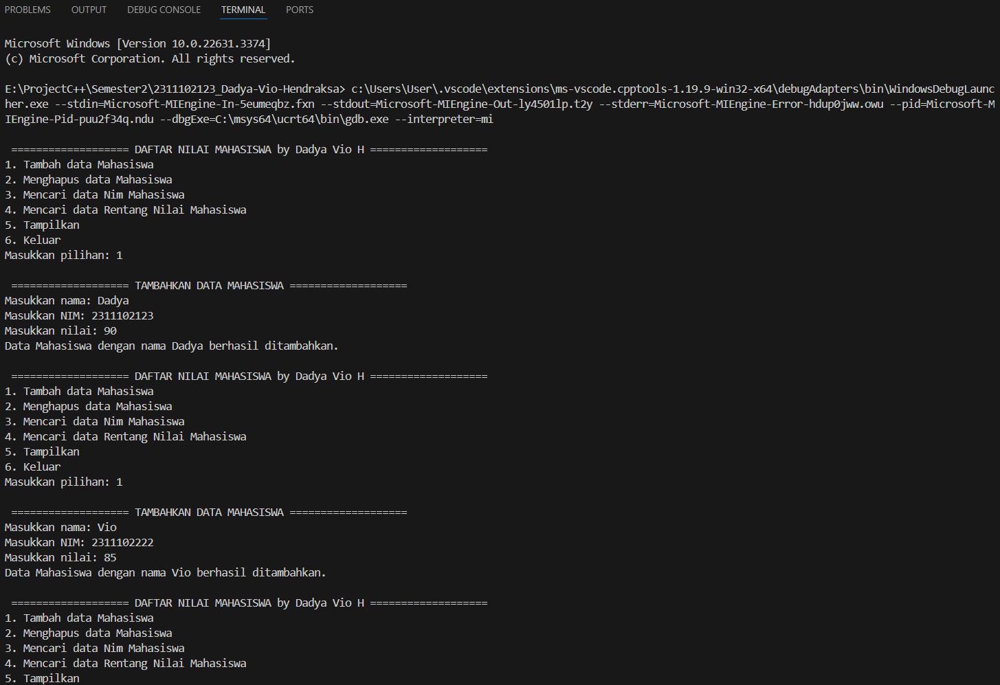
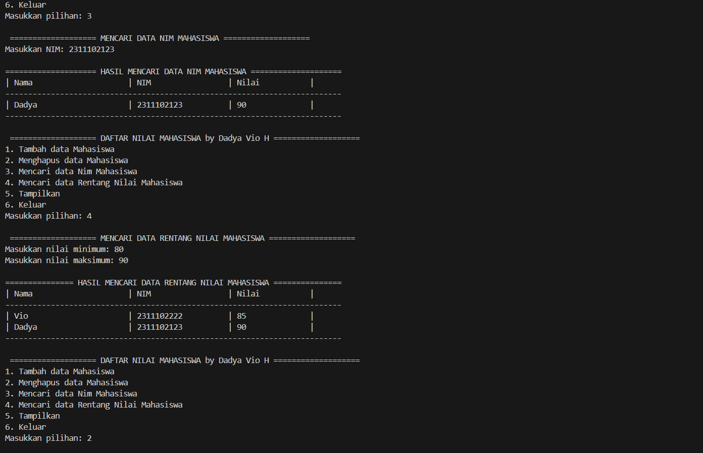
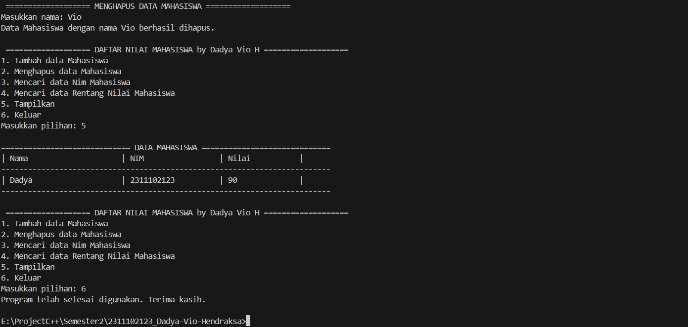

# <h1 align="center">Laporan Praktikum Modul 5 - HASH TABLE</h1>
<p align="center">Dadya Vio Hendraksa - 2311102123</p>

## Dasar Teori

1. Pengertian Hash Table<br/>
Linked list non-circular adalah susunan node yang terkait satu sama lain dalam susunan garis lurus, setiap node menyimpan data dan pointer ke node berikutnya. Perbedaan utamanya adalah absennya koneksi kembali ke node awal, sehingga tidak ada loop tertutup. Ini berarti pencarian atau traversal harus dimulai dari awal hingga akhir untuk mengakses elemen. Fleksibilitas dalam menambah atau menghapus node menjadikan linked list non-circular ideal untuk situasi di mana manipulasi data dinamis diperlukan, seperti dalam implementasi antrian atau daftar kontak. Namun, metode traversal ini cenderung lebih lambat daripada struktur data lain seperti array karena membutuhkan pencarian linear.<br/>
</br>

2. Fungsi, Kelebihan, Kekurangan Hash Table<br/>
Dalam single linked list dan double linked list, akhir linked list ditunjukkan dengan nilai NULL. Tetapi linked list circular tidak memiliki akhir. Saat melintasi linked list circular, kita harus berhati-hati; jika tidak, kita akan melintasi list tanpa batas. Dalam linked list circular, setiap simpul memiliki penerus. Perhatikan bahwa tidak seperti daftar tertaut tunggal, tidak ada simpul dengan penunjuk NULL dalam linked list circular. Dalam beberapa situasi, linked list circular berguna. Misalnya, ketika beberapa proses menggunakan sumber daya komputer (CPU) yang sama untuk jumlah waktu yang sama, kita harus memastikan bahwa tidak ada proses yang mengakses sumber daya sebelum semua proses lain melakukannya (algoritma round robin). Linked list circular dapat digunakan untuk menyimpan data yang perlu diakses secara berulang, seperti daftar putar lagu, daftar pesan dalam antrian, atau penggunaan memori berulang dalam suatu aplikasi.</br>


## Guided 

### 1. Program Latihan l Hash Table

```C++
#include <iostream>

using namespace std;

const int MAX_SIZE = 10;
// Fungsi hash sederhana
int hash_func(int key) { return key % MAX_SIZE; }
// Struktur data untuk setiap node
struct Node {
  int key;
  int value;
  Node* next;
  Node(int key, int value) : key(key), value(value), next(nullptr) {}
};
// Class hash table
class HashTable {
 private:
  Node** table;

 public:
  HashTable() { table = new Node*[MAX_SIZE](); }
  ~HashTable() {
    for (int i = 0; i < MAX_SIZE; i++) {
      Node* current = table[i];
      while (current != nullptr) {
        Node* temp = current;
        current = current->next;
        delete temp;
      }
    }
    delete[] table;
  }
  // Insertion
  void insert(int key, int value) {
    int index = hash_func(key);
    Node* current = table[index];
    while (current != nullptr) {
      if (current->key == key) {
        current->value = value;
        return;
      }
      current = current->next;
    }
    Node* node = new Node(key, value);
    node->next = table[index];
    table[index] = node;
  }
  // Searching
  int get(int key) {
    int index = hash_func(key);
    Node* current = table[index];
    while (current != nullptr) {
      if (current->key == key) {
        return current->value;
      }
      current = current->next;
    }
    return -1;
  }
  // Deletion
  void remove(int key) {
    int index = hash_func(key);
    Node* current = table[index];
    Node* prev = nullptr;
    while (current != nullptr) {
      if (current->key == key) {
        if (prev == nullptr) {
          table[index] = current->next;
        } else {
          prev->next = current->next;
        }
        delete current;
        return;
      }
      prev = current;
      current = current->next;
    }
  }
  // Traversal
  void traverse() {
    for (int i = 0; i < MAX_SIZE; i++) {
      Node* current = table[i];
      while (current != nullptr) {
        cout << current->key << ": " << current->value << endl;
        current = current->next;
      }
    }
  }
};
int main() {
  HashTable ht;
  // Insertion
  ht.insert(1, 10);
  ht.insert(2, 20);
  ht.insert(3, 30);
  // Searching
  cout << "Get key 1: " << ht.get(1) << endl;
  cout << "Get key 4: " << ht.get(4) << endl;
  // Deletion
  ht.remove(4);
  // Traversal
  ht.traverse();
  return 0;
}
```
Program yang diberikan merupakan implementasi dari hash table menggunakan metode chaining. Program ini memiliki fungsi-fungsi dasar seperti insert, get, remove, dan traverse. Fungsi insert digunakan untuk memasukkan data ke dalam hash table, get digunakan untuk mencari data berdasarkan kunci (key), remove digunakan untuk menghapus data berdasarkan kunci, dan traverse digunakan untuk menampilkan semua data yang ada di dalam hash table. Pada bagian main, terdapat contoh penggunaan fungsi-fungsi tersebut. Contohnya adalah melakukan operasi insert untuk menambahkan data dengan kunci 1, 2, dan 3, serta nilai (value) masing-masing 10, 20, dan 30. Selanjutnya, dilakukan pencarian nilai berdasarkan kunci 1 dan 4 menggunakan fungsi get, kemudian penghapusan data dengan kunci 4 menggunakan fungsi remove, dan terakhir menampilkan semua data yang ada di dalam hash table menggunakan fungsi traverse.

### 2. Program Latihan 2 Hash Table

```C++
#include <iostream>
#include <string>
#include <vector>

using namespace std;

const int TABLE_SIZE = 11;
string name;
string phone_number;
class HashNode {
 public:
  string name;
  string phone_number;
  HashNode(string name, string phone_number) {
    this->name = name;
    this->phone_number = phone_number;
  }
};
class HashMap {
 private:
  vector<HashNode*> table[TABLE_SIZE];

 public:
  int hashFunc(string key) {
    int hash_val = 0;
    for (char c : key) {
      hash_val += c;
    }
    return hash_val % TABLE_SIZE;
  }
  void insert(string name, string phone_number) {
    int hash_val = hashFunc(name);
    for (auto node : table[hash_val]) {
      if (node->name == name) {
        node->phone_number = phone_number;
        return;
      }
    }
    table[hash_val].push_back(new HashNode(name, phone_number));
  }
  void remove(string name) {
    int hash_val = hashFunc(name);
    for (auto it = table[hash_val].begin(); it != table[hash_val].end(); it++) {
      if ((*it)->name == name) {
        table[hash_val].erase(it);
        return;
      }
    }
  }
  string searchByName(string name) {
    int hash_val = hashFunc(name);
    for (auto node : table[hash_val]) {
      if (node->name == name) {
        return node->phone_number;
      }
    }
    return "";
  }
  void print() {
    for (int i = 0; i < TABLE_SIZE; i++) {
      cout << i << ": ";
      for (auto pair : table[i]) {
        if (pair != nullptr) {
          cout << "[" << pair->name << ", " << pair->phone_number << "]";
        }
      }
      cout << endl;
    }
  }
};
int main() {
  HashMap employee_map;
  employee_map.insert("Mistah", "1234");
  employee_map.insert("Pastah", "5678");
  employee_map.insert("Ghana", "91011");
  cout << "Nomer Hp Mistah : " << employee_map.searchByName("Mistah") << endl;
  cout << "Phone Hp Pastah : " << employee_map.searchByName("Pastah") << endl;
  employee_map.remove("Mistah");
  cout << "Nomer Hp Mistah setelah dihapus : "
       << employee_map.searchByName("Mistah") << endl
       << endl;
  cout << "Hash Table : " << endl;
  employee_map.print();
  return 0;
}
```
Program tersebut adalah implementasi dari hash table dengan metode chaining yang digunakan untuk menyimpan data karyawan, terdiri dari nama dan nomor telepon. Fungsi hash digunakan dengan mengembalikan nilai jumlah karakter dari nama karyawan yang dimodulus dengan TABLE_SIZE. Program ini memiliki beberapa metode, yaitu insert, remove, searchByName, dan print.</br>
• Metode insert digunakan untuk menambahkan data karyawan ke dalam hash table.</br>
• Metode remove digunakan untuk menghapus data karyawan dari hash table.</br>
• Metode searchByName digunakan untuk mencari nomor telepon karyawan berdasarkan nama karyawan.</br>
• Metode print digunakan untuk menampilkan seluruh data karyawan yang ada di hash table.</br>
Di dalam fungsi main, terdapat beberapa contoh penggunaan dari metode-metode tersebut. Misalnya, menambahkan data karyawan dengan nama Mistah, Pastah, dan Ghana serta nomor telepon 1234, 5678, dan 91011 menggunakan metode insert. Selanjutnya, mencari nomor telepon dari karyawan Mistah dan Pastah dengan metode searchByName, menghapus data karyawan Mistah menggunakan metode remove, dan menampilkan seluruh data karyawan yang ada di hash table dengan metode print. 

## Unguided 

### Buatlah program menu Linked List Non Circular untuk menyimpan Nama dan NIM mahasiswa, dengan menggunakan input dari user.</br>

1. Implementasikan hash table untuk menyimpan data mahasiswa. Setiap mahasiswa memiliki NIM dan nilai. Implementasikan fungsi untuk menambahkan data baru, menghapus data, mencari data berdasarkan NIM, dan mencari data berdasarkan nilai. Dengan ketentuan :</br>
a. Setiap mahasiswa memiliki NIM dan nilai.</br>
b. Program memiliki tampilan pilihan menu berisi poin C.</br>
c. Implementasikan fungsi untuk menambahkan data baru, menghapus data, mencari data berdasarkan NIM, dan mencari data berdasarkan rentang nilai
(80 – 90).

```C++
/*
Dadya Vio Hendraksa - 2311102123
*/

#include <iostream> // Library yang digunakan untuk fungsi input-output
#include <string> // Library yang digunakan untuk tipe data string
#include <vector> // Library yang digunakan untuk tipe data vector
#include <iomanip>  // Library yang digunakan untuk fungsi setw()

using namespace std;

const int TABLE_SIZE = 100; // Konstant untuk ukuran tabel hash map (100)

class HashNode { // Class HashNode untuk setiap node pada tabel hash map (berisi nama, NIM, dan nilai)
public: // Atribut-atribut yang dimiliki oleh class HashNode (nama, NIM, dan nilai)
    string name; 
    string nim; 
    int nilai; 

    HashNode(string name, string nim, int nilai) { // Constructor untuk class HashNode dengan parameter nama, NIM, dan nilai
        this->name = name; 
        this->nim = nim; 
        this->nilai = nilai; 
    }
};

class HashMap { // Class HashMap untuk tabel hash map (berisi array of vector dari HashNode)
private: // Atribut-atribut yang dimiliki oleh class HashMap (array of vector dari HashNode) 
    vector<HashNode*> table[TABLE_SIZE]; // Array of vector dari HashNode dengan ukuran TABLE_SIZE (100)

public: // Method-method yang dimiliki oleh class HashMap (insert, remove, searchByNIM, searchByScoreRange, print)
    int hashFunc_2123(string key) { // Method hashFunc_2123 untuk menghitung nilai hash dari key (nama)
        int hash_val = 0;
        for (char c : key) {
            hash_val += c;
        }
        return hash_val % TABLE_SIZE; // Mengembalikan nilai hash dari key (nama) dengan modulo TABLE_SIZE (100)
    }

    void insert_2123(string name, string nim, int nilai) { // Method insert_2123 untuk menambahkan data Mahasiswa ke dalam tabel hash map
        int hash_val = hashFunc_2123(name); // Menghitung nilai hash dari nama Mahasiswa yang akan ditambahkan ke dalam tabel hash map
        for (auto node : table[hash_val]) {
            if (node->name == name) {
                node->nim = nim;
                node->nilai = nilai;
                return;
            }
        }
        table[hash_val].push_back(new HashNode(name, nim, nilai)); // Menambahkan data Mahasiswa ke dalam tabel hash map pada indeks hash_val
        cout << "Data Mahasiswa dengan nama " << name << " berhasil ditambahkan." << endl;
    }

    void remove_2123(string name) { // Method remove_2123 untuk menghapus data Mahasiswa dari tabel hash map berdasarkan nama Mahasiswa
        int hash_val = hashFunc_2123(name); // Menghitung nilai hash dari nama Mahasiswa yang akan dihapus dari tabel hash map
        for (auto it = table[hash_val].begin(); it != table[hash_val].end(); ++it) { // Iterasi untuk mencari data Mahasiswa berdasarkan nama
            if ((*it)->name == name) {
                delete *it;
                table[hash_val].erase(it); // Menghapus data Mahasiswa dari tabel hash map jika ditemukan berdasarkan nama Mahasiswa
                cout << "Data Mahasiswa dengan nama " << name << " berhasil dihapus." << endl;
                return;
            }
        }
    }

    void searchByNIM_2123(string nim) { // Method searchByNIM_2123 untuk mencari data Mahasiswa berdasarkan NIM Mahasiswa
        bool found = false; // Inisialisasi variabel found dengan nilai false
        for (int i = 0; i < TABLE_SIZE; ++i) {
            for (auto node : table[i]) { // Iterasi untuk mencari data Mahasiswa berdasarkan NIM Mahasiswa
                if (node->nim == nim) {
                    cout << "\n==================== HASIL MENCARI DATA NIM MAHASISWA ====================" << endl;
                    cout << left << "| " << setw(25) << "Nama"
                         << "| " << setw(20) << "NIM"
                         << "| " << setw(15) << "Nilai"
                         << " |" << endl;
                    cout << "--------------------------------------------------------------------------" << endl;
                    cout << "| " << left << setw(25) << node->name
                         << "| " << left << setw(20) << node->nim
                         << "| " << left << setw(15) << node->nilai << " |" << endl;
                    cout << "--------------------------------------------------------------------------" << endl;
                    found = true;
                    return;
                }
            }
        }
        if (!found) { // Jika data Mahasiswa tidak ditemukan berdasarkan NIM Mahasiswa
            cout << "Mahasiswa dengan NIM " << nim << " tidak ditemukan." << endl;
        }
    }

    void searchByScoreRange_2123(int minScore, int maxScore) { // Method searchByScoreRange_2123 untuk mencari data Mahasiswa berdasarkan rentang nilai Mahasiswa
        bool found = false;
        cout << "\n=============== HASIL MENCARI DATA RENTANG NILAI MAHASISWA ===============" << endl;
        cout << left << "| " << setw(25) << "Nama"
             << "| " << setw(20) << "NIM"
             << "| " << setw(15) << "Nilai"
             << " |" << endl;
        cout << "--------------------------------------------------------------------------" << endl;
        for (int i = 0; i < TABLE_SIZE; ++i) {
            for (auto node : table[i]) { // Iterasi untuk mencari data Mahasiswa berdasarkan rentang nilai Mahasiswa
                if (node->nilai >= minScore && node->nilai <= maxScore) { // Jika nilai Mahasiswa berada dalam rentang nilai yang dicari
                    cout << "| " << left << setw(25) << node->name
                         << "| " << left << setw(20) << node->nim
                         << "| " << left << setw(15) << node->nilai << " |" << endl;
                    found = true;
                }
            }
        }
        if (!found) {
            cout << "Tidak ada data Mahasiswa dengan nilai antara " << minScore << " dan " << maxScore << "." << endl;
        }
        cout << "--------------------------------------------------------------------------" << endl;
    }

    void print_2123() { // Method print_2123 untuk menampilkan seluruh data Mahasiswa yang ada di dalam tabel hash map
        cout << "\n============================= DATA MAHASISWA =============================" << endl;
        cout << left << "| " << setw(25) << "Nama"
             << "| " << setw(20) << "NIM"
             << "| " << setw(15) << "Nilai"
             << " |" << endl;
        cout << "--------------------------------------------------------------------------" << endl;
        for (int i = 0; i < TABLE_SIZE; ++i) {
            for (auto pair : table[i]) { // Iterasi untuk menampilkan seluruh data Mahasiswa yang ada di dalam tabel hash map
                cout << "| " << left << setw(25) << pair->name
                     << "| " << left << setw(20) << pair->nim
                     << "| " << left << setw(15) << pair->nilai << " |" << endl;
            }
        }
        cout << "--------------------------------------------------------------------------" << endl;
    }
};

int main() { // Fungsi utama pada program ini untuk menjalankan program utama
    HashMap pt_2123;
    int choice_2123;
    string name_2123;
    string nim_2123;
    int nilai_2123;
    int minScore, maxScore;

    do { // Looping untuk menampilkan menu pilihan yang tersedia
        cout << "\n =================== DAFTAR NILAI MAHASISWA by Dadya Vio H ===================" << endl;
        cout << "1. Tambah data Mahasiswa" << endl;
        cout << "2. Menghapus data Mahasiswa" << endl;
        cout << "3. Mencari data Nim Mahasiswa" << endl;
        cout << "4. Mencari data Rentang Nilai Mahasiswa" << endl;
        cout << "5. Tampilkan" << endl;
        cout << "6. Keluar" << endl;
        cout << "Masukkan pilihan: ";
        cin >> choice_2123; // Input pilihan menu yang diinginkan

        switch (choice_2123) { // Switch case untuk memilih menu pilihan yang diinginkan
            case 1: // Jika pilihan menu adalah 1 (Tambah data Mahasiswa)
                cout << "\n =================== TAMBAHKAN DATA MAHASISWA ===================" << endl;
                cout << "Masukkan nama: ";
                cin >> name_2123;
                cout << "Masukkan NIM: ";
                cin >> nim_2123;
                cout << "Masukkan nilai: ";
                cin >> nilai_2123;
                pt_2123.insert_2123(name_2123, nim_2123, nilai_2123); // Memanggil method insert_2123 untuk menambahkan data Mahasiswa
                break;
            case 2: // Jika pilihan menu adalah 2 (Menghapus data Mahasiswa)
                cout << "\n =================== MENGHAPUS DATA MAHASISWA ===================" << endl;
                cout << "Masukkan nama: ";
                cin >> name_2123;
                pt_2123.remove_2123(name_2123); // Memanggil method remove_2123 untuk menghapus data Mahasiswa
                break;
            case 3: // Jika pilihan menu adalah 3 (Mencari data Nim Mahasiswa)
                cout << "\n =================== MENCARI DATA NIM MAHASISWA ===================" << endl;
                cout << "Masukkan NIM: ";
                cin >> nim_2123;
                pt_2123.searchByNIM_2123(nim_2123); // Memanggil method searchByNIM_2123 untuk mencari data Mahasiswa berdasarkan NIM Mahasiswa
                break;
            case 4: // Jika pilihan menu adalah 4 (Mencari data Rentang Nilai Mahasiswa)
                cout << "\n =================== MENCARI DATA RENTANG NILAI MAHASISWA ===================" << endl;
                cout << "Masukkan nilai minimum: ";
                cin >> minScore;
                cout << "Masukkan nilai maksimum: ";
                cin >> maxScore;
                pt_2123.searchByScoreRange_2123(minScore, maxScore); // Memanggil method searchByScoreRange_2123 untuk mencari data Mahasiswa berdasarkan rentang nilai Mahasiswa
                break;
            case 5: // Jika pilihan menu adalah 5 (Tampilkan)
                pt_2123.print_2123(); // Memanggil method print_2123 untuk menampilkan seluruh data Mahasiswa yang ada di dalam tabel hash map
                break;
            case 6: // Jika pilihan menu adalah 6 (Keluar)
                cout << "Program telah selesai digunakan. Terima kasih." << endl; // Menampilkan pesan bahwa program telah selesai digunakan
                break;
            default: // Jika pilihan menu tidak tersedia
                cout << "Input menu tidak tersedia." << endl;
        }
    } while (choice_2123 != 6); // Looping akan terus berjalan selama pilihan menu yang diinputkan bukan 6 (Keluar)

    return 0;
}
```

#### Output:
</br>
</br>
</br>
Program tersebut merupakan implementasi dari hash map dengan chaining yang digunakan untuk menyimpan data mahasiswa, termasuk nama, NIM, dan nilai. Program ini memiliki beberapa metode, antara lain:<br/>
• insert_2123: Digunakan untuk menambahkan data mahasiswa ke dalam hash map.<br/>
• remove_2123: Digunakan untuk menghapus data mahasiswa dari hash map.<br/>
• searchByNIM_2123: Digunakan untuk mencari data mahasiswa berdasarkan NIM mahasiswa.<br/>
• searchByScoreRange_2123: Digunakan untuk mencari data mahasiswa berdasarkan rentang nilai mahasiswa.<br/>
• print_2123: Digunakan untuk menampilkan seluruh data mahasiswa yang ada di dalam hash map.<br/>
Program tersebut juga menyediakan beberapa pilihan menu yang dapat digunakan oleh pengguna, seperti menambahkan data mahasiswa, menghapus data mahasiswa, mencari data mahasiswa berdasarkan NIM, mencari data mahasiswa berdasarkan rentang nilai, dan menampilkan seluruh data mahasiswa yang ada di dalam hash map.

## Kesimpulan
Kesimpulannya tentang materi 

## Referensi
[1] Shofyann Hanief,et al., Konsep Algoritme dan Aplikasinya dalam Bahasa Pemrograman C++. Yogyakarta: Andi Publisher, 2020. <br/>
[2] Joseph Teguh Santoso., STRUKTUR DATA dan ALGORITMA (Bagian 1). Semarang: Yayasan Prima Agus Teknik, 2021.</br>
[3] Malik, D.S., C++ Programming. Boston: Course Technology, 2023.