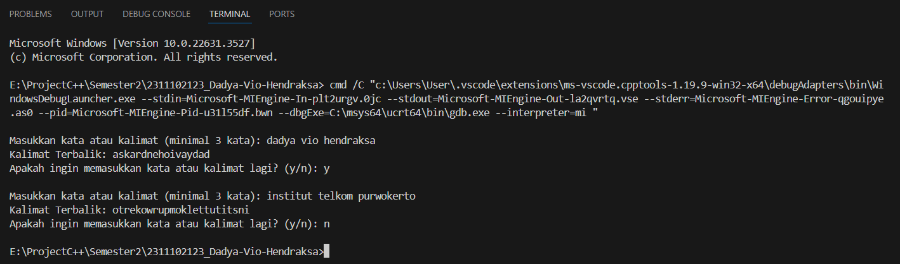

# <h1 align="center">Laporan Praktikum Modul 6 - STACK</h1>
<p align="center">Dadya Vio Hendraksa - 2311102123</p>

## Dasar Teori

1. Pengertian Stack<br/>
Stack, juga dikenal sebagai tumpukan, adalah salah satu struktur data linier dalam pemrograman yang mengikuti aturan Last In First Out (LIFO). Ini berarti elemen terakhir yang dimasukkan ke dalam stack akan menjadi elemen pertama yang diambil. Konsep ini sering diilustrasikan dengan membandingkannya dengan susunan piring yang ditumpuk satu sama lain; ketika kita ingin mengambil piring yang terletak di bagian bawah, kita harus mengambil piring-piring yang ada di atasnya terlebih dahulu.<br/>
Dalam pemrograman C++, stack biasanya diimplementasikan menggunakan array atau linked list. Setiap kali elemen baru dimasukkan ke dalam stack, itu ditempatkan di atas elemen yang sudah ada, sehingga membentuk tumpukan. Operasi utama pada stack adalah push (untuk menambahkan elemen baru ke dalam stack) dan pop (untuk menghapus elemen teratas dari stack). Operasi lain yang umum dilakukan pada stack adalah peek (untuk melihat elemen teratas tanpa menghapusnya) dan isEmpty (untuk memeriksa apakah stack kosong atau tidak).<br/>
Penerapan stack dalam pemrograman sangat luas, mulai dari penyelesaian ekspresi matematika dalam notasi postfix hingga manajemen memori dalam sistem komputer. Dengan karakteristik LIFO-nya, stack sangat berguna dalam mempertahankan urutan operasi atau data yang penting dan memudahkan akses ke elemen terbaru yang dimasukkan. Dalam struktur data stack ada dua kondisi yang perlu dihindari, yaitu underflow dan overflow.<br/>
• Stack underflow, yaitu keadaan dimana kita mencoba mengakses atau menghapus elemen data pada stack yang kosong<br/>
• Stack overflow, yaitu keadaan di mana ruang memori yang dialokasikan untuk struktur data stack sudah penuh namun masih dilakukan operasi penyisipan elemen<br/>
</br>

2. Karakteristik dan Kegunaan Stack<br/>
Karakteristik Stack:<br/>
Stack, sebagai struktur data, memiliki beberapa ciri khas yang perlu diperhatikan:<br/>
• Penggunaan dalam berbagai algoritma seperti Tower of Hanoi, traversal pohon, dan rekursi.<br/>
• Implementasinya dapat dilakukan menggunakan array atau linked list.<br/>
• Mengikuti prinsip Last In First Out (LIFO), di mana elemen terakhir yang dimasukkan akan menjadi yang pertama dikeluarkan.<br/>
• Operasi penyisipan dan penghapusan terjadi di ujung atas tumpukan.<br/>
• Kemungkinan terjadi stack overflow ketika ruang memori sudah penuh dan masih ada operasi penyisipan.<br/>
• Kemungkinan terjadi stack underflow ketika struktur data kosong dan tetap dilakukan operasi penghapusan.<br/>

Fungsi dan Kegunaan Stack:<br/>
Selain karakteristiknya, stack memiliki peran penting dalam berbagai konteks:<br/>
• Evaluasi dan konversi ekspresi aritmatika, sering digunakan dalam program kompiler.<br/>
• Mendukung pemrograman rekursif.<br/>
• Berguna dalam pemeriksaan keseimbangan tanda kurung.<br/>
• Manajemen memori dalam aplikasi komputer.<br/>
• Memproses pemanggilan dan pengembalian fungsi dengan efisien.

3. Operasi Stack</br>
Operasi pada stack melibatkan fungsi dasar yang penting untuk manipulasi struktur data ini. Berikut adalah beberapa operasi umum pada stack:<br/>
Push: Menambahkan elemen ke tumpukan pada posisi teratas.<br/>
Pop: Menghapus elemen dari posisi teratas tumpukan.<br/>
Top: Mendapatkan nilai elemen teratas pada tumpukan tanpa menghapusnya.<br/>
IsEmpty: Memeriksa apakah tumpukan kosong.<br/>
IsFull: Memeriksa apakah tumpukan penuh (khususnya pada implementasi dengan kapasitas terbatas).<br/>
Size: Mengembalikan jumlah elemen dalam tumpukan.<br/>
Peek: Melihat nilai atau elemen pada posisi tertentu dalam tumpukan tanpa menghapusnya.<br/>
Clear: Mengosongkan semua elemen dari tumpukan.<br/>
Search: Mencari keberadaan elemen tertentu dalam tumpukan.<br/>
Operasi-operasi ini merupakan bagian penting dari manipulasi data dengan stack, memfasilitasi pengelolaan data sesuai dengan prinsip Last In First Out (LIFO).

## Guided 

### 1. Program Latihan l Stack

```C++
#include <iostream>

using namespace std;

string arrayBuku[5];
int maksimal = 5, top = 0;

bool isFull() { return (top == maksimal); }
bool isEmpty() { return (top == 0); }

void pushArrayBuku(string data) {
  if (isFull()) {
    cout << "Data telah penuh" << endl;
  } else {
    arrayBuku[top] = data;
    top++;
  }
}
void popArrayBuku() {
  if (isEmpty()) {
    cout << "Tidak ada data yang dihapus" << endl;
  } else {
    arrayBuku[top - 1] = "";
    top--;
  }
}
void peekArrayBuku(int posisi) {
  if (isEmpty()) {
    cout << "Tidak ada data yang bisa dilihat" << endl;
  } else {
    int index = top;
    for (int i = 1; i <= posisi; i++) {
      index--;
    }
    cout << "Posisi ke " << posisi << " adalah " << arrayBuku[index] << endl;
  }
}
int countStack() { return top; }
void changeArrayBuku(int posisi, string data) {
  if (posisi > top) {
    cout << "Posisi melebihi data yang ada" << endl;
  } else {
    int index = top;
    for (int i = 1; i <= posisi; i++) {
      index--;
    }
    arrayBuku[index] = data;
  }
}
void destroyArraybuku() {
  for (int i = top; i >= 0; i--) {
    arrayBuku[i] = "";
  }
  top = 0;
}
void cetakArrayBuku() {
  if (isEmpty()) {
    cout << "Tidak ada data yang dicetak" << endl;
  } else {
    for (int i = top - 1; i >= 0; i--) {
      cout << arrayBuku[i] << endl;
    }
  }
}
int main() {
  pushArrayBuku("Kalkulus");
  pushArrayBuku("Struktur Data");
  pushArrayBuku("Matematika Diskrit");
  pushArrayBuku("Dasar Multimedia");
  pushArrayBuku("Inggris");
  cetakArrayBuku();
  cout << "\n";
  cout << "Apakah data stack penuh? " << isFull() << endl;
  cout << "Apakah data stack kosong? " << isEmpty() << endl;
  peekArrayBuku(2);
  popArrayBuku();
  cout << "Banyaknya data = " << countStack() << endl;
  changeArrayBuku(2, "Bahasa Jerman");
  cetakArrayBuku();
  cout << "\n";
  destroyArraybuku();
  cout << "Jumlah data setelah dihapus: " << top << endl;
  cetakArrayBuku();
  return 0;
}
```
Program tersebut merupakan Pemprograman ini merupakan program yang menunjukkan implementasi stack menggunakan array. Program ini memiliki beberapa fungsi yaitu:</br>
• pushArray - Menambahkan data ke dalam stack array buku dengan syarat stack belum penuh. Jika stack penuh, maka akan menampilkan pesan "Data telah penuh".</br>
• popArray - Menghapus data dari stack array buku dengan syarat stack tidak kosong. Jika stack kosong, maka akan menampilkan pesan "Tidak ada data yang dihapus".</br>
• peekArray - Menampilkan data pada posisi tertentu dari stack array buku dengan syarat stack tidak kosong. Jika stack kosong, maka akan menampilkan pesan "Tidak ada data yang bisa dilihat".</br>
• countStack - Menghitung jumlah data yang ada pada stack array buku.</br>
• changeArrayBuku - Mengubah data pada posisi tertentu dari stack array buku dengan syarat posisi tidak melebihi jumlah data yang ada. Jika posisi melebihi jumlah data yang ada, maka akan menampilkan pesan "Posisi melebihi data yang ada".</br>
• destroyArrayBuku - Menghapus semua data yang ada pada stack array buku.</br>
• cetakArrayBuku - Menampilkan semua data yang ada pada stack array buku.</br>
Program ini juga menampilkan hasil dari implementasi fungsi-fungsi tersebut dengan menambahkan beberapa data ke dalam stack array buku. Jadi program ini merupakan proses stack menggunakan array tentang buku-buku yang ada di dalam stack tersebut. Dengan adanya program ini, kita dapat memahami bagaimana cara kerja stack menggunakan array dan bagaimana cara mengimplementasikannya dalam program.

## Unguided 

### 1. Buatlah program untuk menentukan apakah kalimat tersebut yang diinputkan dalam program stack adalah palindrom/tidak. Palindrom kalimat yang dibaca dari depan dan belakang sama. Jelaskan bagaimana cara kerja programnya.</br>

### Contoh:</br>

### Kalimat : ini</br>
### Kalimat tersebut adalah polindrom</br>

### Kalimat : telkom</br>
### Kalimat tersebut adalah bukan polindrom</br>

```C++
/*
Dadya Vio Hendraksa - 2311102123
*/

#include <iostream> // Library untuk input output
#include <string> // Library untuk string
#include <stack> // Library untuk stack

using namespace std;

// Fungsi untuk membersihkan kata dari karakter non-alfabet dan mengubahnya menjadi huruf kecil
string bersihkan_dan_ubah_ke_huruf_kecil_2123(string str) { 
    string cleanStr; 
    for (char &c : str) {
        if (isalpha(c)) { // Hanya menambahkan karakter alfabet ke string bersih 
            cleanStr += tolower(c); // Mengubah karakter menjadi huruf kecil
        }
    }
    return cleanStr; // Mengembalikan string yang sudah dibersihkan
}

bool Palindrom_2123(string str) { // Fungsi untuk mengecek apakah kata/kalimat tersebut palindrom atau bukan
    stack<char> charStack;
    int length = str.length(); // Panjang kata/kalimat yang akan dicek palindrom atau bukan

    // Menempatkan setengah pertama kata/kalimat ke dalam stack
    for (int i = 0; i < length / 2; i++) {
        charStack.push(str[i]);
    }

    // Membandingkan setengah kedua kata/kalimat dengan karakter yang di-pop dari stack
    int start = length / 2;
    if (length % 2 != 0) {
        start++; // Lewati karakter tengah jika panjang ganjil
    }
    for (int i = start; i < length; i++) { // Membandingkan setengah kedua kata/kalimat dengan karakter yang di-pop dari stack 
        if (charStack.empty() || str[i] != charStack.top()) { // Jika stack kosong atau karakter tidak sama dengan karakter yang di-pop dari stack
            return false;
        }
        charStack.pop(); // Menghapus karakter dari stack jika karakter sama dengan karakter yang di-pop dari stack 
    }

    return true;
}

int main() {
    char lanjutkan_2123;
    do {
        string input;
        cout << "\nMasukkan kata atau kalimat: ";
        getline(cin, input); // Mengambil inputan dari user berupa kata atau kalimat 

        // Membersihkan dan mengubah menjadi huruf kecil
        string membersihkan_input_2123 = bersihkan_dan_ubah_ke_huruf_kecil_2123(input);

        if (Palindrom_2123(membersihkan_input_2123)) { // Memanggil fungsi Palindrom_2123 dengan parameter membersihkan_input_2123
            cout << "Kata atau kalimat tersebut adalah : Palindrom" << endl;
        } else { // Jika fungsi Palindrom_2123 mengembalikan nilai false
            cout << "Kata atau kalimat tersebut adalah : Bukan Palindrom" << endl;
        }

        cout << "Ingin memasukkan kata atau kalimat lain? (y/n): ";
        cin >> lanjutkan_2123;
        cin.ignore(); // Membersihkan newline dari buffer
    } while (lanjutkan_2123 == 'y' || lanjutkan_2123 == 'Y');

    return 0;
}
```

#### Output:
</br>
Program ini adalah program untuk mengecek apakah kata atau kalimat tersebut palindrom atau bukan. Dimana pemprograman ini menggunakan stack untuk mengecek kata atau kalimat tersebut palindrom atau bukan. Program ini akan meminta inputan dari user berupa kata atau kalimat, kemudian program akan membersihkan kata atau kalimat tersebut dari karakter non-alfabet dan mengubahnya menjadi huruf kecil. Setelah itu program akan mengecek apakah kata atau kalimat tersebut palindrom atau bukan. Jika kata atau kalimat tersebut palindrom, maka program akan menampilkan pesan "Kata atau kalimat tersebut adalah : Palindrom", jika kata atau kalimat tersebut bukan palindrom, maka program akan menampilkan pesan "Kata atau kalimat tersebut adalah : Bukan Palindrom". Setelah itu program akan menanyakan kepada user apakah ingin memasukkan kata atau kalimat lain atau tidak. Jika user memasukkan 'y' atau 'Y', maka program akan meminta inputan kata atau kalimat lagi, jika user memasukkan 'n' atau 'N', maka program akan berhenti.Dengan operasi/fungsi beserta tugasnya yang digunakan yaitu: </br>
• string bersihkan_dan_ubah_ke_huruf_kecil_2123(string str) -> Fungsi ini digunakan untuk membersihkan kata dari karakter non-alfabet dan mengubahnya menjadi huruf kecil. 2. bool Palindrom_2123(string str) -> Fungsi ini digunakan untuk mengecek apakah kata/kalimat tersebut palindrom atau bukan. 3. int main() -> Fungsi ini digunakan untuk menjalankan program utama.</br>
• bool Palindrom_2123(string str) -> Fungsi ini digunakan untuk mengecek apakah kata/kalimat tersebut palindrom atau bukan. </br>
• int main() -> Fungsi ini digunakan untuk menjalankan program utama.</br>
Maka program ini akan mengecek apakah kata atau kalimat tersebut palindrom atau bukan. sesuai dengan inputan yang diberikan oleh user.</br>

### 2. Buatlah program untuk melakukan pembalikan terhadap kalimat menggunakanstack dengan minimal 3 kata. Jelaskan output program dan source codenya beserta operasi/fungsi yang dibuat?.</br>

### Contoh:</br>

### Kalimat : Telkom Purwokerto</br>
### Hasil : otrekowruP mokleT</br>

```C++
#include <iostream> // Library untuk input output
#include <string> // Library untuk string
#include <stack> // Library untuk stack
#include <algorithm> // Library untuk count

using namespace std;

// Fungsi untuk membersihkan kata dari karakter non-alfabet dan mengubahnya menjadi huruf kecil
string bersihkan_Dan_Kecilkan_Hurufnya_2123(string str) {
    string cleanStr;
    for (char &c : str) {
        if (isalpha(c)) { // Hanya menambahkan karakter alfabet ke string bersih
            cleanStr += tolower(c); // Mengubah karakter menjadi huruf kecil jika karakter tersebut adalah alfabet 
        }
    }
    return cleanStr;
}

// Fungsi untuk melakukan pembalikan kalimat menggunakan stack
string balik_Kalimat_2123(string kalimat) {
    stack<char> tumpukanKarakter; // Membuat stack untuk menampung karakter yang akan dibalik
    string kalimat_Terbalik_2123;

    // Membersihkan dan mengubah menjadi huruf kecil
    kalimat = bersihkan_Dan_Kecilkan_Hurufnya_2123(kalimat);

    // Menempatkan setiap karakter ke dalam tumpukan
    for (char c : kalimat) {
        if (c != ' ') {
            tumpukanKarakter.push(c); // Menambahkan karakter ke dalam tumpukan jika karakter tersebut bukan spasi 
        } else {
            // Mengosongkan tumpukan dan menambahkan kata yang telah dibalik ke kalimatTerbalik
            while (!tumpukanKarakter.empty()) {
                kalimat_Terbalik_2123 += tumpukanKarakter.top(); // Menambahkan karakter yang di-pop dari tumpukan ke kalimatTerbalik 
                tumpukanKarakter.pop(); // Menghapus karakter dari tumpukan
            }
            kalimat_Terbalik_2123 += ' '; // Menambahkan spasi setelah setiap kata yang telah dibalik
        }
    }

    // Menambahkan kata terakhir yang telah dibalik
    while (!tumpukanKarakter.empty()) { // Mengosongkan tumpukan dan menambahkan kata yang telah dibalik ke kalimatTerbalik 
        kalimat_Terbalik_2123 += tumpukanKarakter.top(); // Menambahkan karakter yang di-pop dari tumpukan ke kalimatTerbalik 
        tumpukanKarakter.pop(); // Menghapus karakter dari tumpukan
    }

    return kalimat_Terbalik_2123; // Mengembalikan kalimat yang telah dibalik
}

int main() {
    string kalimat_2123;
    char lanjutkan_2123;

    do {
        cout << "\nMasukkan kata atau kalimat (minimal 3 kata): ";
        getline(cin, kalimat_2123); // Mengambil inputan dari user berupa kata atau kalimat

        // Mengecek apakah kalimat memiliki minimal 3 kata
        int jumlah_Spasi_2123 = count(kalimat_2123.begin(), kalimat_2123.end(), ' '); // Menghitung jumlah spasi pada kalimat 
        int jumlah_Kata_2123 = jumlah_Spasi_2123 + 1; // Jumlah kata adalah jumlah spasi ditambah 1 

        if (jumlah_Kata_2123 < 3) {
            cout << "Masukkan minimal 3 kata!" << endl;
        } else {
            string kalimatTerbalik = balik_Kalimat_2123(kalimat_2123); // Memanggil fungsi balikKalimat dengan parameter kalimat 
            cout << "Kalimat Terbalik: " << kalimatTerbalik << endl; 
        }

        cout << "Apakah ingin memasukkan kata atau kalimat lagi? (y/n): ";
        cin >> lanjutkan_2123;
        cin.ignore(); // Membersihkan buffer dari newline sebelumnya
    } while (lanjutkan_2123 == 'y' || lanjutkan_2123 == 'Y'); // Perulangan jika user ingin memasukkan kata atau kalimat lagi

    return 0;
}
```

#### Output:
</br>
Program ini utamanya menggunakan struktur data stack untuk membalikkan kalimat yang diinputkan oleh user. dimana saya mengggunakan libary stack 
untuk membuat stack yang berisi karakter-karakter dari kalimat yang diinputkan oleh user. kemudian saya menggunakan fungsi balikKalimat untuk membalikkan kalimat yang diinputkan oleh user. Library algorithm untuk menghitung jumlah spasi pada kalimat yang diinputkan oleh user. Pemprograman ini memiliki tugas utama yaitu membalikkan kalimat yang diinputkan oleh user. Dimana menggunakan beberapa operasi/fungsi yaitu:</br>
• fungsi string bersikan_Dan_Kecilkan_Hurufnya_2123 untuk membersihkan dan mengubah huruf menjadi huruf kecil, </br>
• fungsi string balik_Kalimat_2123 untuk membalikkan kalimat yang diinputkan oleh user,dan juga menggunakan </br>
• fungsi count untuk menghitung jumlah spasi pada kalimat yang diinputkan oleh user. </br>
Sehingga pada fungsi main, program akan meminta user untuk memasukkan kalimat yang akan dibalikkan, kemudian program akan memanggil fungsi balikKalimat untuk membalikkan kalimat yang diinputkan oleh user. Maka kesimpulannya, program ini akan membalikkan kalimat yang diinputkan oleh user dengan menggunakan stack. dengan menggunakan beberapa operasi/fungsi yang telah dijelaskan diatas.


## Kesimpulan
Kesimpulannya tentang materi 

## Referensi
[1] Malik, D.S., C++ Programming. Boston: Course Technology, 2023.<br/>
[2] Ahmad Ghiyas Ahyar, et al., JURNAL PEMBELAJARAN ARRAY, LINKED LIST, STACK, DAN QUEUE, 2021.<br/>
[3] Anita Sindar RMS, ST., M.TI., STRUKTUR DATA DAN ALGORITMA DENGAN C++. Serang: CV. AA. RIZKY, 2019.