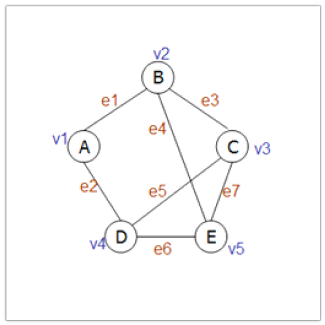
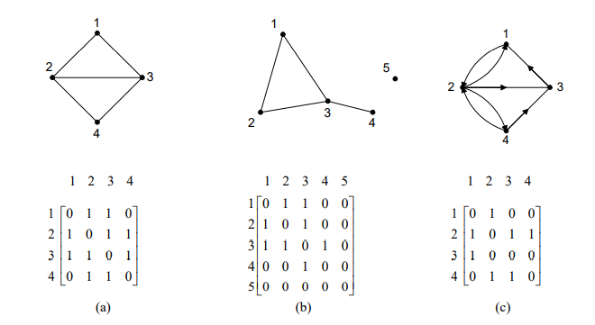
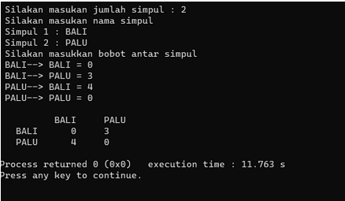
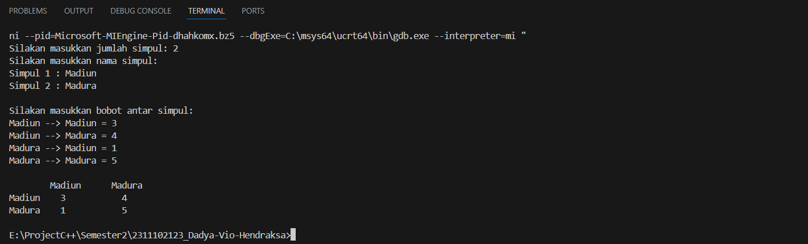
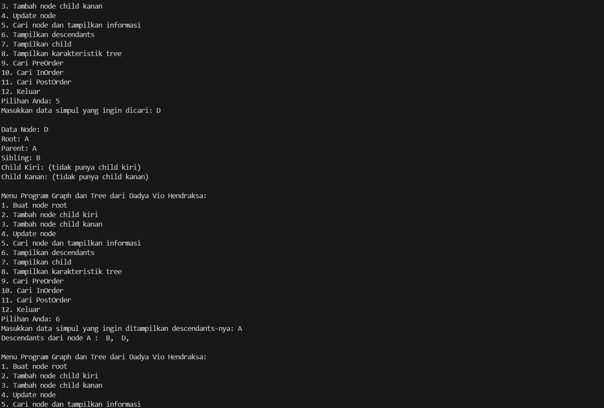
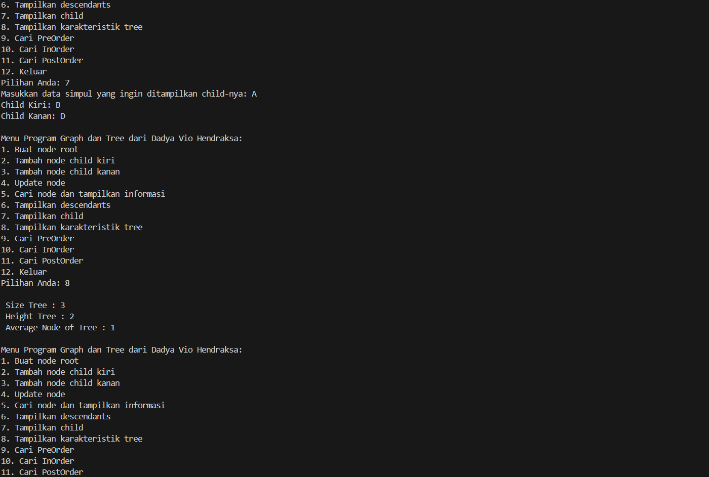
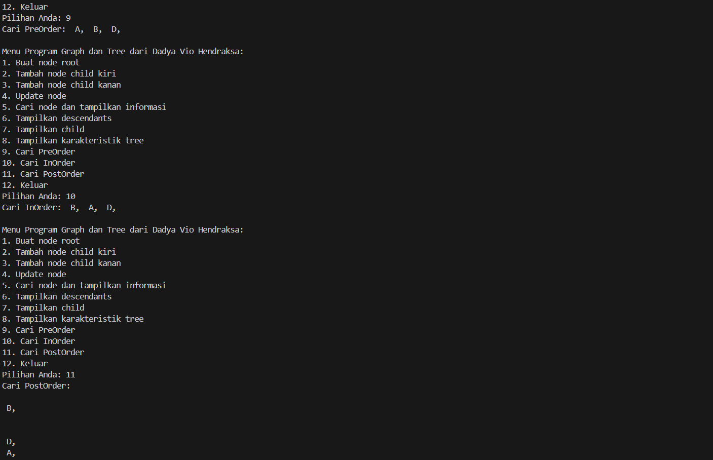
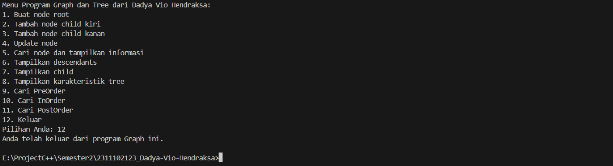

# <h1 align="center">Laporan Praktikum Modul 9 - GRAPH AND TREE</h1>
<p align="center">Dadya Vio Hendraksa - 2311102123</p>

## Dasar Teori

1. Pengertian dan Fungsi Graph<br/>
Graf, dalam konteks struktur data, adalah representasi visual dari hubungan antara objek-objek tertentu. Secara formal, graf dapat dinyatakan sebagai pasangan terurut 𝐺=(𝑉,𝐸), di mana 𝐺 adalah graf, 𝑉 adalah himpunan simpul atau vertex, dan 𝐸 adalah himpunan sisi atau edge yang menghubungkan simpul-simpul tersebut. Dalam graf, simpul-simpul (atau vertex) merepresentasikan objek atau entitas tertentu, sementara sisi-sisi (atau edge) menggambarkan hubungan antara simpul-simpul tersebut. Graf digunakan untuk memodelkan berbagai situasi di berbagai bidang, seperti jaringan komputer, rute transportasi, relasi sosial, dan banyak lagi.<br/>
Dalam representasi graf, simpul-simpul sering kali direpresentasikan sebagai titik atau lingkaran, sedangkan sisi-sisi diwakili oleh garis atau panah yang menghubungkan simpul-simpul tersebut. Setiap sisi dapat memiliki arah (disebut graf berarah) atau tidak (disebut graf tidak berarah), dan dapat memiliki bobot atau atribut tambahan yang menggambarkan informasi tambahan tentang hubungan antara simpul-simpul. Graf dapat berupa acyclic (tanpa siklus) atau cyclic (dengan siklus). Graf acyclic tidak memiliki siklus atau jalur tertutup dari simpul yang melewati sisi yang sama lebih dari sekali, sedangkan graf cyclic memiliki setidaknya satu siklus. Dalam penggunaan praktis, graf digunakan untuk menganalisis dan memodelkan berbagai masalah, dan berbagai algoritma telah dikembangkan untuk memanipulasi dan mengelola graf, seperti algoritma pencarian jalan terpendek, algoritma alur terbesar, dan banyak lagi.<br/>
</br>

2. Jenis-Jenis Graph<br/>
Graf Berarah (Directed Graph):<br/>
Graf berarah adalah graf di mana setiap sisi memiliki arah tertentu, artinya sisi memiliki orientasi dari satu simpul ke simpul lainnya. Dalam graf ini, perjalanan hanya bisa dilakukan dalam satu arah. Contohnya adalah jaringan perjalanan udara dengan penerbangan langsung dari kota A ke kota B, yang tidak selalu memiliki penerbangan langsung balik dari kota B ke kota A.<br/>
Graf Tidak Berarah (Undirected Graph):<br/>
Graf tidak berarah adalah graf di mana setiap sisi tidak memiliki arah tertentu, sehingga perjalanan bisa dilakukan dari satu simpul ke simpul lainnya dalam kedua arah. Contohnya adalah jaringan jalan raya di mana jalan antara dua kota dapat dilalui dalam kedua arah.<br/>
Graf Berbobot (Weighted Graph):<br/>
Graf berbobot adalah graf di mana setiap sisi memiliki nilai numerik yang disebut bobot atau weight, yang menggambarkan biaya, jarak, atau atribut lain dari hubungan antara dua simpul yang dihubungkan oleh sisi tersebut. Graf ini digunakan untuk memodelkan situasi di mana hubungan antara simpul memiliki nilai yang bervariasi, seperti biaya perjalanan antar kota dalam jaringan transportasi.<br/>
</br>

3. Representasi Graph</br>
Representasi graf dengan matriks adjacency menggunakan matriks dua dimensi di mana setiap elemen matriks merepresentasikan hubungan antara simpul-simpul dalam graf. Nilai di posisi (i,j) menunjukkan apakah ada sisi yang menghubungkan simpul 𝑖 dan 𝑗. Keuntungan dari pendekatan ini adalah kemudahan dalam menemukan apakah dua simpul terhubung. Namun, kelemahannya adalah ukuran matriks bisa menjadi besar jika graf memiliki banyak simpul tetapi sedikit sisi.</br>
Di sisi lain, representasi graf dengan linked list adjacency menggunakan struktur data linked list di mana setiap simpul dalam graf direpresentasikan sebagai node. Setiap simpul memiliki linked list sendiri yang berisi simpul-simpul tetangganya. Keuntungan dari pendekatan ini adalah efisien dalam menyimpan graf yang jarang, karena hanya menyimpan informasi tentang sisi yang ada. Namun, pencarian sisi antara dua simpul tertentu mungkin lebih lambat daripada menggunakan matriks adjacency. Pemilihan antara kedua pendekatan ini tergantung pada sifat dari graf yang akan direpresentasikan serta kebutuhan aplikasi yang menggunakan graf tersebut.</br>
</br>
4. Tree atau Pohon</br>
Tree atau pohon adalah struktur data hierarkis yang terdiri dari simpul-simpul yang terhubung satu sama lain dalam pola yang berhingga dan tidak berbentuk siklik. Setiap pohon terdiri dari simpul-simpul yang terdiri dari dua bagian utama: simpul akar (root node) dan simpul-simpul anak (child nodes). Simpul akar adalah simpul paling atas dalam pohon yang tidak memiliki simpul induk (parent node), sedangkan simpul anak adalah simpul-simpul yang berada di bawah simpul akar dan terhubung langsung ke simpul tersebut. Ciri khas lain dari pohon adalah setiap simpul anak hanya memiliki satu simpul induk atau parent node, yang berbeda dengan graf biasa di mana simpul dapat memiliki beberapa simpul induk. Oleh karena itu, setiap simpul dalam pohon memiliki hubungan parent-child yang jelas.</br>
Pohon umumnya digunakan untuk merepresentasikan hierarki data, seperti struktur file pada sistem operasi, struktur direktori pada komputer, struktur organisasi dalam bisnis, dan struktur hierarki dalam bahasa pemrograman seperti struktur dari pohon ekspresi dalam pemrosesan bahasa aljabar. Selain itu, pohon juga sering digunakan dalam algoritma dan struktur data, seperti pohon pencarian biner (binary search tree), pohon merah-hitam (red-black tree), dan pohon B (B-tree), yang digunakan dalam berbagai aplikasi seperti pengurutan dan pencarian data, manajemen basis data, dan lain-lain. Pemahaman tentang konsep pohon sangat penting dalam pemrograman dan pengembangan perangkat lunak karena memungkinkan pengorganisasian data secara hierarkis dan efisien serta menyediakan kerangka kerja untuk berbagai algoritma dan struktur data yang kompleks.</br>

Operasi pada tree melibatkan berbagai tindakan untuk manipulasi dan analisis data dalam struktur pohon. Beberapa operasi umum termasuk:</br>
• Penyisipan (Insertion): Menambahkan simpul baru ke dalam pohon.</br>
• Penghapusan (Deletion): Menghapus simpul tertentu dari pohon.</br>
• Penelusuran (Traversal): Mengunjungi setiap simpul dalam pohon dalam urutan tertentu, seperti pre-order, in-order, dan post-order.</br>
• Pencarian (Searching): Mencari simpul tertentu dalam pohon berdasarkan kriteria pencarian tertentu.</br>
• Penelusuran Level (Level Traversal): Menelusuri pohon secara level, dari atas ke bawah.</br>
• Pengimbangan (Balancing): Memastikan pohon tetap seimbang untuk mengoptimalkan kinerja operasi.</br>
• Penghitungan (Counting): Menghitung jumlah simpul atau tinggi pohon.</br>
Setiap operasi memiliki peran khusus dalam manipulasi dan analisis data dalam pohon, dan pilihan operasi bergantung pada jenis pohon yang digunakan dan kebutuhan aplikasi tertentu.</br>
Urutan penelusuran pohon (tree traversal) umumnya dibagi menjadi tiga jenis: inorder, postorder, dan preorder.</br>
• Inorder Traversal: Mengunjungi simpul kiri, kemudian akar, dan terakhir simpul kanan.</br>
• Preorder Traversal: Mengunjungi simpul akar, kemudian simpul kiri, dan terakhir simpul kanan.</br>
• Postorder Traversal: Mengunjungi simpul kiri, kemudian simpul kanan, dan terakhir akar.</br>
Setiap jenis penelusuran memiliki kegunaan dan aplikasi yang berbeda tergantung pada kebutuhan dalam pemrosesan data pada pohon. Misalnya, inorder traversal cocok untuk pencarian data terurut, sementara preorder traversal berguna untuk membuat salinan pohon.</br>
</br>

## Guided 

### 1. Latihan 1 Graph.

```C++
#include <iomanip>
#include <iostream>

using namespace std;

string simpul[7] = {"Ciamis",  "Bandung",    "Bekasi",    "Tasikmalaya",
                    "Cianjur", "Purwokerto", "Yogyakarta"};

int busur[7][7] = {{0, 7, 8, 0, 0, 0, 0},   {0, 0, 5, 0, 0, 15, 0},
                   {0, 6, 0, 0, 5, 0, 0},   {0, 5, 0, 0, 2, 4, 0},
                   {23, 0, 0, 10, 0, 0, 8}, {0, 0, 0, 0, 7, 0, 3},
                   {0, 0, 0, 0, 9, 4, 0}};

void tampilGraph() {
  for (int baris = 0; baris < 7; baris++) {
    cout << " " << setiosflags(ios::left) << setw(15) << simpul[baris] << " : ";
    for (int kolom = 0; kolom < 7; kolom++) {
      if (busur[baris][kolom] != 0) {
        cout << " " << simpul[kolom] << "(" << busur[baris][kolom] << ")";
      }
    }
    cout << endl;
  }
}

int main() {
  tampilGraph();
  return 0;
}
```
Pemprograman diatas merupakan program yang menampilkan graf berarah yang terdiri dari 7 simpul dan 12 busur. Program ini menggunakan array 2 
dimensi untuk merepresentasikan graf tersebut. Program ini juga menggunakan fungsi tampilGraph() untuk menampilkan graf tersebut. Terdapat array
simpul yang berisi nama simpul dan array busur yang berisi bobot antar simpul. Program ini akan menampilkan graf berarah yang terdiri dari 7 simpuldan 12 busur. Yang kemudian kita menggunakan void tampilGraph() untuk menampilkan graf tersebut. Yang dimana kita menggunakan perulangan for untuk menampilkan graf tersebut. Lalu pada fungsi main() kita memanggil fungsi tampilGraph() untuk menampilkan graf tersebut. </br>

### 2. Latihan 2 Tree.

```C++
#include <iostream>
#include <iomanip>

using namespace std;

struct Pohon
{
    char data;
    Pohon *left, *right, *parent;
};

Pohon *root, *baru;

void init()
{
    root = NULL;
}

bool isEmpty()
{
    return root == NULL;
}

void buatNode(char data)
{
    if (isEmpty())
    {
        root = new Pohon();
        root->data = data;
        root->left = NULL;
        root->right = NULL;
        root->parent = NULL;
        cout << "\n Node " << data << " berhasil dibuat sebagai root."
             << endl;
    }
    else
    {
        cout << "\n Tree sudah ada!" << endl;
    }
}

Pohon *insertLeft(char data, Pohon *node)
{
    if (isEmpty())
    {
        cout << "\n Buat tree terlebih dahulu!" << endl;
        return NULL;
    }
    else
    {
        if (node->left != NULL)
        {
            cout << "\n Node " << node->data << " sudah ada child kiri !" << endl;
            return NULL;
        }
        else
        {
            Pohon *baru = new Pohon();
            baru->data = data;
            baru->left = NULL;
            baru->right = NULL;
            baru->parent = node;
            node->left = baru;
            cout << "\n Node " << data << " berhasil ditambahkan ke child kiri " << baru->parent->data << endl;
            return baru;
        }
    }
}

Pohon *insertRight(char data, Pohon *node)
{
    if (isEmpty())
    {
        cout << "\n Buat tree terlebih dahulu!" << endl;
        return NULL;
    }
    else
    {
        if (node->right != NULL)
        {
            cout << "\n Node " << node->data << " sudah ada child kanan !" << endl;
            return NULL;
        }
        else
        {
            Pohon *baru = new Pohon();
            baru->data = data;
            baru->left = NULL;
            baru->right = NULL;
            baru->parent = node;
            node->right = baru;
            cout << "\n Node " << data << " berhasil ditambahkan ke child kanan " << baru->parent->data << endl;
            return baru;
        }
    }
}

void update(char data, Pohon *node)
{
    if (isEmpty())
    {
        cout << "\n Buat tree terlebih dahulu!" << endl;
    }
    else
    {
        if (!node)
        {
            cout << "\n Node yang ingin diganti tidak ada!!" << endl;
        }
        else
        {
            char temp = node->data;
            node->data = data;
            cout << "\n Node " << temp << " berhasil diubah menjadi "
                 << data << endl;
        }
    }
}

void retrieve(Pohon *node)
{
    if (isEmpty())
    {
        cout << "\n Buat tree terlebih dahulu!" << endl;
    }
    else
    {
        if (!node)
        {
            cout << "\n Node yang ditunjuk tidak ada!" << endl;
        }
        else
        {
            cout << "\n Data node : " << node->data << endl;
        }
    }
}

void find(Pohon *node)
{
    if (isEmpty())
    {
        cout << "\n Buat tree terlebih dahulu!" << endl;
    }
    else
    {
        if (!node)
        {
            cout << "\n Node yang ditunjuk tidak ada!" << endl;
        }
        else
        {
            cout << "\n Data Node : " << node->data << endl;
            cout << " Root : " << root->data << endl;
            if (!node->parent)
                cout << " Parent : (tidak punya parent)" << endl;
            else
                cout << " Parent : " << node->parent->data << endl;
            if (node->parent != NULL && node->parent->left != node &&
                node->parent->right == node)
                cout << " Sibling : " << node->parent->left->data << endl;
            else if (node->parent != NULL && node->parent->right != node && node->parent->left == node)
                cout << " Sibling : " << node->parent->right->data << endl;
            else
                cout << " Sibling : (tidak punya sibling)" << endl;
            if (!node->left)
                cout << " Child Kiri : (tidak punya Child kiri)" << endl;
            else
                cout << " Child Kiri : " << node->left->data << endl;
            if (!node->right)
                cout << " Child Kanan : (tidak punya Child kanan)" << endl;
            else
                cout << " Child Kanan : " << node->right->data << endl;
        }
    }
}

// Penelusuran (Traversal)
// preOrder
void preOrder(Pohon *node = root)
{
    if (isEmpty())
    {
        cout << "\n Buat tree terlebih dahulu!" << endl;
    }
    else
    {
        if (node != NULL)
        {
            cout << " " << node->data << ", ";
            preOrder(node->left);
            preOrder(node->right);
        }
    }
}

// inOrder
void inOrder(Pohon *node = root)
{
    if (isEmpty())
    {
        cout << "\n Buat tree terlebih dahulu!" << endl;
    }
    else
    {
        if (node != NULL)
        {
            inOrder(node->left);
            cout << " " << node->data << ", ";
            inOrder(node->right);
        }
    }
}

// postOrder
void postOrder(Pohon *node = root)
{
    if (isEmpty())
    {
        cout << "\n Buat tree terlebih dahulu!" << endl;
    }
    else
    {
        if (node != NULL)
        {
            postOrder(node->left);
            postOrder(node->right);
            cout << " " << node->data << ", ";
        }
    }
}

// Hapus Node Tree
void deleteTree(Pohon *node)
{
    if (isEmpty())
    {
        cout << "\n Buat tree terlebih dahulu!" << endl;
    }
    else
    {
        if (node != NULL)
        {
            if (node != root)
            {
                node->parent->left = NULL;
                node->parent->right = NULL;
            }
            deleteTree(node->left);
            deleteTree(node->right);
            if (node == root)
            {
                delete root;
                root = NULL;
            }
            else
            {
                delete node;
            }
        }
    }
}

// Hapus SubTree
void deleteSub(Pohon *node)
{
    if (isEmpty())
    {
        cout << "\n Buat tree terlebih dahulu!" << endl;
    }
    else
    {
        deleteTree(node->left);
        deleteTree(node->right);
        cout << "\n Node subtree " << node->data << " berhasil dihapus." << endl;
    }
}

void clear()
{
    if (isEmpty())
    {
        cout << "\n Buat tree terlebih dahulu!!" << endl;
    }
    else
    {
        deleteTree(root);
        cout << "\n Pohon berhasil dihapus." << endl;
    }
}

// Cek Size Tree
int size(Pohon *node = root)
{
    if (isEmpty())
    {
        cout << "\n Buat tree terlebih dahulu!!" << endl;
        return 0;
    }
    else
    {
        if (!node)
        {
            return 0;
        }
        else
        {
            return 1 + size(node->left) + size(node->right);
        }
    }
}

// Cek Height Level Tree
int height(Pohon *node = root)
{
    if (isEmpty())
    {
        cout << "\n Buat tree terlebih dahulu!" << endl;
        return 0;
    }
    else
    {
        if (!node)
        {
            return 0;
        }
        else
        {
            int heightKiri = height(node->left);
            int heightKanan = height(node->right);
            if (heightKiri >= heightKanan)
            {
                return heightKiri + 1;
            }
            else
            {
                return heightKanan + 1;
            }
        }
    }
}

// Karakteristik Tree
void characteristic()
{
    cout << "\n Size Tree : " << size() << endl;
    cout << " Height Tree : " << height() << endl;
    cout << " Average Node of Tree : " << size() / height() << endl;
}

int main()
{
    buatNode('A');
    Pohon *nodeB, *nodeC, *nodeD, *nodeE, *nodeF, *nodeG, *nodeH, *nodeI, *nodeJ;
    nodeB = insertLeft('B', root);
    nodeC = insertRight('C', root);
    nodeD = insertLeft('D', nodeB);
    nodeE = insertRight('E', nodeB);
    nodeF = insertLeft('F', nodeC);
    nodeG = insertLeft('G', nodeE);
    nodeH = insertRight('H', nodeE);
    nodeI = insertLeft('I', nodeG);
    nodeJ = insertRight('J', nodeG);
    update('Z', nodeC);
    update('C', nodeC);
    retrieve(nodeC);
    find(nodeC);
    characteristic();

    cout << "\n PreOrder :" << endl;
    preOrder(root);
    cout << "\n"<< endl;

    cout << " InOrder :" << endl;
    inOrder(root);
    cout << "\n" << endl;

    cout << " PostOrder :" << endl;
    postOrder(root);
    cout << "\n" << endl;
}
```
Pemprograman diatas ini merupakan program yang mengimplementasikan struktur data tree dengan menggunakan bahasa C++. Dimana banyak sekali fungsi
yang digunakan dalam program ini, seperti fungsi buatNode yang digunakan untuk membuat node baru, fungsi insertLeft dan insertRight yang digunakan untuk menambahkan node baru pada child kiri dan kanan, fungsi update yang digunakan untuk mengubah data node, fungsi retrieve yang digunakan untuk mengambil data node, fungsi find yang digunakan untuk mencari data node, fungsi preOrder, inOrder, dan postOrder yang digunakan untuk melakukan penelusuran pada tree, fungsi deleteTree yang digunakan untuk menghapus tree, fungsi deleteSub yang digunakan untuk menghapus subtree, fungsi clear yang digunakan untuk menghapus pohon, fungsi size yang digunakan untuk mengecek ukuran tree, fungsi height yang digunakan untuk mengecek tinggi tree,dan fungsi characteristic yang digunakan untuk mengecek karakteristik tree. Yang kemudian pada fungsi main, dilakukan pemanggilan fungsi-fungsi tersebut Sesuai dengan kebutuhan program.</br>

## Unguided 

### 1. Buatlah program graph dengan menggunakan inputan user untuk menghitung jarak dari sebuah kota ke kota lainnya. Output Programnya:
</br>

```C++
/*
Dadya Vio Hendraksa - 2311102123
*/

#include <iostream>
#include <vector>
#include <iomanip>

using namespace std;

int main() {
    int jumlah_Simpul_2123;
    cout << "Silakan masukkan jumlah simpul: ";
    cin >> jumlah_Simpul_2123;

    vector<string> simpul_2123(jumlah_Simpul_2123);
    vector<vector<int>> busur_2123(jumlah_Simpul_2123, vector<int>(jumlah_Simpul_2123));

    // Input nama simpul
    cout << "Silakan masukkan nama simpul:\n";
    for (int i = 0; i < jumlah_Simpul_2123; ++i) {
        cout << "Simpul " << i + 1 << " : ";
        cin >> simpul_2123[i];
    }

    // Input bobot antar simpul
    cout << "\nSilakan masukkan bobot antar simpul:\n";
    for (int i = 0; i < jumlah_Simpul_2123; ++i) {
        for (int j = 0; j < jumlah_Simpul_2123; ++j) {
            cout << simpul_2123[i] << " --> " << simpul_2123[j] << " = ";
            cin >> busur_2123[i][j];
        }
    }

    // Tampilkan graf
    int n = simpul_2123.size();

    // Cetak header
    cout << "\n        ";
    for (int i = 0; i < n; ++i) {
        cout << left << setw(12) << simpul_2123[i];
    }
    cout << endl;

    // Cetak baris
    for (int i = 0; i < n; ++i) {
        cout << left << setw(10) << simpul_2123[i];
        for (int j = 0; j < n; ++j) {
            cout << left << setw(12) << busur_2123[i][j];
        }
        cout << endl;
    }

    return 0;
}

```

#### Output:
</br>
Pemprograman diatas ini merupakan program untuk menampilkan graf dengan menggunakan vector. Program ini menggunakan vector untuk menyimpan nama 
simpul dan bobot antar simpul. Kemudian pada int main() program ini akan meminta user untuk memasukkan jumlah simpul yang diinginkan, kemudian
terdapat vector simpul_2123 yang digunakan untuk menyimpan nama simpul dan vector busur_2123 yang digunakan untuk menyimpan bobot antar simpul.
Setelah itu program akan meminta user untuk memasukkan nama simpul dan bobot antar simpul dengan menggunakan perulangan for. Selanjutnya program
akan menampilkan graf dan header dari graf yang telah diinputkan oleh user.</br>

### 2. Modifikasi guided tree diatas dengan program menu menggunakan input data tree dari user dan berikan fungsi tambahan untuk menampilkan node child dan descendant dari node yang diinput kan!


```C++
/*
Dadya Vio Hendraksa - 2311102123
*/

#include <iostream>
#include <iomanip>

using namespace std;

struct Pohon
{
    char data;
    Pohon *left, *right, *parent;
};

Pohon *root, *baru;

void init() // inisialisasi
{
    root = NULL;
}

bool isEmpty() // cek apakah tree kosong
{
    return root == NULL;
}

void buatNode(char data) // membuat node root
{
    if (isEmpty())
    {
        root = new Pohon();
        root->data = data;
        root->left = NULL;
        root->right = NULL;
        root->parent = NULL;
        cout << "\nNode " << data << " berhasil dibuat sebagai root!" << endl;
    }
    else
    {
        cout << "\nTree sudah ada!" << endl;
    }
}

Pohon *findNode(Pohon *node, char data) // mencari node
{
    if (node == NULL) return NULL;
    if (node->data == data) return node;

    Pohon *foundNode = findNode(node->left, data);
    if (foundNode == NULL)
        foundNode = findNode(node->right, data);

    return foundNode;
}

Pohon *insertLeft(char data, Pohon *node) // menambah child kiri
{
    if (isEmpty())
    {
        cout << "\nBuat tree terlebih dahulu!" << endl;
        return NULL;
    }
    else
    {
        if (node->left != NULL)
        {
            cout << "\nNode " << node->data << " sudah ada child kiri!" << endl;
            return NULL;
        }
        else
        {
            Pohon *baru = new Pohon();
            baru->data = data;
            baru->left = NULL;
            baru->right = NULL;
            baru->parent = node;
            node->left = baru;
            cout << "\nNode " << data << " berhasil ditambahkan ke child kiri " << baru->parent->data << endl;
            return baru;
        }
    }
}

Pohon *insertRight(char data, Pohon *node) // menambah child kanan
{
    if (isEmpty())
    {
        cout << "\nBuat tree terlebih dahulu!" << endl;
        return NULL;
    }
    else
    {
        if (node->right != NULL)
        {
            cout << "\nNode " << node->data << " sudah ada child kanan!" << endl;
            return NULL;
        }
        else
        {
            Pohon *baru = new Pohon();
            baru->data = data;
            baru->left = NULL;
            baru->right = NULL;
            baru->parent = node;
            node->right = baru;
            cout << "\nNode " << data << " berhasil ditambahkan ke child kanan " << baru->parent->data << endl;
            return baru;
        }
    }
}

void update(char data, Pohon *node) // mengupdate node
{
    if (isEmpty())
    {
        cout << "\nBuat tree terlebih dahulu!" << endl;
    }
    else
    {
        if (!node)
        {
            cout << "\nNode yang ingin diganti tidak ada!!" << endl;
        }
        else
        {
            char temp = node->data;
            node->data = data;
            cout << "\nNode " << temp << " berhasil diubah menjadi " << data << endl;
        }
    }
}

void find(Pohon *node) // mencari node dan menampilkan informasi node
{
    if (isEmpty())
    {
        cout << "\nBuat tree terlebih dahulu!" << endl;
    }
    else
    {
        if (!node)
        {
            cout << "\nNode yang ditunjuk tidak ada!" << endl;
        }
        else
        {
            cout << "\nData Node: " << node->data << endl;
            cout << "Root: " << root->data << endl;
            if (!node->parent)
                cout << "Parent: (tidak punya parent)" << endl;
            else
                cout << "Parent: " << node->parent->data << endl;
            if (node->parent != NULL && node->parent->left != node && node->parent->right == node)
                cout << "Sibling: " << node->parent->left->data << endl;
            else if (node->parent != NULL && node->parent->right != node && node->parent->left == node)
                cout << "Sibling: " << node->parent->right->data << endl;
            else
                cout << "Sibling: (tidak punya sibling)" << endl;
            if (!node->left)
                cout << "Child Kiri: (tidak punya child kiri)" << endl;
            else
                cout << "Child Kiri: " << node->left->data << endl;
            if (!node->right)
                cout << "Child Kanan: (tidak punya child kanan)" << endl;
            else
                cout << "Child Kanan: " << node->right->data << endl;
        }
    }
}

void printDescendants(Pohon *node) // menampilkan descendants
{
    void preOrder(Pohon * node);

    if (isEmpty())
    {
        cout << "\nBuat tree terlebih dahulu!" << endl;
    }
    else if (!node)
    {
        cout << "\nNode yang ditunjuk tidak ada!" << endl;
    }
    else
    {
        cout << "Descendants dari node " << node->data << " : ";
        if (node->left) preOrder(node->left);
        if (node->right) preOrder(node->right);
        cout << endl;
    }
}

void printChild(Pohon *node) // menampilkan child
{
    if (isEmpty())
    {
        cout << "\nBuat tree terlebih dahulu!" << endl;
    }
    else if (!node)
    {
        cout << "\nNode yang ditunjuk tidak ada!" << endl;
    }
    else
    {
        if (node->left)
        {
            cout << "Child Kiri: " << node->left->data << endl;
        }
        else
        {
            cout << "Child Kiri: (tidak ada)" << endl;
        }

        if (node->right)
        {
            cout << "Child Kanan: " << node->right->data << endl;
        }
        else
        {
            cout << "Child Kanan: (tidak ada)" << endl;
        }
    }
}

// Cek Size Tree
int size(Pohon *node = root)
{
    if (isEmpty())
    {
        cout << "\n Buat tree terlebih dahulu!!" << endl;
        return 0;
    }
    else
    {
        if (!node)
        {
            return 0;
        }
        else
        {
            return 1 + size(node->left) + size(node->right);
        }
    }
}

// Cek Height Level Tree
int height(Pohon *node = root)
{
    if (isEmpty())
    {
        cout << "\n Buat tree terlebih dahulu!" << endl;
        return 0;
    }
    else
    {
        if (!node)
        {
            return 0;
        }
        else
        {
            int heightKiri = height(node->left);
            int heightKanan = height(node->right);
            if (heightKiri >= heightKanan)
            {
                return heightKiri + 1;
            }
            else
            {
                return heightKanan + 1;
            }
        }
    }
}

// Penelusuran (Traversal)
// preOrder
void preOrder(Pohon *node)
{
    if (node != NULL)
    {
        cout << " " << node->data << ", ";
        preOrder(node->left);
        preOrder(node->right);
    }
}


// inOrder
void inOrder(Pohon *node = root)
{
    if (node != NULL)
    {
        inOrder(node->left);
        cout << " " << node->data << ", ";
        inOrder(node->right);
    }
}

// postOrder
void postOrder(Pohon *node = root)
{
    if (node != NULL)
    {
        postOrder(node->left);
        postOrder(node->right);
        cout << " " << node->data << ", ";
    }
    cout << endl;
}

// Karakteristik Tree
void characteristic()
{
    cout << "\n Size Tree : " << size() << endl;
    cout << " Height Tree : " << height() << endl;
    cout << " Average Node of Tree : " << size() / height() << endl;
}

int main() {
    int choice_2123;
    char data_2123, parentData_2123;
    Pohon *parentNode_2123;

    init();

    do {
        cout << "\nMenu Program Graph dan Tree dari Dadya Vio Hendraksa:\n";
        cout << "1. Buat node root\n";
        cout << "2. Tambah node child kiri\n";
        cout << "3. Tambah node child kanan\n";
        cout << "4. Update node\n";
        cout << "5. Cari node dan tampilkan informasi\n";
        cout << "6. Tampilkan descendants\n";
        cout << "7. Tampilkan child\n";
        cout << "8. Tampilkan karakteristik tree\n";
        cout << "9. Cari PreOrder\n";
        cout << "10. Cari InOrder\n";
        cout << "11. Cari PostOrder\n";
        cout << "12. Keluar\n";
        cout << "Pilihan Anda: ";
        cin >> choice_2123;

        switch (choice_2123) {
            case 1:
                if (isEmpty()) {
                    cout << "Masukkan data untuk simpul root: ";
                    cin >> data_2123;
                    buatNode(data_2123);
                } else {
                    cout << "Tree ternyata sudah ada\n";
                }
                break;
            case 2:
                cout << "Masukkan data untuk simpul parent: ";
                cin >> parentData_2123;
                parentNode_2123 = findNode(root, parentData_2123);
                if (parentNode_2123)
                {
                    cout << "Masukkan data untuk child kiri: ";
                    cin >> data_2123;
                    insertLeft(data_2123, parentNode_2123);
                }
                else
                {
                    cout << "Simpul parent tidak ada.\n";
                }
                break;
            case 3:
                cout << "Masukkan data untuk simpul parent: ";
                cin >> parentData_2123;
                parentNode_2123 = findNode(root, parentData_2123);
                if (parentNode_2123)
                {
                    cout << "Masukkan data untuk child kanan: ";
                    cin >> data_2123;
                    insertRight(data_2123, parentNode_2123);
                }
                else
                {
                    cout << "Simpul parent tidak ada.\n";
                }
                break;
            case 4:
                cout << "Masukkan data simpul yang ingin diubah: ";
                cin >> data_2123;
                parentNode_2123 = findNode(root, data_2123);
                if (parentNode_2123)
                {
                    cout << "Masukkan data baru untuk simpul: ";
                    cin >> data_2123;
                    update(data_2123, parentNode_2123);
                }
                else
                {
                    cout << "Simpul tidak ada.\n";
                }
                break;
            case 5:
                cout << "Masukkan data simpul yang ingin dicari: ";
                cin >> data_2123;
                parentNode_2123 = findNode(root, data_2123);
                find(parentNode_2123);
                break;
            case 6:
                cout << "Masukkan data simpul yang ingin ditampilkan descendants-nya: ";
                cin >> data_2123;
                parentNode_2123 = findNode(root, data_2123);
                printDescendants(parentNode_2123);
                break;
            case 7:
                cout << "Masukkan data simpul yang ingin ditampilkan child-nya: ";
                cin >> data_2123;
                parentNode_2123 = findNode(root, data_2123);
                printChild(parentNode_2123);
                break;
            case 8:
                characteristic();
                break;
            case 9:
                cout << "Cari PreOrder: ";
                preOrder(root);
                cout << endl;
                break;
            case 10:
                cout << "Cari InOrder: ";
                inOrder(root);
                cout << endl;
                break;
            case 11:
                cout << "Cari PostOrder: ";
                postOrder(root);
                cout << endl;
                break;
            case 12:
                cout << "Anda telah keluar dari program Graph ini.\n";
                break;
            default:
                cout << "Pilihan anda tidak sesuai.\n";
                break;
        }
    } while (choice_2123 != 12);

    return 0;
}
```

#### Output:
</br>
</br>
</br>
</br>
</br>
</br>
Pemprograman diatas ini sama seperti guided 2, namun dengan penambahan beberapa fungsi baru seperti printdescendants dan printchild. Yang dimana sekarang memiliki 12 fungsi yang dapat digunakan untuk mengelola tree denga menggunakan menu yang telah disediakan. Yang dimana fungsi-fungsi tersebut ialah buatNode yang digunakan untuk membuat node baru, fungsi insertLeft dan insertRight yang digunakan untuk menambahkan child kiri dan kanan, fungsi update yang digunakan untuk mengupdate node, fungsi find yang digunakan untuk mencari node dan menampilkan informasi node, fungsi printDescendants yang digunakan untuk menampilkan descendants dari node, fungsi printChild yang digunakan untuk menampilkan child dari node, fungsi size yang digunakan untuk mengecek size tree, fungsi height yang digunakan untuk mengecek height level tree, fungsi preOrder, inOrder, dan postOrder yang digunakan untuk melakukan penelusuran tree, dan fungsi characteristic yang digunakan untuk menampilkan karakteristik tree. Selanjutnya pada fungsi utama main dibuat sebuah menu yang berisi 12 pilihan yang dapat digunakan untuk mengelola tree. Yang kemudian pada fungsi
main, dilakukan pemanggilan fungsi-fungsi tersebut Sesuai dengan kebutuhan program.</br>

## Kesimpulan
Dari berbagai materi yang telah diuraikan, dapat disimpulkan bahwa tree dan graph menawarkan pemahaman yang mendalam tentang struktur data yang sangat penting dalam pengembangan perangkat lunak dan pemrosesan informasi. Tree atau pohon menyediakan kerangka kerja hierarkis untuk mengorganisasi data secara efisien, memungkinkan representasi yang jelas dari hubungan parent-child antara elemen-elemen data. Sementara itu, graph memberikan representasi yang lebih umum dari hubungan antara objek dalam bentuk node dan sisi, yang dapat mewakili berbagai situasi dalam dunia nyata, seperti jaringan komputer, rute transportasi, dan relasi sosial. Dengan pemahaman tentang operasi dasar seperti penyisipan, penghapusan, dan penelusuran, serta jenis-jenis penelusuran seperti inorder, postorder, dan preorder, pengembang dapat mengimplementasikan dan memanipulasi struktur data tree dan graph secara efektif untuk memenuhi berbagai kebutuhan dalam pemrograman.</br>
Dalam pengembangan perangkat lunak, pengetahuan tentang tree dan graph menjadi kunci dalam merancang algoritma yang efisien dan mengatasi berbagai tantangan pemrosesan data. Kemampuan untuk memahami dan menerapkan konsep-konsep seperti representasi graf dengan matriks dan linked list, serta operasi dasar pada tree, memungkinkan pengembang untuk menghadapi masalah yang kompleks dan membangun solusi yang efisien. Dengan demikian, pemahaman yang mendalam tentang materi ini memberikan pondasi yang kuat bagi pengembang untuk menjelajahi aplikasi yang beragam, mulai dari analisis jaringan hingga pengembangan algoritma pencarian dan pengurutan data. Dengan memanfaatkan konsep-konsep ini secara efektif, pengembang dapat menciptakan solusi yang inovatif dan terukur dalam pemrosesan informasi modern.</br>

## Referensi
[1] Malik, D.S., C++ Programming. Boston: Course Technology, 2023.<br/>
[2] John Carey, et al., C++ Data Structures and Algorithm Design Principles, Birmingham: PACKT Publishing, 2019.<br/>
[3] Anita Sindar RMS, ST., M.TI., STRUKTUR DATA DAN ALGORITMA DENGAN C++. Serang: CV. AA. RIZKY, 2019.